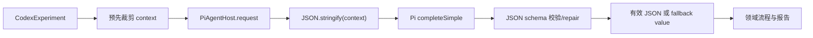
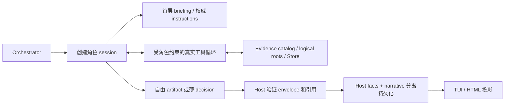
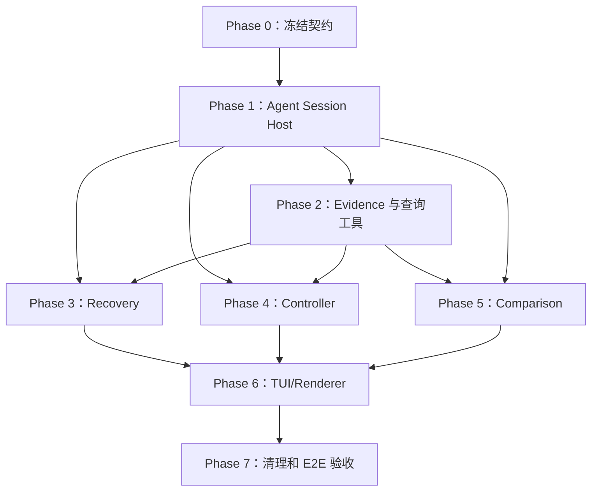

# Reprise 当前实现偏差分析与系统修正方案

> 状态：Draft for implementation
> 日期：2026-08-12
> 依据：[三个 Agent 的职责、能力与 System Prompt 对齐稿](../architecture/agent-roles-and-system-prompts.md)
> 范围：Recovery Agent、Controller Agent、Comparison Agent，以及承载它们的 Host、Orchestrator、证据系统、TUI、报告和测试

## 1. 文档目的

本文不是提出另一套新架构，而是把已经确认的 canonical 设计与当前实现逐项对照，回答四个问题：

1. 当前实现具体偏离在哪里；
2. 哪些偏差是共同根因，哪些只是表面症状；
3. 哪些现有能力应保留，哪些旧契约必须删除；
4. 应按什么顺序修正，才能避免在错误基础上继续堆功能。

本文只给出修正方案，不在本次变更中修改代码。实施时应以 canonical 文档为产品语义来源，以本文作为迁移路线和验收清单；两者冲突时，以 canonical 文档为准。

## 2. 审计范围与非目标

### 2.1 已审计范围

- Agent 定义：`src/agents/*-agent.ts`；
- Agent 承载：`src/infrastructure/pi-agent-host.ts`、`src/infrastructure/pi-model-caller.ts`；
- 编排：`src/application/codex-experiment.ts`、`candidate-run.ts`、`comparison.ts`；
- 环境：`src/environment/local-workspace-provider.ts`；
- 持久化：`src/infrastructure/store/experiment-store.ts`、`src/core/schema.ts`；
- 展示：`src/tui/`、`src/report/comparison-report.ts`；
- 配置和预算：`src/application/harness-agents.ts`、`codex-tui-workflow.ts`；
- 相关测试：`test/agent-host.test.ts`、`codex-experiment.test.ts`、`candidate-run.test.ts`、`comparison-report.test.ts`、`environment.test.ts`、`timeline.test.ts` 等。

### 2.2 非目标

本修正不要求：

- 重写 `ExperimentStore` 或 Candidate runtime；
- 引入通用工作流 DSL、动态插件市场或第二套事件存储；
- 给 Controller/Comparison 全能写入 shell；
- 让 Comparison 默认读取整个会话、全部输出和全部文件；
- 限制 Recovery 的网络目标或用途；
- 为旧的错误结构继续增加兼容性分支而固化旧设计。

## 3. 已确认的 canonical 目标

### 3.1 Agent 与 Host 的职责分界

系统包含三个模型 Agent 和一个确定性 Host/Orchestrator：

| 角色 | 核心职责 | 写权限 | 默认上下文 | canonical 输出 |
|---|---|---:|---|---|
| Recovery | 在 staging 中实际恢复 baseline candidate | 仅 staging | 原始会话、证据、只读用户工作区、playbook | `recovery.md` + 薄 `RecoveryEnvelope` |
| Controller | 在每个 CandidateRun 中扮演连续的用户协作方 | 无 | 完整原会话入口 + 当前连续运行轨迹 | `send \| done` |
| Comparison | 基于可复查证据解释 Baseline 与 Candidate 差异 | 无 | TUI 等价 briefing + 增强 manifest + 按需调查 | `comparison.md` + 薄 `ComparisonEnvelope` |
| Host | 隔离、工具执行、事实记录、验证、生命周期和投影 | 机械执行 | 全部已授权事实 | Host facts、RunOutcome、审计记录 |

### 3.2 不可退让的契约

1. Controller 只有 `send | done`，不存在 Controller `stop`。
2. `done` 只表示 Controller 不再发送消息，不等于运行一定成功或正常结束。
3. 用户取消、timeout、delivery unknown、安全终止、runtime/Controller/Harness 故障均由 Host 记录，不能伪造成 `done`。
4. Recovery 是执行型 Agent，不是恢复建议生成器。
5. Recovery 网络默认开放，不设目标或用途 allowlist；网络活动必须留痕，但网络权限不扩大文件权限。
6. Recovery 文件边界只禁止：任意绝对路径访问、用户工作区写入、全局配置写入、凭据目录访问。
7. Comparison 不默认读全量；它从面向人的 TUI 信息起步，额外获得结构化索引，并按需读取可能改变结论的内容。
8. Recovery/Comparison 的说明性正文使用自由 Markdown，结构化信封只承载状态、产物引用和少量稳定机器字段。
9. Host facts 永远独立于 Agent narrative；模型失败不能产生伪造的领域决定或结论。

## 4. 执行摘要

当前最大问题不是某个 prompt 写得短，也不是某个 JSON schema 少了字段，而是：**现有 `PiAgentHost` 实际是一次性结构化 completion 包装器，不是能承载 coding agent 的 Agent Host。**

它把一个预先拼好的 context 整体序列化后交给 `completeSimple`，然后校验 JSON；所谓 capabilities 只是字符串标签，没有注册真实工具，也没有 session、tool loop、按需读取、工作区隔离或工具审计。因此三个 Agent 都被压扁成“一次性看摘要并返回 JSON”的调用：

- Recovery 只能写恢复计划，不能恢复；
- Controller 每轮失忆，看到的轨迹还不会随运行更新；
- Comparison 既不能分层浏览，也不能读取实际文件内容；
- fallback 被当作有效结果继续流入 RunOutcome 和报告，污染事实。



目标链路应是：



因此修正顺序必须是 Host → Evidence/工具 → Recovery/Controller/Comparison → TUI/报告，而不是先继续扩 prompt 或给旧 JSON 增加字段。

## 5. 值得保留的现有基础

项目并非需要推倒重来。以下部分具备复用价值：

- `ExperimentStore` 的 append-only event、sequence、checksum、writer lock、artifact commit/read/replay；
- `CandidateRun` 对 delivery、settlement、cleanup、runtime stop 的生命周期处理；
- `RuntimePort` 与本地隔离 workspace 的基本边界；
- TUI 已有的过滤、滚动、详情和取消交互壳；
- `LocalWorkspaceProvider` 的复制、fingerprint 和 symlink 拒绝逻辑；
- schema 校验和 immutable artifact 的思路。

修正应在这些基础上增加缺失的 Agent session、工具和 evidence catalog，而不是再造 Store、runtime 或 TUI 状态源。

## 6. 共同根因分析

### 6.1 `PiAgentHost` 名称与能力不一致（P0）

**代码证据**

- `src/infrastructure/pi-agent-host.ts:4` 的能力只有 `read_observation | read_artifact | write_staging` 三个字符串；
- 同文件 `request()` 直接 `JSON.stringify(request.context)`；
- 文件注释明确说它不负责工具执行；
- `src/infrastructure/pi-model-caller.ts` 只调用 `completeSimple`，用户消息要求只使用整块 JSON context；
- capabilities 没有转化为 Pi 工具定义。

**影响**

- prompt 中写“可使用工具”也无法落实；
- 无法执行 Recovery；
- 无法做到 Comparison 按需检索；
- 无连续 Controller session；
- Host 无法机械实施角色权限；
- 所有上下文只能预先全塞或人为裁剪，二者分别导致爆上下文或证据不足。

**目标状态**

新增一个最薄的 `AgentSessionHost` adapter，复用 Pi 已有的 agent/tool 能力，负责：session 生命周期、消息追加、真实工具注册、tool loop、取消/timeout、审计事件和最终 artifact/envelope 收集。旧 `completeSimple` 只能保留为 provider/model 连通性 probe，不再承担三个 Agent 的运行时。

### 6.2 fallback 污染领域事实（P0）

**代码证据**

- `PiAgentHost` 对 privacy blocked、timeout、provider failure、invalid output 都返回调用方提供的 fallback value；
- Controller fallback 是 `done/no_further_value`；
- Recovery fallback 是 `unavailable` 的领域结果；
- Comparison fallback 是一段看起来完整的 comparison narrative；
- `codex-experiment.ts` 在循环没有真实 decision 时再次生成 fallback `done`。

**影响**

技术故障被包装为 Agent 的有效判断。用户无法区分“Agent 判断无更多价值”和“Agent 根本没返回”；RunOutcome、TUI 和报告的事实可信度被破坏。

**目标状态**

运行结果使用判别联合：

```ts
type AgentInvocation<T> =
  | { status: 'completed'; value: T; sessionId: string }
  | { status: 'failed'; failure: AgentFailure; sessionId?: string }
  | { status: 'cancelled'; factRef: EvidenceRef; sessionId?: string };
```

`failed/cancelled` 不携带伪造的 `T`。UI 可以显示确定性的“narrative unavailable”，但它属于 renderer fallback，不得反序列化成 Agent 结果。

### 6.3 Host facts、Agent narrative、UI fallback 混层（P0）

当前 ComparisonResult 同时被用作模型输出、报告结构和失败降级；Controller decision 又参与 termination 构造；Recovery status 代替 provider 验证。三个事实层必须拆开：

1. **Host facts**：事件、命令结果、文件 hash、delivery、termination、检查结果；
2. **Agent products**：decision、`recovery.md`、`comparison.md` 和薄 envelope；
3. **Projection fallback**：当 narrative 缺失时，TUI/HTML 从 Host facts 渲染固定提示。

只有第 1 层可以决定机械事实；第 2 层只能表达被授权的 Agent 判断；第 3 层不能回写前两层。

## 7. 分子系统问题与目标状态

## 7.1 Recovery Agent

### 现状问题

| ID | 严重度 | 问题与证据 | 直接后果 |
|---|---|---|---|
| R-01 | P0 | `recovery-agent.ts` system prompt 明确写 `Plan recovery only` | 与执行型 Recovery 完全相反 |
| R-02 | P0 | 输出固定为 `status/proposedSteps/evidenceRefs` | 实际恢复过程被压成建议 JSON |
| R-03 | P0 | `codex-experiment.ts` playbook 写死 `Do not execute commands` | 产品层主动禁止执行 |
| R-04 | P0 | baseline 在 Recovery 前已由 provider 整树复制 | Recovery 产物不参与 baseline 建立 |
| R-05 | P0 | 无 shell、file、Git、network 工具 | 无法调查和执行恢复 |
| R-06 | P1 | 未提供逻辑根，只在领域中流转绝对路径 | “禁止绝对路径”没有机械边界 |
| R-07 | P1 | 无命令、文件变更和网络审计 | 无法复查恢复来源与副作用 |
| R-08 | P1 | 只写 `recovery.json` | 不符合 Markdown + 薄信封契约 |

### 目标工作流

1. Provider inspect source，只产生确定性 readiness、clues 和只读 logical roots；
2. Host 建立独立 writable staging；
3. Recovery session 阅读原始会话索引、playbook、evidence 和只读用户工作区；
4. Recovery 在 staging 内使用文件/shell/Git/网络实际恢复；
5. Host 记录每个工具调用，并限制所有文件访问到逻辑根 + 相对路径；
6. Recovery 写 `recovery.md` 并返回薄 `RecoveryEnvelope`；
7. Provider 独立验证 staging 的可读性、fingerprint、必要文件和允许检查；
8. 验证通过后冻结为 baseline candidate；验证失败则记录 provider failure，不篡改 Recovery narrative。

### Recovery 工具最小集

- `list_files(root, path, cursor, limit)`；
- `read_file(root, path, startLine, endLine)`；
- `search_text(root, query, path?, cursor?, limit?)`；
- `write_file(root='staging', path, content)`；
- `apply_patch(root='staging', patch)`；
- `run_command(cwdRoot='staging', cwd, argv, timeoutMs)`；
- `git_status/git_diff/git_log/git_show`，工作树只能位于 staging；
- `network_request(...)` 或 Pi 原生网络工具，默认开放；
- `write_recovery_report(path='recovery.md', markdown)`。

工具层必须拒绝：任何绝对路径、`..` 逃逸、user_workspace 写入、全局配置写入、凭据根访问。网络不设域名 allowlist，但记录时间、URL/目标、方法、状态、发送/接收字节、关联 tool call；敏感 header/body 不应原样落盘。

## 7.2 Controller Agent

### 现状问题

| ID | 严重度 | 问题与证据 | 直接后果 |
|---|---|---|---|
| C-01 | P0 | `ControllerDecisionSchema` 仍含 `stop` | 违反已确认的 `send | done` |
| C-02 | P0 | failure fallback 为 `done/no_further_value` | 把故障伪造成语义决定 |
| C-03 | P0 | 每轮独立 completion，无 session | Controller 不是连续协作角色 |
| C-04 | P0 | 取消时伪造 `stop/requires_real_user_decision` | 用户行为被错误归因给 Controller |
| C-05 | P1 | `targetEvents.slice(-64)` 在循环前只计算一次 | 新 Target 活动对 Controller 不可见 |
| C-06 | P1 | current/trajectory 是固定或过薄摘要 | 无法基于真实轨迹决策 |
| C-07 | P1 | `requiresRealUserDecision` 固定 false | 权限/用户决策边界形同虚设 |
| C-08 | P1 | 固定 4 target turns、3 model calls、1 次 no-progress | 语义流程被过早硬截断 |
| C-09 | P1 | prompt 过短，未覆盖身份、证据、注入、完成条件 | 易越权或误判 |

### canonical 决策和终止投影

```ts
type ControllerDecision =
  | { type: 'send'; message: string; intent: 'continue'|'inform'|'correct'|'verify'; rationale?: string; evidenceRefs?: EvidenceRef[] }
  | { type: 'done'; reason: 'satisfied'|'blocked'|'requires_real_user_decision'|'no_further_value'; rationale?: string; evidenceRefs?: EvidenceRef[] };
```

Controller `done` 后，Host 结合 delivery、settlement、runtime 状态、安全事实和取消事实生成 RunOutcome。示例：

| Controller/Host 事实 | RunOutcome 投影 |
|---|---|
| `done:satisfied`，目标 turn 已 settled，无故障 | task 可为 apparently_completed；termination completed |
| `done:blocked` | task incomplete/indeterminate；termination blocked |
| `done:requires_real_user_decision` | task indeterminate；termination blocked，不冒充用户取消 |
| 用户点击取消 | termination cancelled、initiatedBy user；没有 ControllerDecision |
| Controller provider failure | termination failed/uncertain、origin controller；没有 fallback done |
| turn timeout / delivery unknown | 由 Host runtime facts 投影，不创建 done/stop |

### 连续 session 设计

- 每个 CandidateRun 创建一个 Controller session；不同 Candidate 绝不共享；
- 首次注入权威 system prompt、原任务与会话索引；
- 每次 Target settle 后只追加新的 observation/event cursor，不重复灌整段历史；
- Controller 可用只读 `read_transcript_range`、`read_event_range`、`read_artifact_range`、`get_run_state`；
- `send` 由 Host 进行空白、长度、重复、目标状态和 delivery 前置校验；
- `done` 结束 Controller 发言权，但不能覆盖 Host 已有终止事实；
- Controller 工具不得写 workspace、运行 Candidate 命令或替 Candidate 完成任务。

预算应拆成两类：

- **语义预算**：默认不设固定 3 次模型调用/4 个 turn 上限；若产品允许用户配置 token/cost，则显式记录；
- **安全 watchdog**：保留单次 call/turn timeout、heartbeat、取消、异常重复和资源保护，但由 Host 产生终止事实，不能伪造成 Controller 决定。

## 7.3 Comparison Agent

### 现状问题

| ID | 严重度 | 问题与证据 | 直接后果 |
|---|---|---|---|
| P-01 | P0 | 固定 `ComparisonResult`：summary/observations/limitations | 输出被报告模板反向限制 |
| P-02 | P0 | 只有预先拼好的摘要和 artifact ref 字符串 | 没有实际证据内容 |
| P-03 | P0 | workspace 释放前只保存 changedPaths/fingerprint | 比较时真实结果文件已丢失 |
| P-04 | P1 | `read_artifact` 只是 capability 标签 | 无法按需打开、搜索、分页 |
| P-05 | P1 | 无 TUI-equivalent briefing 和 enhanced manifest | 起始视野既不等同用户也不够结构化 |
| P-06 | P1 | 无 truncation/range/cursor | 大输出只能全塞或完全不看 |
| P-07 | P1 | 只写 `comparison.json` | 不符合自由 Markdown + 薄信封 |
| P-08 | P1 | fallback narrative 冒充 Agent 比较结果 | 报告不能区分失败和结论 |

### 三层上下文

**第一层：TUI-equivalent briefing**

至少包含用户在结果 TUI 中默认能看到的信息：任务、baseline/candidate 状态、termination、fidelity、关键时间线、变更摘要、检查摘要、已知限制。主时间线输出应截断，不能直接附完整 `aggregatedOutput`。

**第二层：Agent-enhanced manifest**

给 Agent 比人类默认界面略多的索引，而不是内容全集：

- transcript/event 的 range、角色、时间、大小；
- artifacts 的类型、mediaType、size、hash、provenance、owner、可读性；
- changed files、diffstat、binary 标记；
- commands/checks 的状态、exit code、输出范围；
- images/screenshots 的 metadata；
- privacy/redaction 和 fidelity facts。

**第三层：按需只读调查**

Comparison 仅在某项证据可能改变结论时调用：

- `list_artifacts(filter, cursor, limit)`；
- `read_artifact_range(id, offset/lineRange, maxBytes)`；
- `search_artifacts(query, filters, cursor, limit)`；
- `read_transcript_range(runId, from, to)`；
- `read_event_range(runId, fromSequence, limit)`；
- `get_diff(file?, contextLines?, cursor?)`；
- `get_check_result(checkId, outputRange?)`；
- `get_image_preview(artifactId)`（后续可选）。

所有响应都返回 `truncated`、`nextCursor`、实际字节/行范围。默认限制单次输出，Agent 自己选择继续读取，而不是 Host 在后台把全部内容拼入 prompt。

### 输出

```ts
type ComparisonEnvelope = {
  status: 'completed' | 'insufficient_evidence';
  reportArtifactId: string; // comparison.md
  evidenceRefs: EvidenceRef[];
  limitationCodes?: string[];
};
```

正文允许根据证据自然组织，不强制固定三段。Host 验证 artifact 存在、引用可解析、Markdown 大小合法；不验证观点是否“正确”，也不允许正文修改 RunOutcome。

## 7.4 Candidate evidence 与 artifact 生命周期

`captureWorkspaceScope()` 当前只保存 baseline/candidate fingerprint、changedPaths 和 runtimeGeneratedPaths。由于 workspace 随后释放，Comparison 无法查看文件内容或 diff。这是 Comparison 修复的前置 P0。

目标是在 release 前产生不可变 evidence bundle：

- changed-file index 和 diffstat；
- 文本 diff（分页存储；大文件/二进制只给 metadata/hash）；
- 最终相关文件快照，至少覆盖 changed/created files，并应用大小和隐私策略；
- command/check catalog 及分段输出；
- Target transcript/event ranges；
- screenshots 或其他产品 artifact；
- provenance：runId、source logical path、capture time、hash、size、media type。

不必新建存储：继续通过 `ExperimentStore.commitArtifact/readArtifact` 保存；新增 catalog artifact 和查询 adapter。Workspace release 只发生在 capture 完成或明确记录 capture failure 后。

## 7.5 Orchestrator 与 RunOutcome

当前 `CodexExperiment` 同时负责上下文拼接、Agent fallback、Controller loop、Recovery playbook、workspace capture 和 Comparison 报告，语义过度集中。无需抽象成通用 DSL，但应把确定性步骤拆成可测试函数/服务：

1. `RecoveryCoordinator`：staging/session/provider validation；
2. `CandidateEvidenceCapture`：release 前冻结证据；
3. `ControllerCoordinator`：session、动态 observation、decision delivery；
4. `ComparisonCoordinator`：briefing/manifest/session/report artifact；
5. `RunOutcomeProjector`：只从 Controller completed decision + Host facts 投影。

关键原则：Orchestrator 可以决定流程何时停止；只有 Projector 可以构造 RunOutcome；Agent adapter 和 renderer 都不能私自制造 outcome。

## 7.6 Store、审计与配置

### Store 增量扩展

在现有 event store 上增加事件，不新建第二套日志：

- `agent.session_started/completed/failed/cancelled`；
- `agent.message_appended`（内容可存 artifact，事件存 hash/ref）；
- `agent.tool_called/completed/failed`；
- `agent.context_projected`（policy hash、manifest ref、cursor）；
- `recovery.validation_started/completed/failed`；
- `evidence.capture_started/completed/failed`；
- `comparison.report_committed`。

每次工具调用记录 role、sessionId、tool、规范化参数摘要、结果 ref、duration、truncated、failure；不得记录凭据或未脱敏敏感 body。

### Manifest 与配置

当前 `ExperimentSpec` 只有 controller/comparison，`RunManifest` 只解析 controller，三 Agent 又共享 90 秒/1 repair 配置。目标：

- spec 显式包含 recovery/controller/comparison 的模型与角色配置；
- manifest 分别记录 resolved model、prompt hash、tool policy hash、context policy hash、budget、session ID；
- prompt 文本版本化，hash 对应实际运行版本；
- 三角色 timeout/context/tool policy 独立；
- structured repair 只用于薄 envelope，不用于强迫自由正文变 JSON。

## 7.7 TUI 与 HTML Renderer

### 当前问题

- `timeline.ts` 把 comparison started/completed 标成 `CONTROLLER`；
- command completed 把完整 `aggregatedOutput` 放入 timeline detail，容易淹没主视图；
- Recovery/Comparison fallback 被作为结果展示；
- HTML renderer 固定依赖 `ComparisonResult` 的 Summary/Observations/Limitations；
- artifact 链接缺少真实 evidence navigation 和 range 定位。

### 修正原则

TUI 和报告是 persisted facts 的投影，不是事实拥有者：

- 来源标签改为 `COMPARISON`/`RECOVERY`/`HOST`；
- 主时间线只显示摘要、状态、截断标志和“展开”入口；
- 详情页按 cursor/range 读取完整输出；
- 顶部固定展示 Host facts cards：termination、task assessment、fidelity、checks、capture completeness；
- `comparison.md` 使用安全 Markdown renderer（禁 raw HTML、脚本和危险 URL）；
- evidence link 在 Host 侧解析和校验，支持跳转到 event/artifact/range；
- narrative 缺失时显示“Comparison Agent 未产生报告”，同时仍展示 Host facts，不生成假的 ComparisonResult。

## 7.8 安全、隐私与 prompt injection

安全边界不能靠 system prompt 单独保证。

| 边界 | 当前问题 | 机械修正 |
|---|---|---|
| Recovery 路径 | 绝对路径直接流转，无真实工具约束 | logical root + relative path；resolve 后再次验证仍在 root 内 |
| Recovery 写入 | `write_staging` 只是标签 | 写工具只绑定 staging；拒绝 user workspace/global config/credential roots |
| Recovery 网络 | 尚无工具和审计 | 默认开放，不加目标限制；记录 metadata/bytes/status，脱敏敏感字段 |
| Controller/Comparison | 只读能力是声明而非能力边界 | 只注册 reader/query 工具，不注册 write/exec |
| 上下文隐私 | 只有 `allowModelText` 总开关 | artifact/range 级 policy、redaction、owner 和拒绝原因 |
| 大输出 | 整块 context/aggregated output | max bytes、分页、cursor、truncated |
| prompt injection | 数据与指令未在工具层区分 | system prompt 标明权威层级；工具结果用数据 envelope；不从 artifact 动态注册工具 |
| 审计敏感信息 | 若直接记录网络/命令全文会泄漏 | 参数摘要 + hash/ref；secret patterns/redaction；凭据目录从源头不可达 |

Recovery 的“网络默认开放”是明确产品决定，修复中不得偷偷增加域名 allowlist 或只允许与恢复用途相关的网站。

## 8. 优先级问题矩阵

| ID | 优先级 | 问题 | 修复依赖 | 验收信号 |
|---|---|---|---|---|
| A-01 | P0 | completion wrapper 冒充 Agent Host | 无 | 真实 session + tool loop 集成测试 |
| A-02 | P0 | fallback 污染领域事实 | A-01 | provider failure 不产生 decision/envelope |
| R-01 | P0 | Recovery plan-only | A-01、E-01 | staging 中产生并验证真实恢复产物 |
| C-01 | P0 | Controller 仍有 stop | A-02 | 类型、运行路径、测试中无 Controller stop |
| C-02 | P0 | Controller 无连续 session | A-01 | 单 run sessionId 恒定、增量 observation 可见 |
| P-01 | P0 | Comparison 固定 JSON 结果 | A-01、E-01 | `comparison.md` + envelope |
| E-01 | P0 | release 后真实结果证据丢失 | Store | release 前 capture bundle 可读 |
| O-01 | P0 | RunOutcome 与 Agent/fallback 混杂 | A-02、C-01 | 所有终止都能追溯 Host facts |
| R-02 | P1 | Recovery logical roots/network audit 缺失 | A-01 | traversal/write boundary/network audit 测试 |
| C-03 | P1 | Controller 上下文静态且过薄 | C-02、E-01 | 新事件按 cursor 增量可见 |
| P-02 | P1 | Comparison 无三层上下文/分页 | A-01、E-01 | 搜索、range、truncation 测试 |
| S-01 | P1 | 三 Agent 配置/manifest 不独立 | schema migration | 三角色 hash/config 可回放 |
| U-01 | P1 | TUI/报告混淆来源和 fallback | 新持久化契约 | Host facts 与 Markdown 分层展示 |
| Q-01 | P1 | 测试主要固定旧行为 | 前述各项 | 新契约测试覆盖关键失败路径 |
| M-01 | P2 | 老实验格式兼容 | 新 renderer | 旧结果只读可展示，不伪装新结果 |
| O-02 | P2 | context/性能优化 | P-02 | 大 artifact 下 prompt 大小稳定 |

## 9. 分阶段实施方案

### 9.1 Phase 0：冻结契约并切断错误语义

**目的**：先阻止旧契约继续扩散。

**主要文件**

- `src/core/schema.ts`
- `src/agents/controller-agent.ts`
- `src/agents/recovery-agent.ts`
- `src/agents/comparison-agent.ts`
- `src/application/candidate-run.ts`
- `src/application/codex-experiment.ts`

**变更**

1. Controller 类型删除 `stop`；
2. 定义 `AgentInvocation<T>`，删除 `StructuredAgentResult<T>.usedFallback` 作为领域成功路径；
3. 定义薄 `RecoveryEnvelope`、`ComparisonEnvelope`；
4. 明确 `RunOutcomeProjector` 输入，不再接受 fallback decision；
5. 对旧 `comparison.json/recovery.json` 标为 legacy read-only；
6. 更新 canonical prompt 文件 hash/version 接口，暂不接入旧 completion runtime。

**删除**

- `stopByController` 及 Controller stop 分支；
- cancelled → fake stop；
- loop exhausted → fake done；
- Comparison/Recovery narrative fallback value。

**验收**

- 编译期不可能构造 `{type:'stop'}`；
- Controller timeout/provider error 测试断言没有 ControllerDecision；
- 用户取消的 `initiatedBy` 为 user；
- renderer fallback 不写入 Agent artifact。

### 9.2 Phase 1：实现最薄的真实 Agent Session Host

**目的**：建立所有 Agent 的共同运行基础。

**主要文件**

- 重构 `src/infrastructure/pi-agent-host.ts`
- 重构 `src/infrastructure/pi-model-caller.ts`
- 新增角色工具 registry、session audit adapter（按现有目录放置，避免通用框架）
- 扩展 `experiment-store.ts` 事件

**变更**

1. 审计当前 Pi 依赖提供的 agent-core/session/tool API；
2. 用最薄 adapter 实现 create/resume/run/cancel session；
3. 工具由 Host 注册真实 handler，而非 capability 字符串；
4. session 和 tool 活动追加到 Store；
5. final response 区分 completed/failed/cancelled；
6. 单次 tool 输出强制 size/range/truncation；
7. `completeSimple` 只留 provider probe（若无其他用途则删除）。

**验收**

- fake tool 测试证明模型可调用工具并收到结果；
- 同 session 第二轮能看到第一轮消息；
- abort 能停止 session 并留下 cancelled fact；
- tool handler failure 不变成领域结果；
- 未注册工具不可调用。

### 9.3 Phase 2：建立 evidence catalog 和只读查询工具

**目的**：让 Agent 从索引起步并按需取证。

**主要文件**

- `src/infrastructure/store/experiment-store.ts`
- `src/application/codex-experiment.ts` 或独立的最小 evidence capture 模块
- `src/core/schema.ts`

**变更**

1. release 前 capture candidate evidence bundle；
2. 建 artifact/event/transcript/check/diff catalog；
3. 实现 list/search/read-range/query 工具；
4. 所有结果携带 cursor、range、truncated、hash；
5. 增加 ownership/privacy 检查；
6. capture failure 作为 Host fact，仍允许后续以 limitation 运行。

**验收**

- workspace 删除后仍能读取已捕获的 changed file/diff/check output；
- 10MB 输出不会一次进入模型 context；
- range 边界、cursor、binary、missing artifact、privacy denied 均有测试；
- artifact hash/provenance 可核验。

### 9.4 Phase 3：把 Recovery 改为真实恢复流程

**目的**：让 Recovery 在唯一可写 staging 中实际工作。

**主要文件**

- `src/agents/recovery-agent.ts`
- `src/environment/local-workspace-provider.ts`
- Recovery coordinator/playbook 接入
- canonical system prompt 资源

**变更**

1. Provider 创建 staging logical root；
2. 注册 Recovery 专属 file/shell/Git/network 工具；
3. 接入完整会话索引、playbook、evidence/user workspace 只读根；
4. 运行 Recovery session，生成 `recovery.md` 和 envelope；
5. Provider 独立验证并冻结 staging；
6. 记录命令、文件和网络审计；
7. Recovery failure 与 provider validation failure 分开。

**验收**

- 最小 fixture 中 Recovery 能复制/patch/checkout 并通过 provider check；
- 绝对路径、`..`、user workspace 写、global config 写、credential root 访问全部拒绝；
- 任意普通网络目标可访问（测试用本地 HTTP server），调用有审计；
- 网络开放不允许越过文件边界；
- 产物为 `recovery.md` + envelope，不再是 proposedSteps JSON。

### 9.5 Phase 4：Controller 连续会话与正确终止语义

**目的**：恢复“持续协作用户”的角色。

**主要文件**

- `src/agents/controller-agent.ts`
- `src/application/codex-experiment.ts`
- `src/application/candidate-run.ts`
- `src/application/codex-tui-workflow.ts`

**变更**

1. 每 run 创建独立 Controller session；
2. 使用 canonical 长 prompt；
3. 每次 settle 后追加增量 observation 和最新 Host facts；
4. 注册 transcript/event/artifact 只读工具；
5. send/done 严格校验；
6. RunOutcomeProjector 统一处理 done + Host facts；
7. 移除固定 4/3 语义上限，保留可配置 watchdog；
8. duplicate/no-progress 只能形成 Host stall fact，不能调用 Controller stop。

**验收**

- 两轮决定 sessionId 相同且第二轮能读取新事件；
- 不同 Candidate session 隔离；
- Controller 无法写 workspace/执行 Candidate 任务；
- send delivery unknown、用户取消、Controller failure、turn timeout 各自生成正确 Host outcome；
- `done` 自身不直接覆盖已有 failure/cancel fact。

### 9.6 Phase 5：Comparison 三层上下文与自由报告

**目的**：既避免全量灌入，又让 Agent 能主动取证。

**主要文件**

- `src/agents/comparison-agent.ts`
- `src/application/comparison.ts`
- Comparison coordinator
- evidence query tools

**变更**

1. 构建与 TUI 同源的 briefing projector；
2. 构建 enhanced manifest；
3. 注册只读 list/search/range/diff/check 工具；
4. 接入 canonical Comparison system prompt；
5. 输出 `comparison.md` + `ComparisonEnvelope`；
6. 验证 evidence refs，不把 narrative 写回 Host facts；
7. 记录 Agent 实际读取了哪些证据，便于解释上下文成本。

**验收**

- 初始 prompt 不含完整 transcript/全部文件；
- Agent 可按需搜索并读取目标 range；
- 未读取的巨大 artifact 不进入 context；
- 引用不存在 artifact 时 envelope 验证失败但 Host facts 完整；
- 无证据时可返回 insufficient_evidence，而非编造结论。

### 9.7 Phase 6：TUI 和 Renderer 迁移

**目的**：把新事实模型准确展示给用户。

**主要文件**

- `src/tui/timeline.ts` 及详情组件
- `src/report/comparison-report.ts`

**变更**

1. 修正事件来源标签；
2. timeline 默认摘要化 command output；
3. 增加 Host facts cards 与 Agent session/tool activity；
4. 安全渲染 `comparison.md/recovery.md`；
5. evidence links 支持 artifact/event/range 导航；
6. narrative 不可用时显示明确状态，不制造结果；
7. 保留旧实验只读投影。

**验收**

- comparison 不再显示为 Controller；
- 大输出不阻塞/淹没 timeline；
- Markdown 中 raw HTML/script/javascript URL 被禁止；
- Agent 报告与 Host termination 冲突时两者并列显示，Host facts 不被覆盖；
- 老实验仍可打开，并明确标记 legacy/fallback 来源。

### 9.8 Phase 7：删除旧路径并完成系统验收

**变更**

- 删除不再使用的 fixed ComparisonResult、proposedSteps RecoveryResult、capability 字符串 runtime；
- 删除旧测试中的 fallback-as-result 断言；
- schemaVersion 升级并补 migration/read compatibility；
- 更新架构、事件字典、artifact 格式和安全边界文档；
- 运行端到端真实模型 smoke，确认 trace 可回放。

**完成判据**见第 12 节。

## 10. 数据与兼容迁移

1. 新实验提升 schemaVersion；旧 event/artifact 只读，不原地改写。
2. 旧 `comparison.json` 可由 legacy renderer 展示，但必须标记为旧固定结构，不能伪称 `comparison.md`。
3. 旧 `recovery.json` 的 proposed steps 只作为历史记录，不视为已执行恢复。
4. 旧 Controller `stop` 回放时映射为 legacy event + Host termination，不转换成新 ControllerDecision。
5. 新 manifest 对三个 Agent 分别记录配置；读取旧 manifest 时缺失字段显示 unknown，不猜默认值。
6. UI persisted-facts fallback 允许旧实验在无 narrative 时打开，但不得写入新 artifact。

## 11. 测试修正方案

### 11.1 应删除或改写的旧测试假设

- “invalid JSON 自动得到有效 fallback decision/result”；
- “capability 字符串等于真实工具权限”；
- Recovery 只需 proposedSteps；
- Comparison 必须返回固定 observations 数组；
- Controller stop 是正常 canonical 行为；
- HTML 报告只依赖 ComparisonResult。

### 11.2 新增最小测试矩阵

| 层 | 必测内容 |
|---|---|
| Agent Host | session 连续性、tool loop、取消、timeout、工具失败、未注册工具 |
| Logical roots | absolute path、traversal、symlink escape、读写矩阵、凭据/global config |
| Recovery | staging 实际变更、Provider verify、network audit、报告/envelope |
| Controller | `send|done`、动态 events、跨 run 隔离、failure 无 fallback、outcome projection |
| Evidence | release 前 capture、release 后读取、hash/provenance、range/truncation/privacy |
| Comparison | briefing/manifest、按需 search/read、巨大 artifact 上下文上限、引用校验 |
| Store | session/tool events 回放、artifact immutable、敏感信息脱敏 |
| TUI/Renderer | 来源、渐进披露、安全 Markdown、legacy read-only、无 narrative 状态 |
| E2E | 一个真实 Recovery → Candidate → Controller → Comparison 流程，trace 与报告可复查 |

遵循项目规则：每个非平凡工具边界至少保留一个最小 runnable check；实施阶段只运行直接受影响测试，最终阶段再做一次受控构建和 E2E smoke。

## 12. 系统级完成判据（Done-means）

全部满足才可称为纠偏完成：

### Recovery

- [ ] 能在 staging 内真实使用 file/shell/Git/network 完成恢复；
- [ ] 网络默认开放且有审计，不附加目标/用途限制；
- [ ] 绝对路径、user workspace 写、global config 写、credential root 访问被工具层拒绝；
- [ ] Provider 独立验证并冻结 baseline candidate；
- [ ] 产出 `recovery.md` + 薄 envelope，失败不伪造成功结果。

### Controller

- [ ] canonical 类型只剩 `send | done`；
- [ ] 每个 CandidateRun 使用独立连续 session；
- [ ] 能按需读取完整原会话和实时新增轨迹；
- [ ] 无 Candidate workspace 写入或任务执行能力；
- [ ] 用户取消、timeout、delivery unknown、runtime/Controller/Harness failure 均由 Host facts 表达；
- [ ] RunOutcome 由 `done.reason + Host facts` 投影，无 fake done/stop。

### Comparison

- [ ] 初始只接收 TUI-equivalent briefing 和 enhanced manifest；
- [ ] 能按需 list/search/read range/diff/check；
- [ ] 所有大内容支持 cursor/truncation；
- [ ] workspace 释放后仍有足够不可变证据；
- [ ] 产出 `comparison.md` + 薄 envelope；
- [ ] 无 narrative 时 UI 展示 Host facts，不生成假比较结论。

### 共同基础

- [ ] Pi runtime 是真实 session/tool loop，不是 `completeSimple + JSON.stringify(context)`；
- [ ] 三 Agent prompt/tool/context/config hash 可追溯；
- [ ] Agent failure 与领域结果是互斥类型；
- [ ] Store 可回放 session、tool、capture、validation 和 artifact；
- [ ] TUI/HTML 是投影层，来源、截断、安全 Markdown 和 evidence navigation 正确；
- [ ] 新测试覆盖权限、失败、上下文预算和关键生命周期。

## 13. 风险与控制

| 风险 | 控制方式 |
|---|---|
| Pi agent-core API 与预期不符 | Phase 1 先做最小 spike；adapter 保持薄，不先设计通用框架 |
| evidence capture 导致磁盘膨胀 | size policy、文本 diff 优先、binary metadata/hash、明确 truncation |
| Recovery 网络审计泄漏 secret | metadata 化、header/body 脱敏；凭据目录从工具层不可达 |
| system prompt 再次与工具能力漂移 | prompt/tool policy 同版本和 hash；contract test 验证每项宣称能力 |
| RunOutcome 迁移引入归因错误 | 集中到单一 projector，表驱动覆盖全部 termination facts |
| 老实验无法查看 | legacy renderer 只读兼容，不污染新 schema |
| TUI 与 Comparison briefing 漂移 | 共用同一个 persisted-facts projector，分别设置展示深度 |
| 大上下文再次失控 | manifest 只存索引；所有正文按需 range 读取并记录成本 |

## 14. 推荐实施顺序与依赖



最重要的实施纪律：

- 不要先“扩写 prompt”然后仍交给无工具的 completion wrapper；
- 不要先改 HTML schema 来迁就旧 ComparisonResult；
- 不要给 fallback 换一个更好听的 reason；应删除伪造领域值；
- 不要用更多摘要弥补缺失的 evidence reader；应提供索引和按需读取；
- 不要通过限制 Recovery 网络来替代真正的文件隔离；两者是独立权限维度；
- 每个 Phase 完成后删除该阶段替代的旧路径，避免双契约长期并存。

## 15. 最终结论

当前实现严重偏离最初设计的核心原因已经明确：三个 Agent 被实现成一次性、固定 JSON、无真实工具的模型调用，而不是分别具有不同上下文策略、权限边界和生命周期的自主 Agent。继续在现有 `StructuredAgentRequest + fallback` 上补字段，只会让表面更完整，无法获得 Recovery 的执行能力、Controller 的连续性或 Comparison 的按需取证能力。

最小且正确的纠偏路径不是整体重写，而是：

1. 保留 Store、Candidate runtime、workspace provider 和 TUI 壳；
2. 先建立真实 Agent session/tool host；
3. 把 Host facts 与 Agent products 分开；
4. 在 workspace release 前冻结可查询证据；
5. 依次迁移 Recovery、Controller、Comparison；
6. 最后让 TUI/报告只投影新事实模型并清理旧 fallback 契约。

只要按这个依赖顺序推进，项目可以在复用现有可靠基础的同时，回到已经确认的产品设计，而不需要进行一次高风险的全项目重写。
