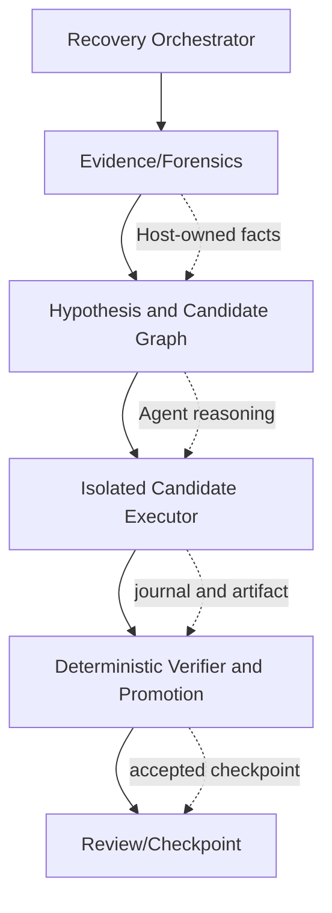

# Recovery 模块架构分析与后续调整建议

> 更新时间：2026-08-19
>
> 分析依据：Codex 会话 `01a00ef5-ee62-7f73-b0ee-e5810ff473f7` 的完整迭代记录、当前工作区代码与测试、最新脱敏真实 5+5 产物 `recovery-sample-20260818-git-probe-tolerant-5plus5`，以及现有唯一整合方案 `docs/plan/recovery-real-sample-failure-analysis-and-recommendations.md`。
>
> 本文是架构分析和下一步实施建议，不直接修改 Recovery 源码，也不把历史 completed session 的结果夸大为恢复成功率。

## 1. 结论先行

你想要的 Recovery 不是“有足够证据才恢复”的静态校验器，而是一个**最大努力、隔离执行、候选分支、可验证晋级**的恢复系统：

- 证据少时仍然进入 staging，读取所有可用材料，形成多个可证伪假设，尽力恢复；
- Agent 负责理解任务、调查历史、归因变化、提出和验证候选；
- Host/Provider 负责隔离、路径边界、写入归属、checkpoint、字节级回放和最终接受；
- 不允许因为“Agent 很可能判断错”而提前放弃，也不允许因为“Agent 声称恢复”而绕过验证；
- `insufficient_evidence` 的含义应是“在最大努力搜索后不能自动确认”，而不是“没有足够证据所以不尝试”；
- `recovered`、`verified`、`truth-passed` 必须是不同层级，避免把流程完成误读成语义恢复成功。

当前实现已经完成了安全骨架和最大努力入口，真正的下一步不是再增加一个 gate，而是把**调查循环、候选执行和接受晋级**拆成清晰的状态机，并补齐“任务起点真值”评估闭环。

## 2. 从目标会话还原出的真实意图

### 2.1 目标如何发生变化

会话的演进有明确方向：

1. 初始规划关注 evidence catalog、observation ref、Git 探测、输出合同、manifest 和 Provider 验证。
2. 第一轮真实 5+5 失败后，发现空 catalog、过早 preflight 和仅验证产物存在，导致 Agent 无法发挥。
3. 你明确提出：即使证据少，也应让 Agent 尽力恢复，不应不尝试就放弃。
4. 后续设计因此转向最大努力策略：弱证据仍启动 forensics，允许 hypothesis/candidate graph、alternate candidate、审查和反馈，但不放宽安全边界。
5. 最新 5+5 证明“最大努力链路”已经启动，但没有证明恢复结果正确；因此下一阶段必须优化 Agent 的恢复能力和可观测性，而不是简单提高 `recovered` 数量。
6. “99%”在会话中被明确为愿景表达，不是硬性 KPI；后续目标应以隐藏真值、错误自动接受率和分层失败率衡量。

### 2.2 应固定的产品语义

Recovery 的输出应理解为：

```text
当前 workspace
  -> 历史证据与当前状态调查
  -> 一个或多个候选起点
  -> 每个候选的受控修改与验证
  -> Provider 审核/用户选择/确定性回放
  -> accepted candidate（可供下游 Candidate 使用）
```

不是：

```text
调用模型 -> 模型说 recovered -> 复制报告 -> 认为恢复成功
```

## 3. 当前系统：已经具备什么

### 3.1 已有的安全与协议能力

主要位置：

- Agent 合同、提示词和 envelope：`src/agents/recovery-agent.ts`；
- 调查事实、观察工具和 evidence catalog：`src/infrastructure/recovery-tools.ts`；
- Host 编排、preflight、候选和失败分层：`src/application/experiment.ts`、`src/application/recovery-preflight.ts`、`src/application/recovery-failure-classification.ts`；
- Provider 隔离、checkpoint、报告和验证：`src/environment/local-workspace-provider.ts`；
- 受控写入 journal、delta/blob 回放：`src/infrastructure/recovery-write-journal.ts`；
- 候选选择和信息增益决策：`src/application/recovery-selection.ts`；
- 评估与机械验证：`src/application/recovery-evaluation.ts`、`src/application/recovery-verifier.ts`；
- 持久化 schema、CandidateGraph、checkpoint 和 evaluation artifact：`src/core/schema.ts`。

从代码和进度记录看，当前已经有：

- staging/COW 隔离、source tripwire、路径边界和源目录不变审计；
- Host-owned evidence catalog 与 observation ref 闭环；
- transcript/history-only/空 transcript 的最大努力入口；
- Git repo、HEAD、status、object 分离探测及可预期 Git 错误降级；
- `recovered`、`partial`、`insufficient_evidence` 的联合输出合同；
- `recovery-manifest.json`、changed path、before/after hash 和 evidence ownership 校验；
- preimage、patch、Git、observation、current workspace 的候选种子；
- candidate graph、alternate candidate 保留、逐候选隔离重执行、Provider revalidation；
- Host-owned 用户选择、反馈 artifact/event 和 reviewed staging checkpoint；
- 模型失败、Provider 验证失败、preflight 失败、runner crash 等分层记录；
- external side effects 能力声明，且当前 Codex/Claude Code 明确为 `unobserved`，不会虚构远端回滚。

### 3.2 从现有整合方案补充确认的实现边界

现有整合方案中有几项内容对架构判断很重要，不能在新方案中误列为待实现：

1. **确定性基线已经不只是设计。** Provider 隔离副本已有 checkpoint、digest、受控 delta/blob 字节级回放，并校验 `baseDigest` 与 `checkpointId`；large repository、symlink 等边界已有 fixture。下一步应扩展覆盖和晋级语义，而不是另造一套 snapshot 系统。
2. **候选闭环已经形成基础实现。** alternate candidates 会保留，用户选择有 Host-owned event 和 immutable feedback artifact，候选会独立重执行并经过 Provider revalidation；接受反馈还能形成 reviewed staging checkpoint。下一步是让调查循环更动态、候选动作更有恢复效果，不是重新实现“多候选”。
3. **模型失败已有精确重试边界。** timeout、rate limit、transient network 可以有界重试；认证、工具、协议、路径边界和未知失败不应盲目重试。重试耗尽后应保留 forensics/candidate 诊断，不能伪装成 `insufficient_evidence`。
4. **评估层已支持隐藏真值指标的结构。** exact recovery rate 与 Wilson 95% 区间已有聚合基础；缺口是构建有代表性的预注册中断数据集，而不是再设计一个百分比字段。
5. **外部副作用记录与补偿协议已有骨架。** 当前 Codex/Claude Runtime 仍声明 `unobserved`，因此真正缺少的是产品 Runtime 的可观察/可补偿 action，不是让本地 Provider 猜测远端状态。

这些事实收窄了后续范围：优先复用现有 checkpoint、candidate graph、journal、feedback 和 evaluation schema，只在现有职责无法表达生命周期时做最小提取。

### 3.3 当前架构的主要问题

#### 问题 A：核心编排仍集中在 `experiment.ts`

`src/application/experiment.ts` 同时承担恢复启动、facts/preflight、investigation 生成、Agent 调用、候选执行、manifest/写入、失败 fallback、评估和 Candidate 启动等职责。虽然已有多个 helper，但恢复生命周期仍难以从类型上看出：

- 哪一步是 Host 事实收集；
- 哪一步是 Agent 决策；
- 哪一步允许写入；
- 哪一步是候选分支；
- 哪一步能够晋级为 accepted。

这会让新增策略继续堆在总编排器里，并使“调查失败是否应继续”“候选失败是否应换分支”容易被混成同一个异常路径。

#### 问题 B：最大努力虽已开启，但循环不是一等概念

当前已经有动态 hypothesis/candidate 和 `decideRecoverySearch`，但真实样本通常仍只有 2 个 hypothesis、2 个 candidate。说明候选图已经存在，尚未成为一个根据**未解释路径、冲突、候选差异和验证反馈**持续扩展的调查闭环。

应避免“固定两个候选”的隐形上限；同时也不能只把同一个猜测改写两遍。每次扩展必须带来新证据、不同恢复机制或明确的反事实验证价值。

#### 问题 C：事实、假设、动作和结果边界仍需更硬

`RecoveryFact`、`RecoveryCandidate` 和 manifest 已存在，但 Agent 仍容易把当前状态、历史线索和推断混成“事实”。尤其 history-only 场景，`initialInput` 只能是线索，不能被报告成观察到的历史命令或文件。

需要把以下四类数据在 schema 和报告中显式分开：

```text
Fact       Host 观察或机械复核得到的事实
Hypothesis Agent 对起点/变化原因的可证伪解释
Action     在某个隔离 candidate 上实际执行的动作
Outcome    该动作的 before/after、验证、反证和未解决项
```

#### 问题 D：Provider 仍是安全验证器，不是完整的恢复效果判定器

最新样本中，Provider preview 多为 `accepted=false`、`changedPathCount=0`；这说明 Agent 主要生成了 `recovery.md` 和 `recovery-manifest.json`，并未形成可被独立确认的任务相关文件恢复。当前设计正确地没有把这些结果自动算成功，但也暴露了“模型做了报告，没做足够的恢复动作”的问题。

应增加候选级别的恢复效果摘要：目标路径、删除/恢复/保留集合、每个路径的 before/after hash、验证命令、验证结果和反证。不能以报告文件本身作为 `recoveredPaths` 的主要内容。

#### 问题 E：真实样本没有任务开始真值

完成的历史 session 只提供“任务结束后的当前状态”和部分历史线索，没有任务开始 tree。因此无法回答“是否回到了正确起点”。这不是 verifier 失败，而是数据集不具备可判定性。

真实样本可以用于观察链路可用性、失败分类和 Agent 是否尝试；恢复正确率必须通过预注册中断案例、隐藏 truth tree/hash 和允许等价结果来测量。

#### 问题 F：失败分类已有，但缺少对 Agent 的可操作反馈

`preflight_failed`、`agent_model_failed` 等分类比早期笼统 fallback 更好；但下一次尝试需要知道：哪个 operation 失败、是否重试、哪些候选已排除、哪类证据缺失、下一项 probe 的信息增益是什么。否则系统只能“记录失败”，不能“从失败改善搜索”。

## 4. 建议的目标架构

### 4.1 五层职责



1. **Evidence/Forensics Layer（Host + Agent tools）**：读取 transcript、history、Git、patch、preimage、artifact、当前 workspace；每次 observation 产生稳定 ref 和脱敏摘要。
2. **Hypothesis/Candidate Layer（Agent 主导，Host 约束）**：提出起点假设、受影响路径、支持/反证、下一 probe 和候选差异。
3. **Candidate Executor（Agent 在 Provider 隔离区）**：只能对当前 candidate 做受控写入；所有动作写 journal，并保留可回放 postimage。
4. **Verifier/Promotion（Host/Provider）**：检查路径、hash、evidence ownership、验证结果、source tripwire 和外部副作用边界；决定 verified、pending review 或 rejected。
5. **Review/Checkpoint（Host）**：保留 alternate candidates，输出短审查摘要；用户选择后生成 Provider-owned reviewed checkpoint，供下游运行复用。

### 4.2 推荐状态机

```text
created
  -> staged
  -> forensics_running
  -> hypotheses_ready
  -> candidate_running[*]
  -> candidate_verified | candidate_pending_review | candidate_rejected
  -> selected_checkpoint
  -> accepted | review_required | exhausted
```

状态约束：

- `staged` 失败只表示无法建立安全隔离；不能由 Agent 修复，也不能进入源目录。
- `forensics` 的辅助 operation 失败可以记录并继续其他来源；安全边界失败必须停止。
- `candidate_running` 失败只淘汰该 candidate，不能丢弃其他分支。
- `candidate_verified` 是机械/强证据结论，不等于任务语义 truth-passed；
- `accepted` 只能指向一个 Provider-owned checkpoint；不能只指向模型 envelope。
- `exhausted` 必须附带搜索过的 evidence sources、hypotheses、candidates 和停止原因。

### 4.3 结果晋级层级

整合方案对 `recovered` 的误读风险判断是正确的，建议在架构上固定以下晋级层级：

| 层级 | 含义 | 能否自动供下游使用 |
|---|---|---|
| `attempted` | 已建立安全 staging 并进行调查 | 否 |
| `candidate_created` | 形成了可复核候选，但尚未通过验证 | 否 |
| `pending_user_review` | 安全/结构验证通过，证据仍弱或不完整 | 仅经显式选择后 |
| `verified` | 强证据覆盖受影响路径，机械 verifier 通过 | 可以晋级为 Provider checkpoint |
| `truth_passed` | 在隐藏真值数据集中与目标起点一致 | 仅用于评估，不是运行时自报状态 |

协议 `recovered` 只能描述 Agent envelope，不能跨级替代 `verified` 或 `truth_passed`。最终 `accepted` 必须指向 Provider-owned checkpoint，而不是指向报告或模型文本。

### 4.4 调查循环

每轮 Agent 应提交一个结构化 investigation step：

```json
{
  "hypothesisId": "...",
  "unresolved": ["..."],
  "probe": { "tool": "...", "purpose": "...", "expectedInformation": "..." },
  "candidateAction": "...",
  "stopIf": ["..."],
  "factRefs": ["fact:..."]
}
```

Host 只需验证 probe 工具、路径和预算；不替 Agent 决定恢复结论。每轮结束计算：

- 新增事实数与新覆盖路径数；
- 是否消除冲突；
- 候选与已有分支的差异；
- 风险、耗时和剩余预算；
- 失败是否仅影响当前 branch。

停止条件应是“没有新增信息/候选差异、预算耗尽、风险达到安全阈值或所有可验证候选已结束”，而不是“初始证据少”。

## 5. 具体修改建议（按优先级）

### P0：先让结果可解释、可继续

1. **从 `experiment.ts` 提取 Recovery 生命周期。**
   - 建议新增 `src/application/recovery-orchestrator.ts`，只负责状态机和依赖注入；
   - 将 facts/preflight、candidate 执行、promotion、failure summary 分成已有模块的窄函数；
   - 不要新建泛化 workflow framework；只提取 Recovery 需要的最小端口。
2. **统一 `RecoveryAttempt` 记录。**
   - 每个 operation 记录 `attemptId`、`phase`、`operation`、`candidateId`、`attemptNumber`、`result`、`failureCode`、`durationMs`；
   - schema 通过 `Value.Check` 后写入 event/artifact；敏感内容只保留哈希、枚举和脱敏摘要。
3. **把失败重新映射为可操作决策。**
   - `facts` 辅助失败：保留其它 facts，给 Agent 一个 unavailable fact；
   - timeout/限流/临时网络：小次数、有界退避；
   - 认证、协议、schema、路径越界、安全 tripwire：不重试，进入明确失败；
   - candidate 工具失败：记录该分支反证，转向下一个候选。
4. **把 `recoveredPaths` 从报告文件转为任务相关路径集合。**
   - 报告/manifest 仍是交付物，但不能作为恢复效果主体；
   - 要求每个 candidate 产出 changed/restored/removed/retained 路径集合和验证摘要。

### P1：让 Agent 真正进行分支搜索

1. **候选图从“候选种子”升级为“可扩展图”。**
   - 节点：hypothesis、candidate、probe result、verification result；
   - 边：derived-from、contradicts、refines、replays；
   - 每个节点保存 fact refs、未解决项、路径 scope、预期差异和停止原因。
2. **候选生成按机制去重。**
   - patch replay、preimage restore、Git tree restore、history-derived edit、current-state minimal rollback 是不同机制；
   - 同一机制仅因描述不同不创建新候选；冲突证据必须保留互斥分支。
3. **恢复验证前移到候选内。**
   - Candidate 不是写完后才验证；每个关键动作后进行低成本 hash/Git/object 检查，再选择是否继续昂贵测试；
   - 验证失败作为该候选的可读反证，供其它候选参考，不中断全局搜索。
4. **补充 Agent 可用的恢复动作能力。**
   - 当前 Agent 主要能调查和写候选产物；应让它能在 candidate 内执行受控 restore/delete/rename/patch/replay/test；
   - 每个动作必须由 Host 分配 action id、绑定 base digest/checkpoint、记录 before/after hash，并可用 journal 回滚/重放；
   - 绝不把“扩大写权限”变成允许写 source 或执行未登记外部副作用。

### P1：让审查结果真正帮助下一次恢复

- 审查摘要显示候选差异、覆盖率、冲突、验证和未解决项，而不是完整 transcript；
- 用户选择绑定 staging digest 和 candidate id；
- feedback 只改变候选排序和 playbook 线索，不修改历史事实、不绕过 verifier；
- reviewed checkpoint 必须可追溯到 candidate graph、journal 和 verifier 结果。

### P2：提升产品证据适配和外部副作用能力

- Codex：优先绑定 rollout/turn context、工具写入记录、patch/preimage 和 Git object；不把 cwd 或模型自述当历史事实。
- Claude Code：区分完整 transcript、history-only、compact gap、API error；不根据 session slug 反推目录。
- 外部命令、IDE、浏览器、数据库和远端 API：当前能力是 `unobserved`，只能报告未知并要求 review；只有 Runtime 显式声明可补偿且 Host 有不可伪造记录时，才可执行补偿动作。

## 6. 最新 5+5 的客观解读

批次：`.reprise/recovery-sample-20260818-git-probe-tolerant-5plus5/summary.json`。

| 指标 | Codex | Claude Code | 合计 |
|---|---:|---:|---:|
| 样本 | 5 | 5 | 10 |
| staging 成功 | 5 | 5 | 10/10 |
| forensics started | 5 | 5 | 10/10 |
| forensics completed | 4 | 5 | 9/10 |
| 真实模型调用 | 4 | 5 | 9 |
| 创建候选 | 4 | 5 | 9/10 |
| source audit 通过 | 5 | 5 | 10/10 |
| Codex `preflight_failed` | 1 | 0 | 1 |
| Claude `agent_model_failed` | 0 | 1 | 1 |
| 协议 `recovered` | 0 | 1 | 1 |
| 独立真值成功 | 不可判定 | 不可判定 | 0 个可计算样本 |

按现有独立评估：Codex 4 条为“基本可用但不完整”、1 条为错误恢复（preflight）；Claude 2 条为“基本可用但不完整”、1 条为错误恢复（model failure）、2 条为“证据不足，无法判断”。所有 source unchanged 只证明隔离安全，不证明起点正确。

最重要的诊断不是“模型能力只有 0%”，而是：

- 链路可用性已明显改善；
- 9 个样本确实调用 Agent 并创建候选；
- 候选主要停留在结构化产物，任务相关恢复效果没有隐藏 truth 可以判定；
- 1 个基础设施失败和 1 个模型失败需要单独修复/归因；
- 一个 `recovered` 不能被计入成功，说明协议终态与真值评估已被正确区分。

## 7. 测试与评估策略

### 7.1 当前测试覆盖

现有测试已覆盖恢复工具、experiment orchestration、preflight、selection、evaluation、verifier、process runner、checkpoint fixtures、session discovery 等；`npm run check` 的门禁记录显示最新一次为 11 个门禁通过、0 失败、0 跳过。历史 `.tmp-recovery-check.log` 中曾有一次 recovery prompt snapshot drift 导致 test 门禁失败，该记录属于旧状态，不能覆盖当前进度。

纯文档变更按项目规则只运行 `npm run verify:docs`；修改源码后仍须先 `npm run build`，再运行直接受影响测试，并最终按范围执行 `npm run check`。

### 7.2 评估指标必须分层

整合方案中最有价值的约束之一，是禁止用单一“成功率”混合不同问题。后续报告至少同时给出：

| 指标 | 分母 | 证明内容 |
|---|---|---|
| source safety rate | 所有恢复尝试 | 是否保持源目录不变 |
| forensics start/completion rate | 可安全 staging 的请求 | Recovery 链路是否可用 |
| candidate creation rate | 完成 forensics 的请求 | Agent 是否形成可审查方案 |
| mechanical verification rate | 已创建候选 | Provider 是否能以强证据验证 |
| truth recovery rate | 有隐藏真值的预注册案例 | 是否真的回到目标起点 |
| false acceptance rate | 所有自动接受候选 | 是否错误地放行了错误恢复 |
| review-assisted top-k rate | 有真值且进入审查的案例 | 多候选和人工选择是否有价值 |

其中 false acceptance 应作为安全性硬指标单独报告；completed history 没有隐藏真值时，truth 字段必须是 `not_evaluable`。

### 7.3 下一轮最小可执行验证

每次 P0/P1 代码变更：

1. 先 `npm run build`；
2. 跑直接受影响的 `dist/test/recovery-*.test.js`、相关 `codex-experiment` 和 `recovery-checkpoint-fixtures`；
3. 对新增门禁补反向用例；
4. 候选搜索闭环通过 fixture 后，再考虑显式 opt-in 的真实模型调用；
5. 真实评估采用预注册中断案例，不拿 completed history 替代真值。

建议的隐藏真值矩阵至少覆盖：Git HEAD/unborn/non-Git、单/多文件、删除/重命名、二进制、生成物、冲突证据、tool failure、timeout/429、history-only 和外部副作用未知。

### 7.4 Done-means

下一阶段不能以“模型调用成功”或“报告生成”完成。至少应满足：

- 弱证据样本仍启动调查，并记录所有尝试过的证据源；
- 每个候选都有独立 journal、manifest、路径级验证和失败原因；
- alternate candidate 不会因第一候选失败而丢失；
- accepted 只指向 Provider-owned checkpoint；
- 有隐藏真值的样本能分别统计 truth-passed、错误接受、pending review、基础设施失败和模型失败；
- 完整历史样本若无真值，报告明确 `not_evaluable`；
- source audit 通过且外部副作用能力未知时，不声称远端已恢复。

## 8. 不建议的调整

- 不要把 `insufficient_evidence` 改成强制 `recovered`；这会让报告虚假而不是让恢复变强。
- 不要删除 evidence ownership、path boundary、source tripwire、baseDigest/checkpoint 绑定或 Provider verifier。
- 不要把工具预算无限放大；应以信息增益、风险和成本动态扩展。
- 不要把更多报告字段当作恢复能力；必须增加候选内受控写入和验证。
- 不要用一次 5+5 估计总体成功率，也不要为了样本“成功”硬编码历史路径。
- 不要把 `externalSideEffects: unobserved` 当作可回滚。

## 9. 已完成与待推进的阶段边界

结合整合方案和当前代码，阶段状态应按下表理解，避免重复建设：

| 阶段 | 当前判断 | 接下来真正要做的事 |
|---|---|---|
| 可靠性收口 | 已有基础闭环 | 只针对新复现的 operation/model failure 修根因 |
| checkpoint/delta | 已有确定性回放能力 | 扩大真实路径覆盖并统一 promotion 语义 |
| 强验证 | 已有 manifest/hash/evidence 校验，仍需加强语义覆盖 | 让任务相关路径而非报告文件成为验证主体 |
| 分支搜索 | 已有 candidate graph、feedback、reviewed checkpoint | 将固定种子升级为按冲突和信息增益扩展的循环 |
| 真值评估 | 有 schema/统计基础，数据集不足 | 建立预注册中断矩阵并发布分层指标 |
| 外部补偿 | 有能力声明和 artifact 协议 | 仅在 Runtime 可观测、可补偿时实现具体 action |

## 10. 推荐实施顺序

```text
P0 状态/失败/路径级结果统一
  -> P1 可扩展调查循环与候选内受控动作
  -> P1 Provider promotion/checkpoint 收口
  -> P2 产品证据适配与外部副作用补偿
  -> 隐藏真值中断评估
```

先做 P0 是因为它能让每一次真实运行都回答“失败在哪一层、Agent 做了什么、为什么没有晋级”；再做 P1 是因为目前最大的能力缺口不是模型没有被调用，而是候选没有充分落到任务相关文件状态并通过验证。完成 fixture 和门禁后，再执行新的真实实验。

## 11. 最终架构判断

当前 Recovery 已经从“可能在 Agent 前被错误阻断”进入“能在安全隔离中最大努力调查并保留候选”的阶段。下一步的核心是**增加有效搜索与受控恢复动作，不是放松安全门槛**。

理想的 Recovery Agent 应该像一个受约束的取证修复工程师：它可以大胆调查、提出多个历史起点解释、在隔离副本中实际重建和测试；Host 则像不可绕过的法务与事务层，保证每个事实有来源、每次写入有归属、每个候选可复盘、每次接受有 checkpoint、每个“成功”都有对应证据。

这样才能同时满足你要的两点：**最大限度发挥 Agent 恢复能力**，以及**恢复失败时不误报、不污染源目录、能知道下一步该修哪里**。
