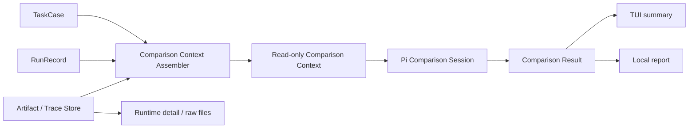

# Comparison Agent 设计

状态：当前模块设计

本文定义产品无关的 Comparison Agent。它读取历史任务、原始完成结果、candidate 结果和运行事实，自主判断用户最值得查看的差异，并生成简洁的比较说明。产品问题只涉及每个 candidate 与原始完成结果之间的差异；多个 candidate 可以共享一次 Experiment，但 Comparison 不据此建立候选间排名。它不是通用文档理解器，也不是固定格式的评分或可视化引擎。

## 1. 目标

Comparison 只回答一个问题：

> 在这个真实任务上，不同候选模型留下的结果和执行过程，哪些差异最值得用户查看？

用户不需要系统替自己给出统一质量分。Comparison 应提供有来源的观察和入口，让用户快速看到重要差异；更细的 runtime 过程和原始文件仍然可以由用户自行查看。

## 2. 模块边界



Comparison 负责：

- 从公共对象构造不可变的只读上下文；
- 通过基础只读工具查看 artifact、遥测和必要的运行事实；
- 自主选择需要检查的证据和需要说明的差异；
- 输出带证据引用的简短比较结果；
- 记录模型调用、工具调用和读取范围。

Comparison 不负责：

- 启动或控制 Runtime、Controller 或 Environment；
- 修改 TaskCase、RunRecord、trace 或 artifact；
- 预先规定所有任务都必须展示哪些指标；
- 生成统一质量分或替用户宣布胜者；
- 自动理解任意数据库、网页、GUI、Office 文档或其他未知格式；
- 生成复杂的通用可视化 DSL；
- 代替用户阅读完整 runtime 会话和原始文件。

## 3. Agent 设计

Comparison 使用一个独立的 Pi session。模型由用户配置，使用 Pi 的 provider API；它与 Controller、Recovery Agent 不共享会话。

核心能力来自 system prompt 和少量只读工具，而不是预设的任务分类或展示模板。system prompt 固定以下原则：

1. 先看能直接反映任务结果的证据，再看 Agent 自述；
2. 原始完成结果是历史基线，但不是要求复刻的标准答案，候选可以用不同方法完成任务；
3. 每个候选只与原始完成结果比较，不对多个候选做相互排名；
4. 区分历史会话中的声明、Runtime 实际记录、Harness 观察和确定性检查；
5. 只陈述能由上下文或工具结果支持的内容；
6. 不生成统一质量分，不替用户做最终价值判断；
7. 发现证据不足时明确说出缺失和限制；
8. 只输出少量最有区分度的观察，避免复述完整日志。

## 4. 基础工具

工具保持产品无关、只读和可审计。第一版只需要：

```ts
interface ComparisonTools {
  listArtifacts(input: {
    side?: "baseline" | "candidate";
    runId?: string;
  }): Promise<ArtifactCatalogView>;

  inspectArtifact(input: {
    artifactId: string;
  }): Promise<ArtifactMetadataView>;

  readArtifact(input: {
    artifactId: string;
    view?: "text" | "structured" | "binary-metadata";
    limit?: ReadLimit;
  }): Promise<ArtifactView>;

  compareArtifacts(input: {
    baselineArtifactId: string;
    candidateArtifactId: string;
    mode?: "auto" | "text" | "json";
    limit?: ReadLimit;
  }): Promise<ArtifactComparisonView>;

  readTelemetry(input: {
    runId?: string;
  }): Promise<TelemetryView>;
}
```

工具的职责是提供可靠的观察能力，不替 Agent 决定展示内容：

- `listArtifacts` 发现可用证据；
- `inspectArtifact` 获取类型、大小、hash、来源和可用性；
- `readArtifact` 读取隐私策略允许的受限内容；
- `compareArtifacts` 提供确定性文本/JSON 比较，Agent 决定是否使用以及如何解释；
- `readTelemetry` 提供原始过程事实。

不在核心工具中加入任意 shell、任意路径读取、写文件、启动 GUI 或通用 `renderPreview`。未来若确实需要某种安全预览，应作为独立、受限的工具能力增加，而不是预先建立展示框架。

## 5. 自由 Markdown 与薄完成信封

Comparison 的人类主产物是自由结构的 `comparison.md`。章节、长度、表格和 finding 数量由实际任务与证据决定；不要求模型把调查压入 `summary + observations[] + limitations[]` 固定模板。

机器接口只保留驱动持久化和渲染所需的薄信封：

```ts
type ComparisonEnvelope =
  | {
      status: "completed" | "insufficient_evidence";
      reportRef: EvidenceRef; // comparison.md
      evidenceRefs: EvidenceRef[];
    }
  | {
      status: "failed";
      errorCode: ComparisonErrorCode;
    };
```

- `completed`：Comparison 已完成可支持的比较报告；不表示存在赢家或统一质量结论。
- `insufficient_evidence`：Agent 完成了调查，但关键证据不足，报告应具体说明哪些维度不能比较；这是有效研究结果，不是调用失败。
- `failed`：Comparison 阶段自身未完成，不能伪装成证据不足。
- `reportRef` 和 `evidenceRefs` 必须属于当前 experiment/run，并由 Host 校验存在性、ownership、privacy 和可导航性。

RunOutcome、termination、模型身份、时间、token、成本和 cleanup 等事实由 Host 独立结构化持久化，不能从 Markdown 反向解析。`report.html` 由 Host 渲染：题头是任务一句话（case/run 降到 kicker）；接着是白名单渲染的 Comparison 正文；然后是同一套格子的基线/候选对照条（磁盘 / 结果 / 身份；基线无工作区快照时写明「仅有终稿」）；回放限制默认折叠。`html lang` 与 Host 壳文案都跟随 `initialInput` 的主要语言（现为中/英）；模型名、路径、终止码和 `sourceRootKind=` 保持原文。这与 TUI 的 `/lang` 无关。Comparison 正文应先写会改变「是否接受这次回放」的差异，不用「两次都完成了」当首句（除非确实没有结果差异）；对照表最多三行，列是「维度 | 基线 | 候选 | 是否影响使用」。Renderer 对白名单标记（`h1`–`h3`、段落、列表、加粗、斜体、行内代码、GFM 表、安全相对链接）做确定性渲染；其余文本转义。不重新解释结论，也不接受 Agent 产出的原始 HTML。`artifact:<id>` 仅在 catalog 拥有该附件时改写成相对路径。

## 6. Artifact 边界

Artifact 是证据，不是答案。原始 artifact 不可变并带有 content hash。确定性比较视图（例如文本 diff、JSON 差异）可以由工具即时生成，也可以作为带 provenance 的派生 artifact 保存；两者都不能覆盖原始内容。

第一版对文本、Markdown、文件列表、Git/普通 diff、图片、JSON 和遥测提供基础读取能力。未知类型仍保留在 catalog 中，至少展示 metadata、MIME/type、大小、hash、来源和 unavailable reason。

baseline 与 candidate 的配对由稳定的 `artifactKey` 完成，优先使用 logical role、规范化相对路径和 media type，不使用 staging 绝对路径。无法确定配对时并列展示，不让 Comparison Agent 猜测事实。

原始文件完整留在本地；`readArtifact` 和 `compareArtifacts` 按字节、行数、深度和总输出大小限制读取，并明确标记截断。外部模型是否能读取文本或图片由 `TaskCase.privacy` 和 Host 强制控制，默认不外发二进制。

## 7. TUI、报告与详细过程

查看深度分为三层：

1. **运行时 TUI**：运行期间显示 Harness、Controller 与 Target 的活动时间线。Controller 可展示 Pi Agent 正常产生的可见 assistant 内容、证据读取、工具活动和最终决定；系统不依赖或承诺获取模型隐藏 reasoning。实际发送的 `send.message` 独立突出并显示 delivery 状态。Runtime 详情第一版只读。
2. **Comparison 摘要**：运行结束后由 `report.html` 先展示白名单渲染后的 `comparison.md` 正文，再展示 Host 对照条与折叠的回放限制、文件入口。
3. **原始详情**：用户可以打开 runtime transcript、trace、artifact 和结果文件自行检查。Harness 自有格式必须可读，任意专有 artifact 不承诺深度渲染。

默认折叠只影响界面投影，不影响事件和 artifact 的持久化。Comparison 不读取或重写 Controller 内部 reasoning，只使用最终输入、结束决定及公共运行事实。完整用户路径和信息层级见 [TUI 与最小用户交互规划](../product/tui.md)。

## 8. 失败与降级

- Comparison Agent 调用失败：使用固定降级结果，列出 baseline/candidate 摘要、artifact catalog、遥测和错误原因；不改变 CandidateRun 状态。
- 工具读取失败或 artifact 缺失：对应观察标记 unavailable，不允许 Agent 补写内容。
- 单个文件过大或类型未知：保留 metadata 和安全引用，不阻塞其他证据。
- 薄信封 schema 非法：允许一次仅修复信封的重试；仍失败则记录 Comparison failure，不要求模型把 Markdown 重写为固定 JSON。
- 报告渲染失败：保留 `comparison.md`、薄信封和原始事实，用户仍可查看文件和 trace。

## 9. 安全与所有权

Comparison Agent 只能访问 Host 构造的只读 `ComparisonContext` 和经过校验的 artifact 引用。所有读取都检查 experiment/run ownership、路径范围、大小和 privacy policy。

报告在本机生成、给本机所有者查看，正文中的路径按原样保留以便用户直接打开；报告不提供任意路径打开能力，链接只指向 Harness 管理的 experiment 目录内文件。分享给他人时需要的去敏导出是独立动作，不在默认渲染路径内。

## 10. 最小实现顺序

1. 构造只读 `ComparisonContext` 和 artifact catalog；
2. 实现五个基础工具及读取限制；
3. 用 Pi session 调查证据、写入 `comparison.md`，并校验薄 `ComparisonEnvelope`；
4. 在 TUI 和本地报告中展示摘要及证据入口；
5. 实现 Agent 失败、缺失 artifact 和未知类型的固定降级；
6. 根据真实使用再增加具体 renderer 或工具，不提前建立展示插件体系。

## 11. 模块验收条件

- Comparison 不导入 Product Pack、RuntimePort 或产品私有事件类型；
- Agent 可自主选择证据和展示内容，不受固定 section taxonomy 约束；
- 所有观察都引用实际存在的证据，不能凭空生成 artifact 或数值；
- 工具只读、产品无关且受 privacy/ownership/size policy 约束；
- Comparison 失败不改变 CandidateRun 或 RunOutcome；
- TUI、报告和原始文件分别承担摘要、导航和详细检查职责；
- 只凭持久化 TaskCase、RunRecord、artifact、Host 事实、`comparison.md` 和薄信封即可重新生成本地报告。
