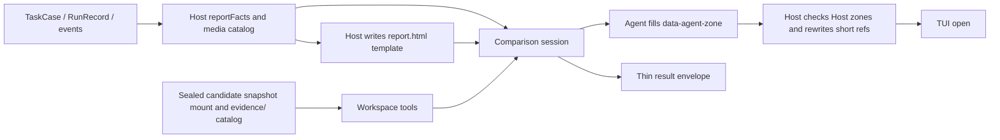

# Comparison Agent 设计

本文约束当前实现。未关闭验收见 [MASTER](../progress/MASTER.md)。卡面十秒可读；可见身份为历史会话 / 当前会话、不印写卡行、Token 直接对照。

状态：当前模块设计

Comparison 的 HTML 首屏是**真实任务比较卡**，取舍见[可分享任务比较卡](../decisions/accepted/2026-09-09-comparison-shareable-task-card.md)。Comparison 是产品无关的比较研究者。它从冻结的 baseline、Candidate RunRecord、事件与 catalog artifact 中调查差异，写出面向人类的比较卡；它不运行 Runtime、不修改实验状态，也不做跨任务排名。Comparison 由 TUI 结果段按 `c` 或 CLI `--compare` 显式启动，默认不调用。

## 数据流

## 输出与所有权

Agent 直接编辑 `report.html`，拥有 `data-agent-zone` 与 `data-agent-slot` 的 category、task、headline。第三轮开始前 Host 把完整模板写入 attempt 根 `report.html`（`writeAtomic`，不经 Agent 工具）。`data-host-zone` 为 style、header、metrics、cost-note、evidence、process；`data-agent-zone` 为 key-differences、visual-evidence、delivery、limitations；每个 Agent 区带一行用途注释，模板顶部注释列出可复制的组件原型与 `data-claim` 标记。可分享卡顺序为标题（类别一词与两个模型 ID）、Host 印的「任务描述 / 主要结论」与「历史会话 / 当前会话」、一句任务、一句差异、对照区、卡底时间 / Token / 费用。`reportFacts.models.baseline` 来自历史会话模型 ID，与候选模型 ID 写入标题和指标列名。`reportFacts.models.comparison` 是本次 Comparison Session 的 Harness 模型，写入 facts 与审计 JSON，不进可见卡面。发布页可见区域只有 `.share`；`delivery`、`limitations`、`cost-note`、`evidence`、`process` 留在 DOM 且 `hidden`。双方运行状态写入 `report-model.json` 和详细证据，不渲染可见 status 卡。Agent 决定对照形式，不得改 Host 区域，不得重写整页 CSS，不得引入外部网络资源。Host 保存 Host 区域快照（忽略 Agent 插槽正文），compose 后若 Host 区域被改，同一 Session 多一次修正委托，仍不一致则 `host_zone_modified`。审阅轮读取并修改 Agent 区域，最后一条消息交薄信封。发布页是该 HTML 经短引用替换后的原文，不是按 Report Model 重渲染的页面。`report-model.json` 只作审计。Host 不使用 sanitizer 或审美门禁。报告壳可见文案（`lang`、指标标签、缺失值、cost-note、诊断）随操作者 locale，表在 [`comparison-report-strings.ts`](../../src/application/comparison-report-strings.ts)，缺省 `zh`。

一次比较对应一个新的 `comparison-attempts/{attemptId}`，并只创建一个 Comparison Session。应用入口用 `newComparisonAttempt` 生成 `attemptId` 后调用一次 `compare()`。`comparePersistedFacts` 与 `ComparisonContext.attemptId` 必填；缺省不得回退 `task.caseId`，也不得在对照函数里临时生成。`cancel(attemptId)` 必填，只取消该 attempt 的 Session；无 id 不得取消全部。Host 在该 Session 内顺序发送理解、调查、创作 `report.html`；必要时再恢复 Host 区域；审阅轮可改 Agent 区域后交付薄信封。finalize 委托接受短的结构化信封；JSON 补救轮禁用工具。前几轮是自由文本，不解码 JSON；只有信封成功且 attempt 根存在 `report.html` 时才原子发布到实验根。失败或取消不覆盖旧成功报告。Comparison 请求使用 Host `timeoutMs: 0`（无请求截止）；取消与传输错误仍停止后续委托。

`candidate/` 是候选结束时封存的只读快照；快照未完成时该挂载标识为 unavailable，不是活动 `runs/{runId}`。资料索引与 `candidate/SNAPSHOT.txt` 写明 `snapshotStatus=complete|incomplete|unknown` 以及 cleanup 状态。`history/`、`turns/` 和 `evidence/` 分别提供历史过程、候选 settled turns 和 Host artifact。过程对照读拼接后的 `turns/*/user-view.md`。Harness Git sink 摘录在 `briefing/candidate/git-sink-manifest.json` 与 `briefing/candidate/git-sink-refs.txt`，按仓库相对路径给出 isolation、objectStore、completeness、issues 与初始/最终 refs，不是用户 GitHub，也不假设分支名。`objectStore=not_seeded` 与 `incomplete_object_store` 是源树对象库事实，不是能力差异。见 [Git 隔离不变量](../decisions/accepted/2026-09-11-git-isolation-invariants.md)。冻结 transcript 与本 run 事件在 attempt 根 `observations/`（`events/historical` 与 `events/run`）。`observations/user-inputs/INDEX.tsv` 在第一轮之前落盘，按顺序覆盖全部历史用户输入，路径落在 `observations/user-inputs/`，并用 `historical_user` / `controller` 区分来源。启动 `promptContent` 只给短委托、双方证据是否可用和 INDEX.md 导航，不内联完整 initial task。正文按需读取。HTML 规则与 `data-claim` 写在 compose 轮与模板注释；System Prompt 只保留身份、判断纪律与工作区。`key-differences` 必须非空，无法比较时须显式说明。三个内部角色复用工作区工厂；各角色注册本轮可执行的名字。Comparison 的 `allowWrite` 只认路径第一段 `scratch`、`work/comparison-plan.md` 与 `report.html`。调用前写入 `comparison.requested` 输入快照。

Agent 审阅信封只含 `status`、短名 `evidenceRefs`、可选 `headline`。Host 固定补齐 `reportPath: "report.html"`。HTML 用 `data-evidence-ref="ev-01"` 与 `data-media-ref="media-01"`，短名来自 `briefing/facts/evidence-index.json` 与 `facts/media.json`。证据索引最多 64 条，只收录历史最终回复、候选可见回复、关键 artifact 和用户可见交付；任意路径段上的 `.git`、缓存和构建内部目录不进入默认 links。`facts/context.json` 的 `changedPaths` 只含已索引交付路径。被截断数量写入 `changedPathsOmitted` 与 `facts/links-diagnostics.json`。短引用为 `ev-` 加 2 至 6 位数字。未知短名去掉链接或破图，并在 Host 证据区标记未解析；单个坏引用不失败。带 `data-claim="verified"` 的元素内、祖先，或紧随其后的证据锚点必须有可解析的 `data-evidence-ref`，否则 `evidence_unresolved`。带 `data-claim="visual"` 的元素必须有可用的 `data-media-ref`（同样允许紧随其后的媒体锚点），否则 `media_unavailable`。中英词表按 locale 作版式兜底：无可用媒体却声称视觉检查，或声称已核验而证据不可解析时写入 Host limitations 并仍发布；合同只认 `data-claim`。JSON 无法解析时保留已写页面，失败码 `invalid_envelope`。非标准但非空的 Agent zone 不得作为成功页发布；失败页保留草稿中的标准 Agent 区域与非标准分析。Host 区域按规范化结构比较，不比较原始 HTML 字符串。判空前剥离 HTML 注释，因此模板内 Agent 区注释不构成已填写内容，也不破坏 Host 快照。版式失败（缺 headline、空对照、首屏泄漏、分享卡标签、不成对图）由 Host 自修或追加 `data-host-limitation` 后仍发布。

Host 向 briefing 投影 `reportFacts` 与 `facts/media.json`。双侧始终带 `usageStatus`：`collected` / `not_collected` / `unknown`。无 token 也无费用为 `not_collected`；有费用或 usage 对象但无法合计 token 为 `unknown`。缺失数字不写成 0。`pricingStatus` 区分费用：`collected`、`not_collected`、`pricing_unavailable`、`unknown`。页面费用卡对应为金额、未采集、价格未配置、不可计算。模型 ID 先按 cc-switch 规则清洗（含去掉 `[1m]`），再查 `{dataDir}/model-pricing.override.json`（若存在）、钉住的 `pricing-catalog.json` 与显式别名（含 `deepseek-flash` → `deepseek-v4-flash`）。覆盖优先于快照；全 0 且未声明 `free: true` 视为价格未配置。命中时写 `pricingVersion`、`pricingModelId`、`pricingSource` 与 `pricingRates`。详细证据列出四类单价。`toolCostsIncluded=false`。网关角色映射不参与计价，同系列 SKU 不互相借用。Comparison 不读 Pi `cost`。自定义 openai-compatible 模型仍向 Pi 注册零费率 `cost`，见 [Pi 自定义模型必须带 cost](../decisions/accepted/2026-09-15-pi-custom-model-requires-cost.md)。缺失 usage 或费用不得写成 0。已注册且可用的图片在 Comparison 中允许 `read(format=image)`。`facts/media.json` 从封存历史图（含 `baseline.artifactRefs` 与 `cases/{caseId}/baseline-artifacts`）、候选快照交付与 `evidence/` 预览字节固化；无扩展名的 artifact 按魔数识别。Host 在 `visual-evidence` 预填成对 `pair-pages`，无法成对时写入明确原因；Agent 贴入的单侧图发布时由 Host 去掉并写入 limitations。指标时间以 `min` / `s` 展示。

## 事实纪律与安全

System Prompt 要求区分观察、推断和证据不足，并区分结果差异、过程差异、回放限制与配置差异。它禁止把预算、Runtime、Controller、隔离目录、stand-in workspace，或产品/工具/策略差误写成能力差异；禁止泄露凭据或环境变量值；报告默认离线，不得静默加载外部资源、发送网络请求、提交表单、修改用户文件或伪装系统界面。

这是一条 Agent 行为契约，不是 Host 内容过滤。分享报告或在更高风险环境打开报告是独立产品决策。

## 失败与导航

Comparison 失败、信封不合规或未写出 `report.html` 时，不改变 CandidateRun 或 RunOutcome。Host 写独立的 `comparison-failure.html`，与成功页共用模板外壳，并区分 provider / protocol / evidence / metrics / media / publication / cancelled；失败码含 `host_zone_modified`、`invalid_envelope`、`evidence_unresolved`、`media_unavailable`、`report_incomplete`、`publication_failed`。它绝不覆盖已发布的成功报告。TUI 只允许打开实验根目录的 `report.html` 或该失败页，并继续提供原始 trace/artifact 导航。

## 验收

- Comparison 不依赖 Product Pack、ProductRuntime 或产品私有事件类型。
- 成功 HTML 由 Agent 填写 Agent 区域与 category / task / headline 插槽、Host 保护 Host 区域并改写短引用后发布；对照区不固定条目数量；审阅轮可改页。
- 所有读取仍受 artifact ownership、路径、大小和 privacy policy 约束。
- 持久化事实、attempt 工作区、`report.html`、`report-model.json` 与薄信封足以审计本次比较。

