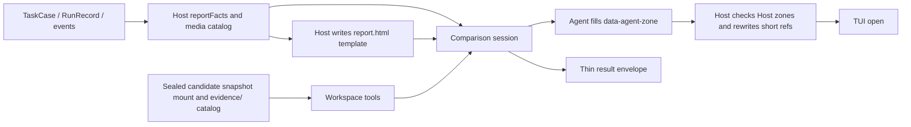

# Comparison Agent 设计

> 统一设计规划见 [Controller 与 Comparison Agent 统一设计规划](../plan/controller-comparison-agent-design.md)。

本文约束当前实现。未关闭验收见 [MASTER](../progress/MASTER.md)。

状态：当前模块设计

Comparison 的 HTML 首屏是**真实任务比较卡**，取舍见[可分享任务比较卡](../decisions/accepted/2026-09-09-comparison-shareable-task-card.md)。Comparison 是产品无关的比较研究者。它从冻结的 baseline、Candidate RunRecord、事件与 catalog artifact 中调查差异，写出面向人类的比较卡；它不运行 Runtime、不修改实验状态，也不做跨任务排名。Comparison 由 TUI 结果段按 `c` 或 CLI `--compare` 显式启动，默认不调用。

## 数据流

## 输出与所有权

Agent 直接编辑 `report.html`，只拥有 `data-agent-zone`。第三轮开始前 Host 写入完整模板：`data-host-zone` 为 style、header、status、metrics、cost-note、evidence、process；`data-agent-zone` 为 key-differences、visual-evidence、delivery、limitations。Agent 决定关键差异的数量与组件组合，不得改 Host 区域，不得重写整页 CSS，不得引入外部网络资源。Host 保存 Host 区域快照，并用与发布相同的区域抽取比较 compose 后的页面；若被改，同一 Session 多一次修正委托，仍不一致则 `host_zone_modified`。最后一轮禁用工具，只交薄信封。发布页是该 HTML 经短引用替换后的原文，不是按 Report Model 重渲染的页面。`report-model.json` 只作审计。Host 不使用 sanitizer 或审美门禁。所有权见[Host 区域与直接 HTML](../decisions/accepted/2026-09-13-comparison-host-zones-and-direct-html.md)与[指标壳](../decisions/accepted/2026-09-11-comparison-host-metrics-shell.md)。

一次比较对应一个新的 `comparison-attempts/{attemptId}`，并只创建一个 Comparison Session。应用入口用 `newComparisonAttempt` 生成 `attemptId` 后调用一次 `compare()`。`comparePersistedFacts` 与 `ComparisonContext.attemptId` 必填；缺省不得回退 `task.caseId`，也不得在对照函数里临时生成。Host 在该 Session 内顺序发送理解、调查、创作 `report.html`；必要时再恢复 Host 区域；最后一轮交付薄信封。finalize 委托在 Session 层禁用工具调用，只接受短的结构化信封；工具调用权限不是仅靠提示词约束。前几轮是自由文本，不解码 JSON；只有信封成功且 attempt 根存在 `report.html` 时才原子发布到实验根。失败或取消不覆盖旧成功报告。Comparison 请求使用 Host `timeoutMs: 0`（无请求截止）；取消与传输错误仍停止后续委托。

`candidate/` 是候选结束时封存的只读快照；快照未完成时该挂载标识为 unavailable，不是活动 `runs/{runId}`。资料索引与 `candidate/SNAPSHOT.txt` 写明 `snapshotStatus=complete|incomplete|unknown` 以及 cleanup 状态，见[封存快照](../decisions/accepted/2026-09-10-comparison-sealed-snapshot.md)。`history/`、`turns/` 和 `evidence/` 分别提供历史过程、候选 settled turns 和 Host artifact。过程对照读拼接后的 `turns/*/user-view.md`。Harness Git sink 摘录在 `briefing/candidate/git-sink-manifest.json` 与 `briefing/candidate/git-sink-refs.txt`，按仓库相对路径给出 isolation、objectStore、completeness、issues 与初始/最终 refs，不是用户 GitHub，也不假设分支名。`objectStore=not_seeded` 与 `incomplete_object_store` 是源树对象库事实，不是能力差异。见 [Git 隔离不变量](../decisions/accepted/2026-09-11-git-isolation-invariants.md) 与 [Git sink catalog](../decisions/accepted/2026-09-11-git-sink-catalog.md)。冻结 transcript 与本 run 事件在 attempt 根 `observations/`（`events/historical` 与 `events/run`）。`observations/user-inputs/INDEX.tsv` 在第一轮之前落盘，按顺序覆盖全部历史用户输入，路径落在 `observations/user-inputs/`，并用 `historical_user` / `controller` 区分来源。启动 `promptContent` 只给短委托、双方证据是否可用、`briefing/facts/context.json` 指针和资料导航，不内联完整 initial task。正文按需读取。三个内部角色复用工作区工厂；各角色注册本轮可执行的名字，见 [工作集与观察文件](../decisions/accepted/2026-09-07-recovery-working-set-and-observation-files.md) 与 [协作工具面](../decisions/accepted/2026-09-10-controller-collaboration-workspace-tools.md)。Comparison 的 `allowWrite` 只认路径第一段 `scratch`、`work/comparison-plan.md` 与 `report.html`。调用前写入 `comparison.requested` 输入快照。

Agent 审阅信封只含 `status`、短名 `evidenceRefs`、可选 `headline`。Host 固定补齐 `reportPath: "report.html"`。HTML 用 `data-evidence-ref="ev-01"` 与 `data-media-ref="media-01"`，短名来自 `briefing/facts/evidence-index.json` 与 `facts/media.json`。未知短名去掉链接或破图，并在 Host 证据区标记未解析；单个坏引用不失败。仅当关键差异声称已核验且其中引用的证据短名全部无效时才 `evidence_unresolved`。引用的媒体短名全部不可用时才 `media_unavailable`。JSON 无法解析时保留已写页面，失败码 `invalid_envelope`。

Host 向 briefing 投影 `reportFacts` 与 `facts/media.json`。双侧始终带 `usageStatus`：`collected` / `not_collected` / `unknown`。无 token 也无费用为 `not_collected`；有费用或 usage 对象但无法合计 token 为 `unknown`。缺失数字不写成 0。只要已有完整 Token 和可识别模型，就必须算出费用。有费用时写 `pricingVersion`；`toolCostsIncluded=false`（只含模型 token 单价）。见 [usage 三态](../decisions/accepted/2026-09-12-comparison-usage-status.md)。时间、token、费用算法见 [指标壳](../decisions/accepted/2026-09-11-comparison-host-metrics-shell.md)。已注册且可用的图片在 Comparison 中允许 `read(format=image)`。

## 事实纪律与安全

System Prompt 要求区分观察、推断和证据不足，并区分结果差异、过程差异、回放限制与配置差异。它禁止把预算、Runtime、Controller、隔离目录、stand-in workspace，或产品/工具/策略差误写成能力差异；禁止泄露凭据或环境变量值；报告默认离线，不得静默加载外部资源、发送网络请求、提交表单、修改用户文件或伪装系统界面。

这是一条 Agent 行为契约，不是 Host 内容过滤。分享报告或在更高风险环境打开报告是独立产品决策。

## 失败与导航

Comparison 失败、信封不合规或未写出 `report.html` 时，不改变 CandidateRun 或 RunOutcome。Host 写独立的 `comparison-failure.html`，与成功页共用模板外壳，并区分 provider / protocol / evidence / metrics / media / publication / cancelled；失败码含 `host_zone_modified`、`invalid_envelope`、`evidence_unresolved`、`media_unavailable`、`report_incomplete`、`publication_failed`。它绝不覆盖已发布的成功报告。TUI 只允许打开实验根目录的 `report.html` 或该失败页，并继续提供原始 trace/artifact 导航。

## 验收

- Comparison 不依赖 Product Pack、ProductRuntime 或产品私有事件类型。
- 成功 HTML 由 Agent 填写 Agent 区域、Host 保护 Host 区域并改写短引用后发布；关键差异区域不固定条目数量。
- 所有读取仍受 artifact ownership、路径、大小和 privacy policy 约束。
- 持久化事实、attempt 工作区、`report.html`、`report-model.json` 与薄信封足以审计本次比较。

