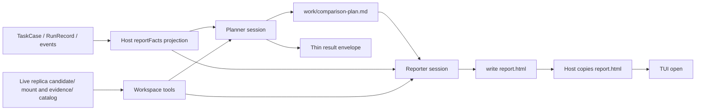

# Comparison Agent 设计

状态：当前模块设计

Comparison 是产品无关的比较研究者。它从冻结的 baseline、Candidate RunRecord、事件与 catalog artifact 中调查差异，输出供用户自行判断的本地报告；它不运行 Runtime、不修改实验状态，也不排名候选。Comparison 由 TUI 对照门或 CLI `--compare` 显式启动，默认不调用。

## 数据流

## 输出与所有权

Comparison Agent 是成功报告的唯一作者。它用 `write` 把完整、自包含的 HTML 写到报告沙箱根 `report.html`；可自由使用 HTML、CSS、SVG 与有价值的本地 JavaScript。Host 校验后把字节拷到实验根，不使用 sanitizer、标签白名单、HTML AST 重写、固定模板或内容门禁。

一次比较对应一个新的 `comparison-attempts/{attemptId}`。Planner 与 Reporter 是同一 role 的两个独立 session：Planner 调查应比较的结果对象和过程片段，把可变计划写入 `work/comparison-plan.md`；Reporter 从短 orientation、INDEX 和当时计划重新开始，可以否定或重写计划。Planner 失败时 Reporter 仍继续，计划状态明确为 `ready`、`partial_unverified` 或 `unavailable`。只有 Reporter 生成的本 attempt HTML 会原子发布；失败不覆盖旧成功报告。

`candidate/` 是 run 结束后仍保留的隔离副本的只读挂载；`history/`、`turns/` 和 `evidence/` 分别提供历史过程、候选 settled turns 和 Host artifact。短 briefing 只保存索引、facts、link catalog 与完整 process index，正文按需读取。Comparison 与 Recovery 为八工具；Controller 为七工具，见 [Controller 七工具](../decisions/accepted/2026-09-03-controller-seven-workspace-tools.md)。调用前写入兼容事件 `comparison.requested`，并为两个阶段分别写入 `comparison.plan_requested` / `comparison.report_requested` 输入快照。

薄信封保存 `status`、固定的 `reportPath: "report.html"`、`evidenceRefs`、可选 `limitationCodes` 与可选 `headline`（TUI 一行差，Host 不从 HTML 抽取）。Host 检查信封 schema、证据归属和报告文件可读性，但不检查页面的章节、视觉组件或指标是否出现。

Host 向 briefing 投影 `reportFacts`。缺失值保持缺失。System Prompt 要求用到某项硬数时写“未采集”或“不可判定”，不得写成零或估价；不要求把全部 `reportFacts` 摊在首屏。报告形式由 Agent 按本次差异自定。

## 事实纪律与安全

System Prompt 要求区分观察、推断和证据不足，并区分结果差异、过程差异与回放限制。它禁止把预算、Runtime、Controller、隔离目录或 stand-in workspace 误写成能力差异；禁止泄露凭据或环境变量值；报告默认离线，不得静默加载外部资源、发送网络请求、提交表单、修改用户文件或伪装系统界面。

这是一条 Agent 行为契约，不是 Host 内容过滤。分享报告或在更高风险环境打开报告是独立产品决策。

## 失败与导航

Comparison 失败、信封不合规或未写出 `report.html` 时，不改变 CandidateRun 或 RunOutcome。Host 写独立的 `comparison-failure.html`，用于解释失败并导航到 trace 与 artifacts；它绝不覆盖成功的 Agent 报告。TUI 只允许打开实验根目录的 `report.html` 或该失败页，并继续提供原始 trace/artifact 导航。

## 验收

- Comparison 不依赖 Product Pack、RuntimePort 或产品私有事件类型。
- 成功 HTML 可包含 Agent 选择的任意页面结构，且被原样保存。
- 所有读取仍受 artifact ownership、路径、大小和 privacy policy 约束。
- 持久化事实、阶段输入快照、attempt 工作区、`report.html` 与薄信封足以审计本次比较。
