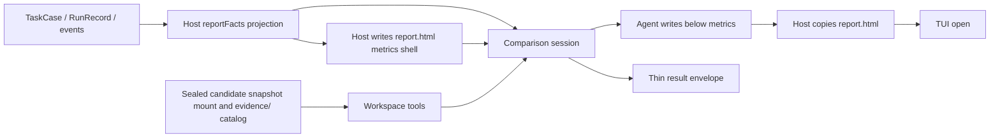

# Comparison Agent 设计
`r`n> 统一设计规划见 [Controller 与 Comparison Agent 统一设计规划](../plan/controller-comparison-agent-design.md)。`r`n
本文约束当前实现。未关闭验收见 [MASTER](../progress/MASTER.md)。

状态：当前模块设计

Comparison 的 HTML 首屏是**真实任务比较卡**，取舍见[可分享任务比较卡](../decisions/accepted/2026-09-09-comparison-shareable-task-card.md)。Comparison 是产品无关的比较研究者。它从冻结的 baseline、Candidate RunRecord、事件与 catalog artifact 中调查差异，写出面向人类的比较卡；它不运行 Runtime、不修改实验状态，也不做跨任务排名。Comparison 由 TUI 结果段按 `c` 或 CLI `--compare` 显式启动，默认不调用。

## 数据流

## 输出与所有权

Comparison Agent 是卡下内容的作者。第三轮开始前 Host 把 `report.html` 写成壳：标题槽、一句任务槽、`data-host="metrics"` 三张卡（时间 / token / 费用，数字已按投影填好）。Agent 用 `write` 改标题和任务句，并在卡下追加完整、自包含的 HTML；可自由使用 HTML、CSS、SVG 与有价值的本地 JavaScript。Host 校验薄信封、报告可读性，以及 metrics 块数字与投影一致；数字被改过则该次 attempt 失败，不发布。Host 不使用 sanitizer、标签白名单、HTML AST 重写或审美门禁，也不解析关键差异 DOM。所有权见[指标壳](../decisions/accepted/2026-09-11-comparison-host-metrics-shell.md)。

一次比较对应一个新的 `comparison-attempts/{attemptId}`，并只创建一个 Comparison Session。应用入口只调用一次 `compare()`。Host 在该 Session 内顺序发送四条工作委托：理解任务、调查与准备、创作 `report.html`、审阅并交付薄信封。前三轮是自由文本，不解码 JSON；只有第四轮成功且 attempt 根存在 `report.html` 时才原子发布到实验根。失败或取消不覆盖旧成功报告。Comparison 请求使用 Host `timeoutMs: 0`（无请求截止）；取消与传输错误仍停止后续委托。

`candidate/` 是候选结束时封存的只读快照；快照未完成时该挂载标识为 unavailable，不是活动 `runs/{runId}`。资料索引与 `candidate/SNAPSHOT.txt` 写明 `snapshotStatus=complete|incomplete|unknown` 以及 cleanup 状态，见[封存快照](../decisions/accepted/2026-09-10-comparison-sealed-snapshot.md)。`history/`、`turns/` 和 `evidence/` 分别提供历史过程、候选 settled turns 和 Host artifact。过程对照读拼接后的 `turns/*/user-view.md`。Harness Git sink 摘录在 `briefing/candidate/git-sink-manifest.json` 与 `briefing/candidate/git-sink-refs.txt`，按仓库相对路径给出 isolation、objectStore、completeness、issues 与初始/最终 refs，不是用户 GitHub，也不假设分支名。`objectStore=not_seeded` 与 `incomplete_object_store` 是源树对象库事实，不是能力差异。见 [Git 隔离不变量](../decisions/accepted/2026-09-11-git-isolation-invariants.md) 与 [Git sink catalog](../decisions/accepted/2026-09-11-git-sink-catalog.md)。冻结 transcript 与本 run 事件在 attempt 根 `observations/`（`events/historical` 与 `events/run`）。`observations/user-inputs/INDEX.tsv` 在第一轮之前落盘，按顺序覆盖全部历史用户输入，路径落在 `observations/user-inputs/`，并用 `historical_user` / `controller` 区分来源。启动 `promptContent` 只给短委托、双方证据是否可用、`briefing/facts/context.json` 指针和资料导航，不内联完整 initial task。正文按需读取。三个内部角色复用工作区工厂；各角色注册本轮可执行的名字，见 [工作集与观察文件](../decisions/accepted/2026-09-07-recovery-working-set-and-observation-files.md) 与 [协作工具面](../decisions/accepted/2026-09-10-controller-collaboration-workspace-tools.md)。Comparison 的 `allowWrite` 只认路径第一段 `scratch`、`work/comparison-plan.md` 与 `report.html`。调用前写入 `comparison.requested` 输入快照。

薄信封保存 `status`、固定的 `reportPath: "report.html"`、`evidenceRefs`、可选 `limitationCodes` 与可选 `headline`（TUI 一行差，Host 不从 HTML 抽取）。Host 检查信封 schema、证据归属、报告文件可读性和 metrics 块数字，但不检查页面其余章节或视觉组件。可引用的 ref 包括 briefing 投影以及 Host 挂载的 `observations/` 与 process-index 事件；夹杂的未知 ref 丢掉，全部未知则拒绝。

Host 向 briefing 投影 `reportFacts`。缺失值保持缺失。时间、token、费用按 [指标壳](../decisions/accepted/2026-09-11-comparison-host-metrics-shell.md) 的算法双侧投影；TUI 结果行与卡读同一套。System Prompt 要求用到某项硬数时写“未采集”或“不可判定”，不得写成零或估价。卡下报告形式由 Agent 按本次差异自定。对照入口读取已提交事实与封存快照，走同一条四轮路径，不依赖原进程、内存 RecoveryAttempt 或活动 Runtime。

## 事实纪律与安全

System Prompt 要求区分观察、推断和证据不足，并区分结果差异、过程差异、回放限制与配置差异。它禁止把预算、Runtime、Controller、隔离目录、stand-in workspace，或产品/工具/策略差误写成能力差异；禁止泄露凭据或环境变量值；报告默认离线，不得静默加载外部资源、发送网络请求、提交表单、修改用户文件或伪装系统界面。

这是一条 Agent 行为契约，不是 Host 内容过滤。分享报告或在更高风险环境打开报告是独立产品决策。

## 失败与导航

Comparison 失败、信封不合规或未写出 `report.html` 时，不改变 CandidateRun 或 RunOutcome。Host 写独立的 `comparison-failure.html`，用于解释失败并导航到 trace 与 artifacts；它绝不覆盖成功的 Agent 报告。TUI 只允许打开实验根目录的 `report.html` 或该失败页，并继续提供原始 trace/artifact 导航。

## 验收

- Comparison 不依赖 Product Pack、ProductRuntime 或产品私有事件类型。
- 成功 HTML 在 Host 指标壳之下可包含 Agent 选择的任意页面结构，且被原样保存。
- 所有读取仍受 artifact ownership、路径、大小和 privacy policy 约束。
- 持久化事实、attempt 工作区、`report.html` 与薄信封足以审计本次比较。
