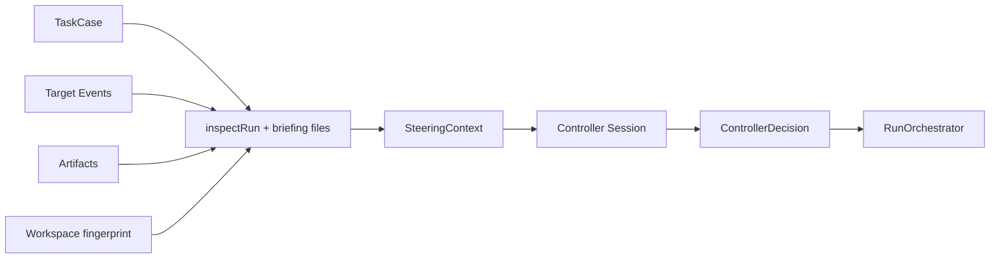

# 同等人类能力与 Controller 设计

本文约束当前实现。未关闭验收见 [MASTER](../progress/MASTER.md)。

状态：当前模块设计

类型以 [`controller-agent.ts`](../../src/agents/controller-agent.ts) 的 `SteeringContext` / `ControllerDecision` 为准，不在本文维护 TypeScript 副本。

## 1. 模块目标

Controller 回答一个问题：

> 面对候选 Agent 当前已经产生的轨迹，一个与原用户能力、目标和约束相当的人，接下来最合理会输入什么？

它不重放原用户的固定文本，不替 Target Agent 做任务，也不裁判模型分数。它只在 Target 到达稳定输入边界后返回一条普通用户消息，或说明为什么应结束。

```text
原始 TaskCase
+ Host 用户视图快照（current-user-view.md）
+ 用户可访问材料（按需）
+ 已发送的用户消息
+ Host 固定权限
          ↓
      Controller
          ↓
 send(message) | done(reason)
```

## 2. 模块边界



Controller 模块负责：

- 从 `TaskCase` 与 Host briefing 构造历史任务视图；
- 接收 Runtime/Environment 已采集的事实（`inspectRun` 写入 `changedPaths`、产物路径、用户可见表面）；
- 管理本 CandidateRun 的 Controller session；
- 调用 Pi Agent Host 并验证结构化输出；
- 返回 `ControllerDecision`；
- 为每次决策生成可追溯事件和上下文引用。

Controller 模块不依赖具体 Product Pack。ProductHistoryReader 和 ProductRuntime 先把产品私有数据转换成公共会话与 turn 事实；Host 再组装 briefing 与 `SteeringContext`。Codex、Claude Code 或其他产品不会获得不同的 Controller 上下文规则。

Controller 模块不负责：

- 发现、安装或解析 Agent Runtime；
- 读取或解释产品私有 session、JSONL、hook 或 CLI 输出；
- 判断进程是否真正 accepted、started 或 settled；
- 恢复、复制、修改或清理任务环境；
- 调用 Target Agent 的工具；
- 生成公共质量分或覆盖原始 trace；
- 代替真实用户授权高影响操作。

## 3. “同等人类能力”的操作定义

等价的是能力条件，不是消息文本。对一个 `TaskCase` 的不同 CandidateRun，固定：

- 原始用户已经表达的目标、事实、偏好和约束；
- 用户在原会话中表现出的协作能力和验收习惯；
- 用户正常能够看到的任务环境与产物；
- Controller 的模型、system prompt、工具能力和配置；
- 安全边界与默认运行预算。

Controller 模型由用户从自己通过 Pi 可用的 provider 与模型中选择。Harness 不指定、捆绑、推荐或评价某个 Controller 模型。该配置属于 `ExperimentSpec`，在首个候选运行前解析一次；每个 CandidateRun 创建独立 Controller session，但同一 Experiment 的所有候选使用同一份 `ResolvedAgentConfig`，不共享隐藏状态。

不固定：

- 后续用户消息的具体文字；
- 消息出现的轮次；
- 候选 Agent 自己已经发现的信息；
- 因候选轨迹不同而产生的纠正、确认和验收请求。

Controller 可以直接读取原始会话，并自主判断哪些历史内容表达用户能力、哪些只属于原轨迹。行为边界由 system prompt、只读观察能力和 trace 可追溯性保证。

## 4. 实验条件

本文 §4 子节与独立「实验条件」专题旧稿 **§1–§8** 一一对应为 **§4.1–§4.8**。ADR 正文中的裸「§N」（如 §4–§5、§6、「第 6 条」）指旧稿 §N，即本文 **§4.N**（「第 6 条」= §4.1 第 6 条）。

### 4.1 已确认结论

1. Controller 模型由用户配置，直接复用 Pi provider 与 model API。
2. 「固定 Controller」指同一 Experiment 内将 Controller 作为控制变量；每个 CandidateRun 使用独立 session，候选共享同一份已解析 `ResolvedAgentConfig`。
3. Pi Agent Host 随项目正常更新，不作为被测变量。
4. Controller 必须通过 briefing 与工具访问 TaskCase 中的完整原始会话；Target Runtime 收到的用户消息全部由 Controller 写出，包括第一句。
5. 「同等人类能力」只能被操作化，不声称精确预测真实用户在反事实情境中的唯一输入。
6. 完整原始会话的使用边界由 canonical system prompt 限制：用户句是协作与验收习惯的证据，不是必须按序打完的队列；停止条件是这个人面对当前轨迹会不会停。历史后续轨迹用于理解目标、知识、偏好和协作方式，不得把原 Agent 后来调查得到的答案或实现路径当作用户原本知道的事实直接提供给候选。候选第一条用户消息的任务形状须与 `initialInput` 同类，且不得引用候选尚未写出的建议、优先级或清单；见[开场不得引用未发生的候选建议](../decisions/accepted/2026-09-16-controller-opening-no-unseen-advice.md)。Controller 只在候选 turn 稳定完成后，先看 Host 的用户视图快照，再按需读取用户可访问材料。
7. Harness 不捆绑、推荐或评价 Controller 模型。

### 4.2 实验内固定与配置归属

用户在创建 Experiment 时选择 Controller provider、模型及必要参数。Harness 在首个候选运行前解析得到 `ResolvedAgentConfig`；所有候选各自创建 session，但引用同一配置快照。

固定的是实验条件：请求与解析后的模型身份、canonical system prompt hash、工具能力边界、原始会话可见范围、可选 Agent 预算、上下文压缩策略与 privacy 策略。不要求实际行为相同：不同候选的决策次数、token、成本、延迟、工具调用与压缩时刻可以不同，这些差异进入 trace。

Controller 配置属于 `ExperimentSpec`，在首个候选运行前解析；Recovery 配置保存在 `TaskCase.provenance`；Comparison 配置在比较调用前解析。setup 默认值后来变化不能静默覆盖这些快照。Harness 不保存 provider secret，只保存 Pi 能安全持久化的标识、请求模型、解析后身份、非敏感参数与配置 hash。

### 4.3 Pi Agent Host 版本

Pi Agent Host 是实现基础设施，不是需要恢复的历史 Agent Runtime。RunManifest 记录 Harness 版本或构建标识、Pi 依赖版本与 Controller prompt hash，供问题排查；同一正在执行的 Experiment 默认由当前安装版本完成。

### 4.4 Controller 工具集合

Controller 工具让扮演用户的模型能看见隔离副本，并像真人一样修改工作区文件、调查其他可读材料。注册集合等于可执行集合：`ls`/`read`/`grep`/`find`/`edit`/`write`/`shell_exec`，含 `shell_exec`，不含 `read_observation`。不能绕过 Target Runtime 执行任务。

Host 把工作区工具挂在 briefing 根上。`project/` 是隔离副本挂载：`edit`/`write` 仅允许该挂载下的文件；briefing 根拒写。`ls`/`read`/`grep`/`find` 与 `shell_exec` 读取不受工作区 containment 限制。不按工具调用次数截断；上下文走 Pi 压缩。

工具边界：不得用 `edit`/`write` 写用户源目录、不得调用 Target 工具、不得直接改 CandidateRun 状态机；发给候选的唯一用户输入仍是信封 `message`。路径、读取范围、类型和大小在 Host 边界验证。工具能力配置在同一 Experiment 的候选间一致，实际调用次数不要求一致。

`project/` 可读范围是整棵隔离副本；用户可见表面由 `current-user-view.md` 承担。Controller 对 `project/` 的 Host 控制写入记入 `controller.workspace_write` 与 `run/controller-writes.jsonl`。shell 在副本外的写入记入 `controller.external_write`，并出现在 Comparison 输入的 `controllerExternalWritePaths`。

### 4.5 原始会话可见范围

Controller 对原始会话采用「完整可访问」，而不是「每轮把所有 token 永久塞进 prompt」。

- 完整 transcript 是不可变事实源；`history/` 下按需 `read`，由 Controller 决定是否说、怎么说；
- Host 不因「还有未使用的历史用户句」拒绝 `done`，也不按序强制投递；
- `current.summary` 只指向 `current-user-view.md` 与结算状态；
- opening 与 steering 读取 briefing 材料时记 `source=briefing_read` 的 observation evidence；
- `privacy.allowModelText` 是化石键，读取恒为允许正文；凭据仍走 `redactModelVisibleText`。见 [allowModelText 化石](../decisions/accepted/2026-09-16-allow-model-text-fossil.md)。

默认上下文组装：

```text
opening：决策段 + 完整 INDEX.md
steering：决策段 + Latest turn 行（不重发 INDEX.md）
+ current-user-view.md / permissions.txt（Host 快照）
+ briefing 上的 history/user-inputs/、history/、run/turns/、THIS-TURN（按需 read）
+ project/ 隔离副本与 notes/ 工作笔记（按需 read；edit/write 可写）
→ 模型可见输入；SteeringContext 其余字段（含 budget）供 Host 校验，不 JSON 进 prompt
```

窗口不够时靠 Pi 压缩，不以摘要替代磁盘原文。不同 CandidateRun 各自从同一个不可变 transcript 开始，不能看到其他候选轨迹或 Comparison 结果。

### 4.6 Controller 预算

Controller、Recovery 和 Comparison 的资源预算默认均不设上限。`timeoutMs: 0` 表示单次调用不设定时器，仍可由用户取消或 session abort 结束。结构化输出修复只在同一次 `append` 已返回但信封不合规时发生；超时或 `append` 抛错不得在同一条 Pi session 上立刻再 `prompt()`。

```ts
interface AgentBudget {
  maxCalls?: number;
  maxTokens?: number;
  maxCost?: number;
  callTimeoutMs: number;
  maxStructuredRepairAttempts: number;
  maxProviderRetries: number;
}
```

- `maxCalls`、`maxTokens` 和 `maxCost` 默认未设置；
- `maxStructuredRepairAttempts` 限制 schema 修复调用，`maxProviderRetries` 限制瞬时 provider 错误重试；两者分别计数且保持很小；
- `callTimeoutMs` 仅在用户显式配置时限制单次调用；实际 Host 调用为 `timeoutMs: 0`；
- `RunPolicy` 只约束 Target Runtime（见 [RunPolicy 只约束 Target](../decisions/accepted/2026-09-16-runpolicy-target-only-safety-valves.md)）；Controller 决策次数只用 `controller.budget.maxCalls`（未设置则不截断）。

所有候选使用相同的显式 Agent 预算配置（默认均为无限制），但实际消费分别记录。Controller token、成本和耗时必须与 Target 指标分开。若用户配置了 Agent 预算，上限耗尽是独立终止原因，不能伪装成 `done` 或任务完成。

### 4.7 上下文压缩

第一版直接复用 Pi 的上下文管理和压缩能力。同一 Experiment 固定压缩策略，而不是压缩结果：每个候选拥有独立 Controller session；system prompt、任务目标、安全边界、当前 turn 和 Controller 已发送消息具有更高保留优先级；较早的候选轨迹可以压缩，但 trace 与 artifact 引用必须保留；原始 transcript 始终可通过只读工具重新读取。

### 4.8 操作化表述

> Harness 使用用户选择且在 Experiment 内保持一致的 Controller 配置。Controller 基于完整原始会话、同一任务事实、当前候选轨迹、用户可见表面和隔离副本（可 edit/write），模拟具有原用户目标、知识、偏好、权限和实际协作能力的用户，动态生成下一条输入。

这是一种可记录、可解释的操作化条件，不是对真实用户反应的证明。报告应显示 Controller 的请求模型、解析后身份、配置 hash、工具能力、预算配置（默认无限制）和压缩策略。

## 5. TaskCase（任务胶囊）视图

`TaskCase` 是 Controller 的历史事实来源。字段以 [`src/core/schema.ts`](../../src/core/schema.ts) 为准。Controller 不重新提炼一份替代 transcript 的任务说明；briefing 提供 `history/user-inputs/`、`initial-input.txt` 与按需可读材料。

### 5.1 完整会话与 initialInput

用户选择的完整逻辑会话就是 TaskCase 表示的任务。Controller 必须同时理解两种不同用途：

```text
TaskCase.initialInput             TaskCase.transcript
─────────────────────┬────────────────────────────────────────
冻结的原用户任务句（只读考卷）     理解用户协作能力与历史结果的完整证据
```

- `initialInput` 是 Case Preparation 从完整会话选出的第一条用户任务句（跳过产品注入的指令块）；
- Target Runtime 收到的每一条用户消息都由 Controller 写出，包括第一句；Host 不把 `initialInput` 原文投递给候选；
- Controller 可以读取完整 transcript，并根据候选当前表现决定是否需要提出历史中类似的纠正、补充或验收输入；
- 历史会话结束不是候选运行的停止边界。

Controller 不选择会话内任务边界，也不为 Target 补造会话开始前上下文。resume、fork 或 parent session 是否属于同一个逻辑会话，由 ProductHistoryReader 在导入时确定并留下 provenance。

### 5.2 用户能力证据

Controller 可以从原会话自然理解：

- 用户知道的业务和技术事实；
- 用户偏好的范围、风格和取舍；
- 用户愿意授权或拒绝的动作；
- 用户通常如何纠偏、要求验证和确认完成；
- 用户实际能查看的文件、页面、命令输出或其他产物。

`taskContext` 可以包含用户确认的备注或导入 Agent 的摘要，但摘要不能替代原始 transcript。推断内容保留 provenance，不能伪装成用户明确说过的话。

### 5.3 BaselineEvidence

Baseline 保存原始完成结果，是候选结果的比较对象，但不是要求复刻的标准答案。更强的候选模型可以采用不同路径、产生更好的结果，Controller 不应把原 Agent 后来调查得到的答案或实现路径当作用户原本知道的事实直接提供给候选。这个边界由 canonical system prompt 约束，不增加未来信息检测或第二审查 Agent。

历史产物缺失时，Controller 只能依据仍然存在的消息和引用；不得把缺失的文件、截图或检查结果补造成事实。

## 6. Target Runner 交互生命周期

TargetRunner 的公共协议定义在[架构总览](./overview.md)。从 Controller 视角，一轮协作经历：

```text
Controller opening send persisted
→ RunOrchestrator 调用 start（正文是 Controller 的 message）
→ delivery accepted
→ Target started（可能稍后发生）
→ Target 输出消息、调用工具和修改环境
→ TargetRunner 产生 TurnSettlement
→ RunOrchestrator 进入 awaiting_controller
→ Observation Assembler 构造 SteeringContext
→ Controller 返回 send 或 done
```

候选进程与 Controller session 在准备阶段一同拉起。第一条用户输入之前，首次 `decide` 在本 run 的同一 Session 内先做一轮自由理解（读取完整历史用户输入，不交决策信封），再返回 opening `send`。没有独立 Understanding schema 或账本。Controller 只在 `awaiting_controller` 上做后续决策，并先看 Host 生成的 `current-user-view.md`。以下都不能触发后续决策：

- Runtime 只接受了消息但 turn 尚未开始；
- 模型刚输出一段流式文本；
- 工具仍在运行；
- Runtime 的 transport 暂时静默；
- Harness 尚未确认 delivery；
- CandidateRun 已进入 `finalizing` 或 `finished`。

### 6.1 可产生决策的 settlement

```ts
type TurnSettlementStatus =
  | "completed"
  | "waiting_input"
  | "failed"
  | "aborted";
```

- `completed`：Target 结束当前 agentic turn，可判断继续、验收或停止；
- `waiting_input`：Target 明确要求澄清、确认或权限决定；
- `failed`：Controller 可以在仍有正常用户可提供的信息时纠正，否则结束；
- `aborted`：通常结束，不自动生成一条假用户消息恢复运行。

Runtime 产品的 turn 数和模型调用数不等价。Controller 的一次决策对应一个稳定用户输入边界，而不是某个固定模型调用次数。

### 6.2 approval 与真实用户决定

如果 Target 等待的是低风险、可逆且原会话已体现授权倾向的普通选择，Controller 可以发送自然语言确认。遇到真实发布、删除、付款、权限扩大、数据迁移或其他高影响动作，而原会话没有明确授权时，Controller 必须返回：

```ts
{ type: "done", reason: "requires_real_user_decision" }
```

Controller 不直接调用 Runtime 的 approval API；它只能通过普通用户消息表达原用户有能力作出的决定。

### 6.3 delivery unknown

`DeliveryReceipt.delivery === "unknown"` 时，RunOrchestrator 不会调用 Controller 生成替代消息。它先要求 ProductRuntime 核查旧 message/turn；仍无法确认则进入 `finalizing`。这样避免同一纠正或授权被发送两次。

## 7. 观察与工具面

Controller 不能只读 Target 的最终自述。Host 把工作区工具挂在 briefing 根上，`project/` 可写挂载隔离副本，`notes/` 可写工作笔记；读取工具与 `shell_exec` 可以访问当前进程可读路径。不注册名为 Observation Adapter 的组件。

当前事实供给：

- [`inspectRun`](../../src/application/controller-queries.ts) 从事件与 fingerprint 派生 `changedPaths`、产物路径、usage 与用户可见表面；
- 文件入口是 `current-user-view.md`、`THIS-TURN.txt`、`changed-paths.txt` 与 INDEX；`notes/` 是 Controller 工作笔记，Host digest 不收录；
- 成功 `read` 记 `controller.observation_read`；`edit`/`write` 记 `controller.workspace_write`；shell 在副本外的写入记 `controller.external_write`。

Controller 需要 Target 建立证据时发送 `verify` 消息；报告由 Comparison 写 `report.html`。

## 8. SteeringContext

Host 每次结构化 `append` 给模型的用户消息是英文决策段，不是本对象的 JSON。opening 附完整 INDEX.md；steering 只附 `Latest turn:` 行，不重发 `# INDEX.md`。首次 `decide` 另有一轮自由理解委托，结论写入 `notes/understanding.md`。`current-user-view.md` 是用户可见表面快照：可见助手文本取最近一次 settlement 事件区间内的全部公开正文（段间拼接），确认/授权请求写入 Prompt。`permissions.txt` 分 Controller 的 `project/` 与 `notes/` 写入与候选运行权限；后者是历史会话推断，缺失时标 unconfirmed，不是本次 launch 授权证明。`allowModelText` 是化石键，Host 恒允许正文。历史正文与本 run 回合在 briefing 文件里，由 Controller 先看快照再按需 `read`；这些 briefing `read` 记 `briefing_read` evidence。`controller.requested` snapshot 含 `promptContent`、`briefingRoot` 与所列文件 hash（不含 `notes/`）；`current.summary` 不内联命令或路径计数。settled turn 先写不可变 turn 目录，再发布 `current-user-view.md` / `THIS-TURN.txt` / `INDEX.md`。

字段定义见 [`controller-agent.ts`](../../src/agents/controller-agent.ts)。`decide()` 只接收 `ControllerRequest`（requestId、runId、phase、promptContent、evidenceCatalog、budget、privacy）。`SteeringContext` 是请求加上审计快照（`current` / `trajectory` 摘要、briefing 路径、digest、`hostFacts`、可选 `replay.changedPaths`），不是独立的 TargetObservation / TrajectoryWindow 类型。模型只看 `promptContent`。

- `current` / `trajectory` 摘要指向文件，不内联命令计数；
- `budget` 供 Host 记录调用次数与可选显式上限；
- 权限以 briefing `permissions.txt` 为准，不是 `SteeringContext.permissions` 字段。

上下文裁剪顺序：

1. 永远保留 `initialInput`、用户目标和硬约束；
2. 保留当前 turn 的完整轻量观察；
3. 保留 Controller 已发送消息；
4. 压缩较早候选轨迹，但保留 artifact/trace 引用；
5. 只按需读取长 artifact；
6. 不因预算不足删除安全和授权边界。

## 9. Canonical ControllerDecision

`ControllerPort.decide` 与 `ControllerDecision` 以 [`controller-agent.ts`](../../src/agents/controller-agent.ts) 的 TypeBox schema 为准。`send` 含 intent 与可选 evidenceRefs；`done` 含 reason。

只有 `send.message` 发送给 Target Agent；intent、rationale 和 evidenceRefs 只写入 trace。`wait` 是 Runner 状态，不是 Controller decision。

### 9.1 四类发送意图

- `continue`：方向正确且继续自主执行仍有价值；
- `inform`：补充原用户知道、但 Candidate 当前缺少的事实或约束；
- `correct`：指出目标理解、范围、计划或产物已经出现的偏差；
- `verify`：要求 Target 对完成声明、风险或产物建立必要证据。

intent 是可观测解释，不是硬编码的行为策略。Controller 仍通过 Agent 判断最自然的具体消息。

### 9.2 done 理由

- `satisfied`：目标和必要证据已经足够；
- `blocked`：Target 或环境无法继续，普通用户输入不能解决；
- `requires_real_user_decision`：需要超出历史授权的真实决定；
- `no_further_value`：继续运行预计不会增加有效结果或比较信息。

预算、timeout、Runtime failure 和 user abort 是 Orchestrator stop reason，不伪装成 Controller done。

有效的非 satisfied 判断表示任务 incomplete。Host 接受 Controller 的 `done` 作为停止决定，不因未读 briefing 文件、缺失账本或省略 `understandingDelta` 而拒绝。历史记录中的 `controller.understanding` 与账本事件仍可只读展示。

## 10. 决策过程

首次 `decide` 先在同一 Session 自由理解完整历史用户输入，再返回 opening `send`。后续只在稳定 settlement 后，先看 `current-user-view.md`，再按需读取用户可访问材料。判断顺序由 prompt 约束，不在 Core 写成规则引擎：

```text
1. 当前用户可见结果是否已经满足这项历史任务？候选自称完成不够。
2. 真实用户此刻会不会继续检查、修改、确认或授权？
3. 若会继续，发送一条符合当前结果和历史交互节奏的自然消息。
4. 若目标已满足且没有必要下一步，则结束。
```

不要按历史用户句下标重放。候选走了不同但有效的路径时，根据当前结果回应。不要为了增加轮数或追求无关完美而继续。

## 11. Prompt 与评估分层

可执行 system prompt 与 understand / opening / steering 以 [`controller-agent.ts`](../../src/agents/controller-agent.ts) 为准，门禁快照为 [`controller-system-prompt.txt`](../../test/snapshots/controller-system-prompt.txt)。本文不复制全文。指令为英文。System Prompt 组成顺序是角色正文、`# Workspace`、locale 语言块、可见过程规则。过程叙述与 `rationale` 随操作者 locale；`send.message` 跟随历史用户当时的语言。

briefing INDEX 只做导航，把材料分成三类，不得混用：历史用户要求（`history/user-inputs/` 与 `initial-input.txt`）、历史 agent 发现（`role=assistant`，不是模拟用户的先验）、当前候选事实（`current-user-view.md`、`run/turns/`、`project/` 与 `notes/`）。历史用户句不是按序重放队列；发完历史句不是完成条件。高影响授权仍要求历史会话已体现。opening 的模型可见请求是决策段加 INDEX.md；steering 不重发 INDEX。不把 SteeringContext JSON 或隐藏字段内联进 prompt。

Host 先持久化 `controller.decision` 再按 `clientMessageId` 投递；取消或 `unknown` 投递不重发。`controller.requested` 快照含 `promptDigest`（与 `agent.session_started.promptDigest` 相同，均为 composed system prompt 的 digest）以及 Host 观察 `hostFacts`（changed paths、最近工具失败、历史用户输入路径；路径 `status=unknown` 表示 Host 不判断该要求是否已满足）。Invocation 完成记录 `modelRequests`；压缩记录 `tokensBefore`。每个 CandidateRun 独立 Controller Session。

机械协议由 `test/controller-collaboration-protocol.test.ts`、`test/candidate-run.test.ts` 与合同 lane `test/controller-capability-evaluation.test.ts` 覆盖。合同 lane 的样例族覆盖已满足用户、尚需核验、无继续价值、授权不足、历史 agent 结论不可信；该 lane 用脚本输出，不证明与真人协作等价。真实模型能力评估入口为 `npm run evaluate:controller -- <dataDir> <绝对报告路径>`，要求 `REPRISE_REAL_MODEL=1`，不进入 `npm run check`；报告只记类型/理由/intent 是否匹配，不含模型原文。见 [协作协议](../decisions/accepted/2026-09-08-controller-collaboration-protocol.md)。

实现时把 schema、有效 reason、任务数据和权限边界作为独立结构化上下文提供，不在 prompt 文本中拼接不可信内容。

## 12. AgentHost

Controller 通过 Reprise `AgentHost` / `AgentSession` 管理模型调用、session、上下文和工具生命周期。每个 CandidateRun 使用独立 Controller session；不同候选模型不能共享模型隐藏状态，但必须使用 Experiment 已解析的同一 Controller 配置。

Host 负责：

- 创建具有固定 system prompt、模型和配置的 session；
- 通过 briefing 工具读取允许的文件，而不是独立 ArtifactReader 类型；
- 捕获模型调用和工具生命周期遥测；
- 使用 schema 验证结构化输出；
- 将输入快照和原始输出保存为受保护 artifact；
- 在 CandidateRun 结束时关闭 session。

Controller session 不是可恢复实验状态。Orchestrator 只信任已经持久化的 `ControllerDecision`。如果调用返回后、decision 持久化前发生中断，可以重新构造同一 `SteeringContext` 调用一次；结果可能不同，但不能把未持久化的模型输出当成已发送事实。如果 decision 已持久化，则恢复时直接使用该事实，不再次调用模型。

Recovery Agent 和 Comparison Agent 复用同一个 AgentHost 实现，但使用独立 session、prompt、上下文和工具，不与 Controller 共享对话。Controller 的 prompt 属于 Controller 模块，不由 Product Pack 提供。执行循环由 Pi 适配器驱动，见[基座 Host](../decisions/accepted/2026-09-09-agent-foundation-host.md)。

## 13. Trace 与遥测

每次 Controller 调用至少追加：

```text
controller.requested
controller.observation_read
controller.workspace_write
controller.external_write
controller.decision
controller.completed | controller.failed
```

`controller.requested` 保存去标识化快照与 digest。同一 `requestId` 的 `controller.observation_read` 把本轮成功的 briefing、候选或外部 `read`，以及 shell 调查记入 catalog。`controller.workspace_write` 记录 Controller 对 `project/` 与 `notes/` 的 edit/write。`controller.external_write` 记录 shell 在隔离副本外的写入摘要。离线重建只读事件日志和已保存 artifacts，并校验 digest。

事件引用：

- `runId`、turn ID、`requestId` 和 operation ID；
- SteeringContext 快照或 hash；
- 使用的 Controller 模型、解析后身份和配置；
- Observation 与 artifact refs；
- 结构化 decision；
- 调用时间、token、成本和工具调用；
- schema 解析或模型失败。

Controller 产生的耗时和成本单独展示，不混入 Target 模型的过程效率。用户关心使用候选模型的实际体验时，报告可以同时显示 target-only 和 end-to-end 两种墙钟时间。

## 14. 失败与重试

- 结构化输出不合法：不发送半截文本；允许一次同上下文修复调用，仍失败则结束为 controller failure。
- Controller provider 失败：根据 Controller 自己的 `AgentBudget.maxProviderRetries` 允许有限重试；`RunPolicy` 只约束 Target Runtime。不能自动换模型后仍声称 Controller 条件相同。
- 工具读取失败：保留 unavailable，Controller 基于其余证据判断。
- 重复调用：以 `runId` + `requestId` 关联；已持久化 decision 不重新生成。不存在 `observationHash` 字段。
- Candidate 已进入 finalizing：迟到的 Controller 输出只保存 raw artifact，不执行。

Controller failure 与 Target failure、Runtime failure 和报告 failure 分开记录。

## 15. 安全与隐私

- Controller 输入先应用 `TaskCase.privacy`；密钥和凭据不进入模型上下文。
- Controller 工具只能作用于本 run 的隔离副本与 Host 允许的观察源；不得写用户源目录或调用 Target 工具。
- 原始会话可能包含个人和业务数据；外部 provider 的发送范围必须可见并可配置。
- `rationale` 不应包含敏感推理或完整私有内容，只保留对用户有用的简短依据。
- Controller 消息经过长度、空文本和控制字符验证后才能发送给 Runtime。
- 模型输出中的路径、artifact ID 和 evidence ref 均视为不可信输入并校验。

## 16. 与 Comparison 的关系

Controller 可以要求 Target 验证工作，但不决定最终报告布局。运行结束后，产品无关的 Comparison Agent 读取 baseline、RunRecord、规范化 artifacts、客观遥测和 FidelityAssessment，选择值得并排展示的结果证据。

两者区别：

```text
Controller Agent: 为了让任务继续完成，下一条用户消息是什么？
Comparison Agent: 为了让用户直接比较结果，应该展示什么以及如何组织？
```

Comparison Agent 不读取 Product Pack 或产品私有日志，也不改变运行结果、质量打分或 fidelity。它失败时报告退化为客观遥测、原始消息和 artifact 列表；CandidateRun 仍然完成。完整设计见[Comparison 专题](./comparison.md)。

## 17. 已落地范围

上述 §1–§8 与 §10–§13 已由当前 Controller 路径覆盖。视觉、浏览器 Observation Adapter 仍属后续范围，不作为当前验收。

## 18. 模块验收条件

- 同一原始会话面对两条不同候选轨迹可以生成不同且合理的消息；
- 原始后续消息不会被机械 replay；
- Controller 只在稳定 settlement 后调用；
- decision 公共 schema 与架构总览一致；
- Target 只收到普通用户消息，不收到 intent 或 rationale；
- Controller 能读取允许的产物证据，并可对隔离副本 `project/` 与 briefing `notes/` 做协作写入；不得写用户源目录或调用 Target 工具；
- 已持久化 decision 在恢复后不会重复生成或重复发送；
- 高影响且无历史授权的决定返回 `requires_real_user_decision`；
- Controller 遥测与 Target 遥测可分开查看；
- 报告失败或 Comparison Agent 失败不改变 Controller 或 RunOutcome。

Controller 会话边界以本文与对应 ADR 为准；未关闭验收见 [MASTER](../progress/MASTER.md)。
