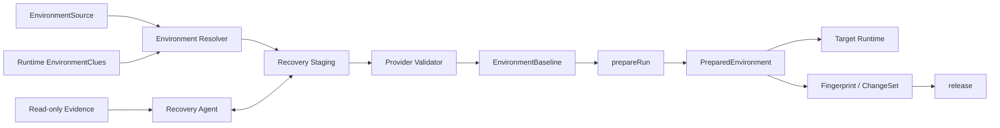

# Environment 子系统设计

状态：当前模块设计

本文定义如何从历史会话证据恢复逻辑会话开始前状态、冻结可复用基线、为每个候选运行准备独立环境、采集前后事实并释放 Harness 自有资源。Recovery Agent 是独立 Agent Module，由 Environment 子系统通过内部端口调用；公共 `EnvironmentPort` 与领域关系以[架构总览](./overview.md)为准。

## 1. 设计结论

环境恢复不是“把原会话倒放”，也不是对当前目录做一次 copy。它要回答：

> 候选模型开始执行历史任务前，哪些资源必须处于什么状态，我们现在能用哪些证据恢复和验证它们？

采用以下模型：

```text
历史会话与本机证据
→ Environment Resolver
→ Recovery Agent 在隔离 staging 中恢复
→ Provider 验证 required resources
→ 冻结 EnvironmentBaseline
→ 每个 CandidateRun 独立 prepareRun
→ before/after fingerprint
→ release Harness 自有运行资源
```

Recovery Agent 负责处理不完整、异构和需要语义判断的恢复问题；Product Pack 提供规范化会话证据和 Recovery Playbook；Provider 负责路径、安全策略、证据真实性和最终验证。Core 与顶层 Orchestrator 不编排 Recovery Agent 的内部 loop。

## 2. 模块边界



Environment 子系统负责：

- 解释历史会话中的 cwd、workspace、文件、Git 和外部资源线索；
- 确定逻辑会话开始前所需的 required、optional 和 observed 资源；
- 搜索并验证可用 snapshot、Git object、文件历史和当前资源；
- 在 Harness 自有 staging 中运行受限 Recovery Agent；
- 冻结经过验证的 baseline；
- 为 CandidateRun 准备相互隔离的环境；
- 生成 before/after fingerprint 和 ChangeSet；
- 释放本 run 拥有的进程外环境资源和临时句柄。

Environment 子系统不负责：

- 解析 Claude/Codex 私有事件格式；
- 安装或启动 Agent Runtime；
- 决定 CandidateRun 何时完成；
- 保证外部网站、数据库或服务可以回到历史状态；
- 自动回滚用户目录或不可逆外部副作用；
- 删除持久化的 `TaskCase` 和用户选择保留的诊断材料。

## 3. 完整会话与恢复时点

用户选择的完整逻辑会话默认就是一个任务。环境恢复目标固定为：

```text
原始 Agent 接受 TaskCase.initialInput 之前
```

Session Source Adapter 针对整段逻辑会话提取：

- 会话开始时的 cwd 和 workspace roots；
- Git repository、HEAD、branch、worktree 和未提交状态线索；
- 首条用户输入之前已存在的输入文件和依赖；
- 会话中首次修改文件时可获得的 preimage 或 file-history；
- 浏览器、数据库、API、MCP 和其他外部资源；
- shell、文件写入、下载、安装和外部调用等潜在副作用。

Environment Provider 不选择会话内任务边界。resume、fork 或 parent session 是否应合并为同一个逻辑会话，由 Product Pack 在导入时确定；无法确定时必须返回 diagnostic，不能为了方便恢复而静默选择一个时点。

## 4. 公共 EnvironmentPort

以下接口与架构总览一致，Core 只依赖这一层：

```ts
interface EnvironmentPort {
  resolveBaseline(
    source: EnvironmentSource,
    clues: EnvironmentClue[],
    policy: EnvironmentPolicy,
  ): Promise<EnvironmentBaseline>;

  prepareRun(
    baseline: EnvironmentBaseline,
    runId: string,
  ): Promise<PreparedEnvironmentRef>;

  fingerprint(
    environment: PreparedEnvironmentRef,
  ): Promise<EnvironmentFingerprint>;

  release(
    environment: PreparedEnvironmentRef,
  ): Promise<ReleaseResult>;
}
```

`resolveBaseline` 是 Case Preparation；`prepareRun`、`fingerprint` 和 `release` 是 CandidateRun 生命周期。Orchestrator 不直接调用 `openRecovery`、`finalizeRecovery` 或 Recovery Agent 工具。

## 5. 公共领域模型

### 5.1 EnvironmentSource 与线索

```ts
interface EnvironmentSource {
  sourceSessionId: string;
  caseId: string;
  initialInputId: string;
  sourceCwd?: PathRef;
  currentWorkspace?: PathRef;
  userSnapshots: ArtifactRef[];
  nativeArtifactRefs: ArtifactRef[];
}

interface EnvironmentClue {
  id: string;
  kind:
    | "cwd"
    | "workspace"
    | "git"
    | "file_read"
    | "file_write"
    | "file_history"
    | "shell"
    | "browser"
    | "external_resource";
  occurredAt?: string;
  locator?: string;
  data: unknown;
  evidenceRef: ArtifactRef;
}
```

`initialInputId` 固定指向完整逻辑会话的第一条可执行用户输入，只用于确定恢复时点，不是可配置的任务切片边界。SessionSourceAdapter 只提取和归一化线索，不声称线索已经验证。未知私有事件采用 ignore-and-record；已知事件缺少关键字段时输出 warning 并保留 raw artifact。

### 5.2 资源、状态与证据

环境资源不是简单的路径清单。每个资源必须同时表达任务开始时所需的状态、实际恢复出的状态、恢复方法和可信度。这样 Orchestrator 可以决定能否运行，Comparison 可以判断环境缺口是否影响结果。

```ts
interface ResourceIdentity {
  resourceId: string;
  kind: "workspace" | "file_set" | "external";
  logicalLocator: string;
  scope: "case" | "machine" | "account" | "remote";
}

interface StateEvidence {
  stateKind: string;
  digest?: string;
  facts: Record<string, unknown>;
  artifactRefs: ArtifactRef[];
  completeness: "full" | "partial" | "metadata_only";
}

type RecoveryMethod =
  | "snapshot"
  | "git_commit"
  | "git_commit_plus_patch"
  | "file_history"
  | "copy_current"
  | "rebuild"
  | "readonly_bind"
  | "none";

type RecoveryConfidence =
  | "verified"
  | "inferred"
  | "partial"
  | "unavailable";

interface EnvironmentResource {
  identity: ResourceIdentity;
  role: "required" | "optional" | "observed";
  requestedState: StateEvidence;
  recoveredState?: StateEvidence;
  method: RecoveryMethod;
  confidence: RecoveryConfidence;
  sourceEvidence: EvidenceRef[];
  limitations: string[];
}
```

`requestedState` 表示根据完整历史会话、Product Pack 和 Recovery Agent 识别出的任务要求；`recoveredState` 表示 Provider 实际恢复并重新读取到的状态。Recovery Agent 可以提出恢复计划和解释，但不能自行把推断提升为 `verified`；最终可信度由 Provider 根据可重读事实确认。

第一版故意只保留三个 resource kind。浏览器 profile、数据库、容器和远程服务先作为 `external` 描述；当出现可执行 Provider 后再增加具体类型。不设计环境恢复总分：缺失的 required 资源不能被其他资源抵消，报告直接展示资源级状态和限制。

### 5.3 EnvironmentBaseline

```ts
interface EnvironmentBaseline {
  baselineId: string;
  caseId: string;
  mode: "canonical" | "copy" | "observational" | "unsupported";
  match: "matched" | "partial" | "mismatched" | "observational";
  resources: EnvironmentResource[];
  readiness: BaselineReadiness;
  canonicalRef?: ArtifactRef;
  fingerprint: EnvironmentFingerprint;
  capabilities: EnvironmentCapabilities;
  warnings: EnvironmentWarning[];
  createdAt: string;
}

interface BaselineReadiness {
  runnable: "isolated" | "observational" | "unsupported";
  strictness: "strict" | "exploratory";
  blockingResourceIds: string[];
}

interface EnvironmentCapabilities {
  canFork: boolean;
  fingerprints: Array<"git" | "file_tree" | "external_observation">;
  externalSideEffects: "none" | "possible" | "uncontrolled";
}
```

- `canonical`：存在经过验证、由 Harness 持有的冻结基线；
- `copy`：只能从当前或近似资源建立隔离副本，保证隔离但不保证历史匹配；
- `observational`：不能安全复制，但可以通过只读或受控绑定观察；不保证任务可完成。
- `unsupported`：既不能创建安全隔离副本，也不能提供受控观察绑定，不能启动候选 Runtime。

`match` 是 Environment 维度事实，由 RunRecord 的 `FidelityAssessment` 直接引用，不表示任务成功。

### 5.4 PreparedEnvironmentRef

```ts
interface PreparedEnvironmentRef {
  environmentId: string;
  baselineId: string;
  runId: string;
  mode: "isolated" | "observational";
  root?: PathRef;
  resources: PreparedResource[];
  manifestRef: ArtifactRef;
  beforeFingerprint: EnvironmentFingerprint;
}

interface PreparedResource {
  resourceId: string;
  mode: "isolated" | "observational";
  bindingRef?: PathRef | ExternalBindingRef;
  writable: boolean;
  owner: "harness" | "external";
}
```

`EnvironmentResource` 描述冻结基线中的恢复和验证结果；`PreparedResource` 描述某次 CandidateRun 如何实际使用该资源。run 的临时目录、挂载和外部句柄不能写回 baseline。

Runtime 只获得 `PreparedEnvironmentRef` 中策略允许的正常工作路径和绑定，不获得 Recovery staging、历史证据目录、用户当前工作目录或其他 CandidateRun 的副本。
### 5.5 Fingerprint 与 ChangeSet

```ts
interface EnvironmentFingerprint {
  capturedAt: string;
  resources: ResourceFingerprint[];
  digest: string;
}

interface ChangeSet {
  environmentId: string;
  before: EnvironmentFingerprint;
  after: EnvironmentFingerprint;
  changedResources: ResourceChange[];
  externalObservations: ExternalObservation[];
  artifactRefs: ArtifactRef[];
}
```

fingerprint 是 Provider 能力范围内的可比较摘要，不等于整个目录的单一 hash：

- 文件系统：相对路径、类型、大小、内容 hash 和必要权限；
- Git：HEAD、branch、tracked diff、untracked、submodule；
- 浏览器：URL、可见状态、截图和登录状态是否可验证；
- 数据库/API：经授权的连接身份和查询摘要，不复制完整敏感数据。

ChangeSet 用于 Controller 观察和最终报告，不用于统一质量评分。

## 6. Environment Resolver

Resolver 处理不完整证据和候选恢复路径。它先做确定性枚举，再把语义判断交给 Recovery Agent：

```text
验证 source 路径和 artifact ownership
→ 枚举 snapshot / Git object / file history / current copy
→ 建立 required resource 候选
→ 创建隔离 staging
→ Recovery Agent 恢复并解释缺口
→ Provider 验证
→ 冻结或诚实降级
```

默认候选优先级：

```text
用户提供的不可变快照
→ 可验证 Git commit + 已保存未提交状态
→ Git commit + 可验证 file-history/preimage
→ 当前目录副本 + 可验证历史文件覆盖
→ 当前目录副本
→ observational / unavailable
```

顺序是默认启发，不是硬编码真理。Resolver 还要判断候选能否覆盖 required resources、证据是否自洽、来源是否仍存在，以及读取是否越过策略边界。

## 7. Recovery Agent

Environment Resolver 通过独立的 `RecoveryAgentPort` 使用 Pi 驱动的 Recovery Agent，因为真实历史状态经常需要组合 Git、文件历史、会话工具记录和任务语义。Agent 不只生成一份脆弱的恢复 DSL，而是在受限 staging 中完成恢复工作。

```ts
interface RecoveryAgentPort {
  recover(context: RecoveryContext): Promise<RecoveryEnvelope>;
}
```

Environment 子系统拥有调用时机、staging 和验证流程；Recovery Agent Module 拥有 session、prompt、Playbook 装载和恢复判断。两者不共享可变内部状态。

### 7.1 内部工作空间

这些类型是 Environment 子系统内部实现，不暴露给 Core：

```ts
interface RecoveryWorkspace {
  recoveryId: string;
  baselineId: string;
  evidenceRoot: PathRef;
  writableRoot: PathRef;
  network: "enabled";
}

type RecoveryEnvelope =
  | {
      status: "completed" | "partial";
      reportRef: EvidenceRef; // recovery.md
      baselineCandidateRef?: EvidenceRef;
      unresolvedResourceRefs: EvidenceRef[];
    }
  | {
      status: "failed";
      reportRef?: EvidenceRef;
      errorCode: RecoveryErrorCode;
    };
```

`RecoveryEnvelope.status` 只表示 Recovery Agent 阶段是否完成，不表示 baseline 已被验证，也不能设置最终 match 或 fidelity。恢复过程、依据和限制写入 `recovery.md`；资源事实、工具 trace 和 Provider 验证结果由 Host 独立结构化持久化。

- `evidenceRoot` 只读，保存经过 ownership 和路径校验的历史证据；
- `writableRoot` 由 Harness 创建，所有恢复动作限制在其中；
- 网络默认开放且不限制访问目标或用途，Host 记录网络活动；网络开放不扩大文件与配置权限；
- Agent 不能直接访问用户全局凭据、当前工作区或其他 run 目录。

### 7.2 Product Recovery Playbook

Recovery 是三个 Agent Module 中唯一默认读取产品专属知识的模块。每个 Product Pack 随代码适配器发布版本化 `recovery/SKILL.md`，用于说明：

- 产品历史数据及关联 artifact 的语义；
- 哪些 session、tool call、patch、command 和 result 对恢复有价值；
- 如何识别 cwd、workspace、逻辑会话起点和文件 preimage；
- 推荐的调查与恢复顺序；
- 数据截断、压缩、脱敏及版本差异；
- 哪些线索只能作为推断，不能作为已验证事实。

SessionSourceAdapter 负责确定性发现当前设备上的实际路径、解析已知格式并建立受保护引用；Playbook 负责告诉 Agent 这些证据意味着什么、如何组合使用。能稳定编码的解析规则不能只写在 Playbook 中。Playbook 只提供知识，不能扩大 Recovery Agent 的工具、网络、路径或凭据权限。

baseline provenance 记录 Recovery 的 `ResolvedAgentConfig`、Product Pack 版本、Playbook 版本和内容 hash。找不到匹配版本时可以继续探索性恢复，但必须把知识不匹配计入 fidelity 原因。

### 7.3 Agent 能做什么

在 staging 中，Recovery Agent 可以自主决定：

- checkout 可验证 Git object；
- 应用已保存的未提交 diff；
- 从 file-history 恢复 preimage；
- 复制仍存在的输入资源；
- 对多个 workspace 的关系作任务语义判断；
- 标记 required/optional/observed；
- 解释缺失证据、冲突和潜在风险。

它不能自行把 `assumed` 提升为 `verified`，也不能决定最终 `match`。这些由 Provider 根据事实验证。

### 7.4 Provider 验证

Recovery Agent 提交结果后，Provider 至少验证：

- 所有路径位于 staging 或受允许的 evidence root；
- 引用的 Git object、file backup 和 artifact 确实存在；
- hash、文件类型和路径映射一致；
- required resource 状态有证据支持；
- staging 没有越权链接、挂载或意外外部写入；
- 最终 fingerprint 可重复读取；
- unresolved resource 正确保留而不是被忽略。

通过验证后，staging 被逻辑冻结为 canonical baseline。冻结表示所有权和写权限约束，不依赖 Windows 只读属性；Candidate Runtime 永远只得到 `prepareRun` 产生的副本。

## 8. prepareRun

`prepareRun` 从同一个 EnvironmentBaseline 为每个 CandidateRun 建立隔离环境：

```text
校验 baseline fingerprint
→ 创建 runId 对应目标目录或隔离句柄
→ fork/copy/绑定 observational resource
→ 写 environment manifest
→ fingerprint(before)
→ 返回 PreparedEnvironmentRef
```

策略：

- `canonical + canFork`：从冻结基线 fork；
- `copy`：从记录的近似来源重新 copy，并再次记录 mismatch；
- `observational`：只绑定用户明确允许的只读或受控观察资源，不声称隔离；无法提供这种绑定时为 `unsupported`；
- baseline digest 变化：拒绝静默继续，重新 resolve 或降级为 mismatch；
- 目标 run 目录已经存在：先按 manifest 和 run ID 核查，不覆盖不明目录。

不同候选模型不能共享可写工作目录。否则前一个候选的修改会成为后一个候选的起点。

Harness 永远不把用户当前工作目录作为 CandidateRun 的 root。当前目录只能作为只读 evidence source；如果既不能生成由 Harness 拥有的隔离副本，也不能提供只读或受控观察绑定，`prepareRun` 必须返回 unsupported，不能原地执行。

## 9. 历史文件还能否恢复

会话记录能帮助反推，但 transcript 本身不是 checkpoint。

### 9.1 可以可靠恢复

- 原始 snapshot 或备份仍存在；
- Git commit/object 仍存在，未提交状态也被保存；
- Claude/Codex file-history 中存在可验证 preimage；
- 工具事件包含结构化 patch，且 patch 的基线可验证；
- 当前输入资源仍与历史 hash 一致。

### 9.2 只能部分恢复

- 有 Git commit，但历史未提交文件缺失；
- 有当前目录和部分 preimage，只能覆盖已知文件；
- shell 命令说明发生过变更，但没有变更前内容；
- 依赖版本、生成物或应用状态只能近似重建。

### 9.3 无法可靠恢复

- 文件被覆盖且没有版本库、备份、preimage 或 snapshot；
- 外部网页、数据库或服务只留下文本描述；
- 原始环境依赖已删除账号、凭据或不可获得软件；
- 闭源产品内部状态未公开也未留下可验证输出。

无法恢复时仍可让用户选择探索性运行，但 `EnvironmentBaseline.match` 必须是 `partial`、`mismatched` 或 `observational`，报告展示具体缺失资源。

## 10. 运行后环境事实

CandidateRun 在 `finalizing` 中按顺序执行：

```text
等待或停止 Target Runtime
→ fingerprint(after)
→ 生成 ChangeSet
→ 固化 artifact refs
→ release PreparedEnvironment
→ 将 ReleaseResult 交给 Orchestrator 合并为 CleanupResult
```

如果 after fingerprint 失败，保留 Target 已产生的 trace 和 artifacts，标记 fingerprint unavailable。失败不能把原 outcome 改成另一个结果。

Environment Provider 不分析“修改得好不好”；Controller 和 Comparison Agent 只读取 ChangeSet 与产物。文件、截图、浏览器状态或文档预览应该通过 artifact 引用暴露，不把大内容塞进 EnvironmentFingerprint。

## 11. release 与资源所有权

`release` 只处理 Harness 明确拥有的 CandidateRun 资源：

- 关闭 Environment Provider 自己创建的句柄；
- 卸载本 run 创建的临时挂载；
- 释放文件锁、浏览器 profile 副本或测试容器；
- 将临时目录标记为可清理或按 policy 保留诊断现场；
- 保存 release 结果和错误。

它不负责：

- 回滚 Target 对用户目录或外部服务造成的不可逆副作用；
- 删除 `TaskCase` 持有的 canonical baseline；
- 擅自删除用户提供的 snapshot；
- 为了清理而重跑恢复或候选任务。

```ts
interface ReleaseResult {
  status: "not_needed" | "complete" | "incomplete" | "unknown";
  released: ResourceRef[];
  retained: ResourceRef[];
  errors: EnvironmentError[];
}
```

release 必须按 run ID 幂等。`ReleaseResult` 只是 Environment 资源的清理事实；Run Orchestrator 将它与 Runtime process、订阅和其他 Harness-owned 资源的清理事实合并为 `RunOutcome.cleanup`。清理未完成不覆盖任务判断或终止原因，完整规则见[CandidateRun 结果与终止协议](./run-outcome.md)。

## 12. 中断与恢复

判断原则：

```text
已持久化 operation 事实
+ 当前文件/进程/挂载状态
+ 操作是否幂等
```

| 操作 | 中断处理 |
|---|---|
| 读取证据、inspect、fingerprint | 可重试 |
| 创建 staging/run 目录 | 使用稳定 ID 和 manifest，核查后重试 |
| checkout/copy/file restore | 只在 staging；核查目标 fingerprint 后继续或重建 staging |
| Recovery Agent 调用中断 | 不信任未提交声明；保留 staging 供核查，可重新调用 |
| baseline 验证完成但响应丢失 | 读取验证 manifest 和 fingerprint，不重复恢复 |
| prepareRun 响应丢失 | 按 run ID 核查副本与 manifest，不盲目再 copy |
| after fingerprint 中断 | 只读重试 |
| release 中断 | 对本 run 资源幂等重试 |
| 外部副作用状态未知 | 不重放、不回滚，记录并结束 |

Recovery staging 中断后可以保留为诊断材料，但不能被 Candidate Runtime 当作已验证 baseline。只有 Provider 验证事实已持久化后才能提升。

## 13. 外部资源与 observational mode

外部资源至少记录：

```ts
interface ExternalObservation {
  resourceId: string;
  locator: string;
  control: "controlled" | "partially_controlled" | "uncontrolled" | "unknown";
  beforeRef?: ArtifactRef;
  afterRef?: ArtifactRef;
  sideEffects: "none_observed" | "possible" | "observed" | "unknown";
}
```

默认策略：

- 优先测试账号、mock、事务、只读 API 或隔离 profile；
- 不能安全隔离但用户仍要运行时，使用 `observational`；
- 不把复制 cookie 或凭据视为普通文件 copy；
- 外部状态 unknown 时不自动重试写操作；
- 报告把外部控制程度纳入 `FidelityAssessment.externalWorld`。

Environment 架构保持任务通用性，但第一版 Provider 不需要假装支持所有外部系统。

## 14. LocalWorkspaceProvider

第一版只实现真实需要的本地能力：

```text
LocalWorkspaceProvider
├── Evidence Reader
│   ├── Git
│   ├── file snapshot/history
│   └── normalized Runtime clues
├── Recovery Staging
├── Recovery Agent tools
├── Baseline Validator
├── Workspace Copier/Forker
└── Fingerprinter
```

这些是内部职责，可以从普通函数开始；只有出现独立状态或复杂测试边界时再拆 class。

最小能力：

- 验证并规范化 Windows/POSIX 路径；
- 复制普通本地工作区到 Harness 自有目录；
- 使用已有 Git object 恢复提交状态；
- 应用有证据的未提交 diff 或 preimage；
- 记录 symlink、submodule、untracked 和权限限制；
- 生成 Git 与 file-tree fingerprint；
- 为多个 CandidateRun 创建独立副本；
- 拒绝越过 workspace root 的恢复写入。

不在第一版实现浏览器、数据库、远程容器或云账号 Provider；它们先作为 external resource 进入 observational 结果。

## 15. 安全策略

```ts
interface EnvironmentPolicy {
  allowedEvidenceRoots: PathRef[];
  experimentRoot: PathRef;
  network: "disabled" | "scoped";
  allowedHosts?: string[];
  externalWrites: "deny" | "explicit";
  symlinks: "deny" | "within_root";
  retainFailedRecovery: boolean;
  retainRunWorkspace: boolean;
}
```

实现要求：

- 所有输入路径先解析为绝对规范路径并检查包含关系；
- 不跟随逃逸 experiment root 的 symlink/junction；
- copy、fork、release 只针对 manifest 中具有稳定 ownership 的目标；
- 不把环境变量、凭据文件或用户全局配置自动复制进 baseline；
- Git hooks、安装脚本和恢复 shell 默认不能访问网络或用户目录；
- artifact 和 manifest 中的路径对报告使用逻辑引用，不暴露不必要的绝对路径；
- 错误记录资源 ID、operation ID 和安全的诊断信息，不记录密钥。

## 16. Trace 事件

Environment 子系统至少产生：

```text
environment.evidence_inspected
environment.recovery_started
environment.recovery_completed | environment.recovery_failed
environment.baseline_validated
environment.baseline_frozen
environment.run_prepared
environment.fingerprint_captured | environment.fingerprint_failed
environment.release_completed | environment.release_failed
```

事件使用架构总览的 `TraceEvent` envelope。恢复 Agent 的原始输入输出、Git diff、长清单和 fingerprint detail 使用 artifact 引用，不扩张公共事件字段。

## 17. 模块验收条件

- 同一个 baseline 可以为两个 CandidateRun 生成互不影响的可写副本；
- Runtime 只能看到本 run 的 PreparedEnvironment；
- Recovery Agent 不能写用户原目录或 evidence root；
- Provider 能拒绝 Agent 声称已恢复但证据不成立的 required resource；
- baseline 不可恢复时仍能生成包含具体缺口的 partial/observational 结果；
- before/after fingerprint 可以生成 ChangeSet 并供 Controller、报告读取；
- prepareRun 和 release 在中断后可按 run ID 安全核查；
- release 失败不会覆盖 Target outcome；
- Runtime 私有 schema 不进入 Environment 公共模型；
- 没有为尚未支持的外部环境建立空 Provider 接口。

相关理论和项目调研保留在[架构研究基础](../research/architecture-foundations.md)。
