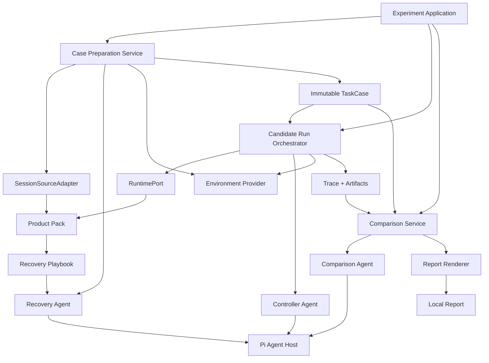
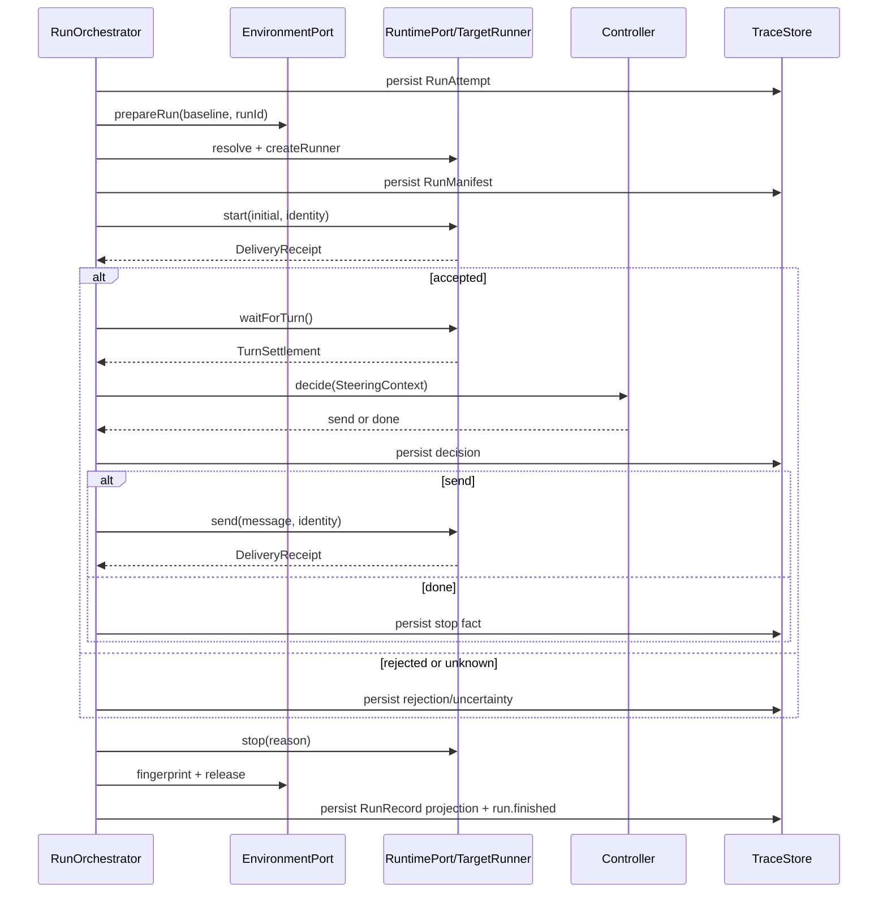

# Reprise 架构总览

状态：当前架构基线

本文是跨模块术语、领域模型、端口和生命周期的唯一规范。专题文档可以完整细化一个模块，但不得重新定义本文的公共类型或改变其所有权。

## 1. 架构目标

Harness 在尽量恢复历史任务环境的前提下，用当前机器已安装的 Agent 产品 Runtime 运行候选模型，并以动态 Controller 模拟同等人类能力的后续协作。模型是实验中唯一被有意改变的主要变量；当前 Runtime、Environment、Controller 和预算等其他条件尽量固定，所有已知偏差和未知项必须完整记录。历史 Runtime 只作为来源证据。

架构优先满足：

1. **真实效用**：面向个人真实任务，不优化公共 benchmark。
2. **条件诚实**：当前 Runtime 自动记录；不能恢复的环境条件记录为 mismatch 或 unknown。
3. **安全隔离**：恢复和候选运行默认不修改用户当前工作区。
4. **可追溯**：输入接受、turn、工具、决策、停止和产物均可回到原始事实。
5. **产品隔离**：Claude Code、Codex 等私有协议只存在于对应 Product Pack。
6. **克制演进**：单进程、显式依赖和少量接口；不预建分布式执行或插件市场。

### 1.1 术语

| 术语 | 含义 |
|---|---|
| Harness | Reprise 本身，拥有确定性编排、事实存储和用户控制面 |
| Agent 产品 | Codex、Claude Code 等保存历史会话并运行候选模型的外部产品 |
| Product Pack | 某一 Agent 产品的静态适配包，包含会话导入、Runtime adapter、Recovery Playbook 和 fixtures；公共代码名称统一使用 `AgentProductPlugin` |
| Target Runtime | 当前机器上由 Product Pack 解析并启动的 Agent 产品 Runtime |
| CandidateRun | 一个候选模型的一次独立运行生命周期 |
| RunAttempt | CandidateRun 在任何外部解析或准备前持久化的最小身份；准备失败时仍然存在 |
| RunManifest | Runtime、模型和隔离环境都解析成功后冻结的完整启动条件 |
| EnvironmentBaseline | Case Preparation 阶段冻结的可恢复环境基线，不等于历史结果证据 |
| BaselineEvidence | 历史会话原始完成结果的只读证据 |
| Comparison Projection | CandidateRun 结束后的只读比较输入、Agent 结果与报告，不属于运行状态机 |

文档叙述统一使用 **Product Pack**；`AgentProductPlugin` 仅作为公共代码接口名。`baseline` 单独出现时必须由上下文明确是 `EnvironmentBaseline` 还是 `BaselineEvidence`。

## 2. 系统边界

Harness 不是单个新的 Agent Loop。它以确定性应用流程连接三个独立的智能模块：Recovery Agent、Controller Agent 和 Comparison Agent。三个模块共享 Pi Agent Host 的 session、工具和遥测原语，但拥有不同的上下文、权限、生命周期和输出契约。



原始会话直接成为基线材料，不经过 TargetRunner。只有候选模型的运行进入执行平面。Product Pack负责把产品私有数据转换成 Harness 公共协议；Controller 和 Comparison 不读取 Claude Code、Codex 等产品的私有日志或格式。

## 3. 三段生命周期

### 3.1 Case Preparation

```text
发现或选择历史会话
→ 导入完整会话并确定第一条可执行用户输入
→ 冻结 transcript 和原始结果证据
→ 解析 SourceRuntimeEvidence（仅作来源事实）
→ 解析并恢复 EnvironmentBaseline
→ 冻结 TaskCase
```

Case Preparation Service 就是一个确定性的 `TaskCaseBuilder`：

```ts
interface TaskCaseBuilder {
  build(
    source: SessionRef,
    privacy: PrivacyPolicy,
    environmentPolicy: EnvironmentPolicy,
  ): Promise<TaskCase>;
}
```

它不使用 Agent 判断任务边界，也不生成会话内任务候选；用户选择的完整逻辑会话直接成为一个 TaskCase。会话列表的摘要窗口只服务展示；冻结资格以选中后的完整 inspect/import 为准，不以列表缓存的 `pending` 或截断摘要为准。只有 Environment 子系统内部的 Recovery Agent 处理恢复所需的语义判断，且只在已有合法 `initialInput` 的 TaskCase 之后运行；它不解析产品 JSONL，也不改写 `initialInput`。Environment Provider 负责隔离和验证。TaskCase manifest 原子写入后全部字段只读；修改会话、证据、环境或策略时创建新 Case。冻结后正常运行不依赖历史产品私有日志或 Recovery Playbook 持续可用。

### 3.2 Candidate Run

```text
TaskCase + CandidateSpec
→ 解析并记录当前已安装 Runtime 和实际模型
→ 从 EnvironmentBaseline 准备候选工作副本
→ 启动 TargetRunner
→ 等待 turn settlement
→ Controller 发送下一条输入或结束
→ 收尾、fingerprint、释放运行资源
→ RunRecord
```

每个候选模型对应独立的 `CandidateRun`、run ID、工作副本和 trace。

### 3.3 Comparison Projection

```text
BaselineEvidence + one or more RunRecord
→ Comparison Agent
→ ComparisonEnvelope + report.html
→ Report Renderer
→ 并排报告
```

Comparison Agent 只读取规范化的任务、结果、artifact、遥测和 fidelity，不理解具体 Agent 产品。报告是可重复生成的只读投影，不属于 CandidateRun 的 `finalizing`；Comparison 或 Renderer 失败不改变运行结果。

## 4. 核心领域模型

### 4.1 TaskCase

`TaskCase` 是冻结的历史任务输入，不是对历史产品的动态查询。

```ts
interface TaskCase {
  schemaVersion: number;
  caseId: string;
  source: SessionRef;
  initialInput: UserMessage;
  transcript: Transcript;             // 完整历史会话
  historicalEvents: HistoricalEvent[];
  baseline: BaselineEvidence;
  sourceRuntimeEvidence: SourceRuntimeEvidence;
  environmentBaseline: EnvironmentBaseline;
  taskContext?: TaskContext;
  provenance: Provenance;
  privacy: PrivacyPolicy;
  contentHash: string;
}
```

`transcript` 和 `historicalEvents` 保存用户选择的完整逻辑会话；整段会话默认就是一个任务，不再从中推断子任务边界。`initialInput` 是 Case Preparation 从完整会话选出的第一条用户任务句（跳过产品注入的指令块），只用于启动候选 Runtime。Controller 可以读取完整历史轨迹，但不会逐轮 replay。

`BaselineEvidence` 保存原始完成结果中可获得的最终消息、产物和检查引用。它是候选结果唯一要比较的历史基线，不要求由 Harness 重跑，也不用于候选之间排名。没有历史产物时明确记录 unavailable，不由 Agent 补造。

### 4.2 ExperimentSpec、CandidateSpec 与 Agent 配置

```ts
interface ExperimentSpec {
  experimentId: string;
  taskCaseId: string;
  candidates: CandidateSpec[];
  controller: AgentConfig;
  comparison: AgentConfig;
  runPolicy: RunPolicy;
  outputRoot: PathRef;
}

interface CandidateSpec {
  candidateId: string;
  productId: string;
  requestedModel: ModelRequest;
}

interface AgentConfig {
  providerId: string;
  requestedModel: string;
  options?: Record<string, unknown>;
  budget: AgentBudget;
  contextPolicy?: Record<string, unknown>;
}

interface AgentBudget {
  maxCalls?: number;
  maxTokens?: number;
  maxCost?: number;
  callTimeoutMs: number;
  maxStructuredRepairAttempts: number;
  maxProviderRetries: number;
}

interface ResolvedAgentConfig {
  providerId: string;
  requestedModel: string;
  resolvedModel: string | "unknown";
  optionsHash: string;
  promptHash: string;
  toolPolicyHash: string;
  contextPolicyHash: string;
  budget: AgentBudget;
}

interface RunPolicy {
  wallClockMs: number;
  maxTargetTurns: number;
  maxModelCalls: number;
  turnTimeoutMs: number;
  heartbeatTimeoutMs: number;
  maxConsecutiveNoProgress: number;
  maxTokens?: number;
  maxCost?: number;
}
```

`ExperimentSpec` 表达用户想比较什么。Controller 和 Comparison 的请求配置在 Experiment 创建时冻结；Controller 在首个候选运行前解析，Comparison 在比较调用前解析，并分别保存实际模型与配置 hash。Recovery 属于 Case Preparation，它的 `ResolvedAgentConfig` 保存在 `TaskCase.provenance`，不进入 `ExperimentSpec`。三个 Agent 的总调用、token 和成本上限默认未设置；单次调用 timeout、结构化修复次数和 provider 重试次数始终有限。`RunPolicy` 只约束 Target Runtime，不能作为内部 Agent 的预算或重试策略。

用户从 Pi 可用的 provider 与模型中选择内部 Agent 配置；Harness 不指定、捆绑或评价这些模型。同一 Experiment 的所有候选共享同一份 Controller 配置，但各自使用独立 session。Comparison 在运行结束后使用冻结的 Comparison 配置；setup 中后来发生的默认值变化不得静默改变已有 TaskCase 或 Experiment。

### 4.3 RunAttempt、RunManifest 与 RunRecord

准备阶段可能在 Runtime、模型或 Environment 尚未解析成功时结束，因此 CandidateRun 先冻结最小 `RunAttempt`；只有启动条件齐备后才提交 `RunManifest`。不使用大量可选字段表达不合法的半 Manifest。

```ts
interface RunAttempt {
  schemaVersion: number;
  runId: string;
  experimentId: string;
  caseId: string;
  candidate: CandidateSpec;
  policy: RunPolicy;
  createdAt: string;
}

interface RunManifest {
  schemaVersion: number;
  attempt: RunAttempt;
  resolvedModel: ResolvedModelIdentity;
  runtime: ResolvedRuntime;
  environment: PreparedEnvironmentRef;
  controller: ResolvedAgentConfig;
  startedAt: string;
}

interface TraceSliceRef {
  experimentId: string;
  runId: string;
  firstSequence: number;
  lastSequence: number;
}

interface RunRecord {
  attempt: RunAttempt;
  manifest?: RunManifest;
  state: "finished";
  stageReached: "created" | "preparing" | "launching" | "awaiting_target" | "awaiting_controller";
  outcome: RunOutcome;
  fidelity: FidelityAssessment;
  finalEnvironment?: EnvironmentFingerprint;
  trace: TraceSliceRef;
  artifactRefs: ArtifactRef[];
  warnings: RunWarning[];
}

interface RunWarning {
  code: string;
  message: string;
  evidenceRefs: EvidenceRef[];
}

`stageReached` 只记录进入 `finalizing` 前到达的最深执行阶段；每个终态记录都已经经过 `finalizing` 并处于 `finished`，因此不把这两个必经终态重复写入该字段。

type EvidenceRef = string;

interface RunOutcome {
  task: TaskAssessment;
  termination: RunTermination;
  cleanup: CleanupResult;
}

interface TaskAssessment {
  status:
    | "apparently_completed"
    | "incomplete"
    | "indeterminate"
    | "not_assessed";
  decidedBy?: "controller";
  evidenceRefs: EvidenceRef[];
}

interface RunTermination {
  kind:
    | "completed"
    | "limit_reached"
    | "stalled"
    | "cancelled"
    | "blocked"
    | "failed"
    | "uncertain";
  code: string;
  initiatedBy: "target" | "controller" | "user" | "harness";
  failure?: RunFailure;
}

interface RunFailure {
  origin:
    | "runtime"
    | "controller"
    | "environment"
    | "harness"
    | "external_dependency"
    | "unknown";
  code: string;
  message: string;
  evidenceRefs: EvidenceRef[];
}

interface CleanupResult {
  status: "not_needed" | "complete" | "incomplete" | "unknown";
  remainingResourceIds: string[];
  evidenceRefs: EvidenceRef[];
}
```

`RunAttempt` 在 `created` 状态提交，因此 Environment `unsupported`、Runtime resolve 失败或初始准备中断仍能产生合法终态记录。`manifest` 只在 `stageReached` 达到 `launching` 或更晚时存在；提交后不可变。请求的模型别名和 Runtime 实际解析出的模型身份必须同时保存，无法验证实际身份时使用 `unknown`。

`EvidenceRef` 是有类型前缀的稳定不透明引用：`event:<event-id>` 或 `artifact:<artifact-id>`。ID 由 Harness 生成、区分大小写、不得直接使用用户输入，并在作为目录名或路径片段前进行格式与长度校验。Core 不根据任意字符串内容推断事实，只按前缀交给 Store 校验 ownership。`RunOutcome` 正交表达任务判断、终止原因和清理结果。技术失败只通过 `RunTermination.failure` 保存；delivery 是操作级事实，fidelity 继续独立。完整生成规则和不变量见[CandidateRun 结果与终止协议](./run-outcome.md)。

### 4.4 FidelityAssessment

匹配程度是多维事实，不是生命周期状态：

```ts
interface FidelityAssessment {
  environment: "matched" | "partial" | "mismatched" | "observational";
  externalWorld: "controlled" | "partially_controlled" | "uncontrolled" | "unknown";
  modelResolution: "verified" | "inferred" | "unknown";
  comparisonClass: "strict" | "exploratory" | "observational";
  reasons: string[];
}
```

`comparisonClass` 由环境、外部世界和模型解析三个维度派生。历史 Runtime 版本差异不参与 fidelity；`runtime_drift` 是候选之间当前执行条件意外变化的 warning，`environment_mismatch` 是 fidelity 原因，二者都不扩张七状态模型，也不表示任务失败。

## 5. 组件与所有权

| 组件 | 拥有 | 不拥有 |
|---|---|---|
| Case Preparation Service | 完整会话导入、环境与证据固化、TaskCase 冻结 | 候选运行状态、会话内任务切片 |
| Recovery Agent Module | 恢复所需的语义判断和 staging 内动作 | baseline 验证、最终 match 判定 |
| Environment Subsystem | 环境证据、恢复 staging、canonical baseline、候选副本 | Runtime 私有协议、实验停止权 |
| Run Orchestrator | 单个 CandidateRun 状态、预算、停止和资源收尾 | 用户协作策略、目标工具执行 |
| Product Pack | 会话私有格式、当前 Runtime 发现与协议适配、Recovery Playbook | SteeringContext、ComparisonContext、质量判断 |
| TargetRunner | 目标 session/process 与规范化事件 | 实验完成判断 |
| Controller Agent Module | 同等人类能力下的下一条输入或结束 | 目标任务工具、环境写入、实验状态 |
| Trace Store | append-only 事实和 artifact 引用 | 覆盖或重新解释历史事实 |
| Comparison Agent Module | 选择和组织值得比较的结果证据 | 修改运行结果、判定 fidelity 或统一打分 |
| Report Renderer | Agent-authored `report.html` 的原样持久化与导航 | 候选运行和语义选择 |
| Pi Agent Host | 模型 session、上下文、工具钩子和调用遥测 | 领域状态与跨模块共享对话 |

三个 Agent Module 只共享 Pi Agent Host 基础设施，不共享 session、prompt、上下文或工具权限。组件之间传递不可变快照、句柄引用、事件和决策，不共享可变全局状态。

## 6. Product Pack（`AgentProductPlugin`）

每种 Agent 产品由一个静态注册的 Product Pack 适配。Product Pack 把确定性代码和 Recovery Agent 使用的版本化知识作为一个不可拆分的包发布，但不承载 Controller 或 Comparison 的产品专属策略。Pack 和 Playbook hash 写入 manifest/provenance，避免代码适配器与恢复知识静默漂移。

```ts
interface ProductPack {
  manifest: ProductPackManifest;
  sessions: SessionSourceAdapter;
  runtime: RuntimePort;
  activity: TargetActivityTranslator;
  recoveryPlaybook(): RecoveryPlaybookDescriptor;
  checkAuth(): Promise<ProductAuthStatus>;
  defaultCandidate(): CandidateSpec;
}

interface ProductPackManifest {
  productId: string;
  displayName: string;
  packVersion: string;
  schemaVersion: number;
  sessionSchemaVersions?: string[];
}

interface RecoveryPlaybookDescriptor {
  version: string;
  sha256: string;
  text: string;
}

interface SessionSourceAdapter {
  readonly defaultRoot: string;
  discover(query?: SessionDiscoveryQuery): Promise<readonly SessionSummary[]>;
  inspect(ref: SessionRef): Promise<SessionInspection>;
  import(ref: SessionRef): Promise<ImportedSession>;
}
```

`ImportedSession` 是产品无关的完整逻辑会话快照。Product Pack 只负责发现与导入；冻结成 `TaskCase`（暂存、原子发布、幂等、脱敏）由共享的 `freezeCase` 承担。Pack 负责确定第一条可执行用户输入；如果 resume、fork 或分支关系无法形成一条明确逻辑会话，则返回 diagnostic，而不是让 Case Preparation 猜测任务边界。

```ts
interface ImportedSession {
  source: SessionRef;
  initialInput: SessionMessage;
  transcript: readonly SessionMessage[];
  historicalEvents: readonly JsonRecord[];
  baseline: TaskCase['baseline'];
  sourceRuntimeEvidence: TaskCase['sourceRuntimeEvidence'];
  taskContext?: TaskCase['taskContext'];
  provenance: { packVersion: string };
  raw: ImportedRawFile;
  extraFiles?: readonly ImportedExtraFile[];
  diagnostics: readonly ImportDiagnostic[];
  signals: SessionSignals;
}
```

SessionSourceAdapter 负责可靠定位和解析私有数据；Recovery Playbook 解释环境证据的语义、调查顺序、恢复方法和已知版本限制。TaskCase 冻结完整会话及其必要证据，正常候选运行不依赖产品私有日志继续存在。

```text
products/<product-id>/
├── manifest
├── session-source
├── runtime
├── recovery/SKILL.md
└── fixtures
```

这是逻辑布局，不要求第一版建立动态模块系统。Product Pack 采用显式静态注册，不实现远程发现、热加载、插件市场、插件沙箱或依赖注入容器。代码能确定性发现和解析的信息不交给 Agent 猜；Playbook 只能提供知识，不能授予工具或文件权限。

产品私有数据的边界是：

```text
historical private data → SessionSourceAdapter → ImportedSession
runtime private events  → RuntimePort          → TargetEvent / TurnSettlement
```

Controller 模块从这些公共数据组装 `SteeringContext`；Comparison 模块从 `TaskCase`、`RunRecord` 和 artifact 组装 `ComparisonContext`。Product Pack 不生成二者，也不提供 Controller/Comparison Playbook。无法规范化但需要追溯的原始数据只保留为受保护 `rawRef`。
## 7. RuntimePort 与 TargetRunner

```ts
interface RuntimePort {
  id: string;
  inspectAvailable(): Promise<AvailableRuntime[]>;
  resolve(
    request: RuntimeRequest,
  ): Promise<ResolvedRuntime>;
  createRunner(
    runtime: ResolvedRuntime,
    environment: PreparedEnvironmentRef,
    sink: TargetEventSink,
  ): Promise<TargetRunner>;
}

interface TargetRunner {
  capabilities(): RuntimeCapabilities;
  start(initial: UserMessage, identity: MessageIdentity): Promise<DeliveryReceipt>;
  send(message: UserMessage, identity: MessageIdentity): Promise<DeliveryReceipt>;
  waitForTurn(options?: WaitOptions): Promise<TurnSettlement>;
  inspect(): Promise<TargetStatus>;
  stop(reason: RuntimeStopReason): Promise<void>;
}

type RuntimeStopReason =
  | "completed"
  | "cancelled"
  | "failed"
  | "shutdown";
```

`TargetEventSink` 是原生与规范化事件的单一流式出口。`waitForTurn()` 只返回 Orchestrator 推进状态所需的 settlement，不能成为第二条重复事件流。

```ts
interface RuntimeCapabilities {
  nativeAdmission: boolean;
  clientMessageId: boolean;
  nativeTurnSettlement: boolean;
  tokenTelemetry: "native" | "partial" | "none";
  reconnectSession: boolean;
  querySubmissionByClientId: boolean;
  confirmProcessTermination: boolean;
}


interface MessageIdentity {
  runId: string;
  turnIndex: number;
  clientMessageId: string;
}

type DeliveryReceipt = {
  delivery: "accepted" | "rejected" | "unknown";
  turnId?: string;
  messageId?: string;
  acceptedAt?: string;
  evidence:
    | "preflight"
    | "rpc_response"
    | "native_admission"
    | "persisted"
    | "native_event";
};
```

`start` 和 `send` 使用相同 delivery 语义：

```text
accepted ≠ started ≠ settled
```

- `accepted`：Runtime 已接纳输入；
- `started`：对应 turn 已开始执行；
- `settled`：turn 到达稳定输入边界或终止边界。

`unknown` 禁止自动重发。Product Pack 先使用 message identity、turn ID、session ID 或进程状态核查；仍无法确认时进入收尾。

```ts
type TurnSettlement = {
  turnId: string;
  status: "completed" | "failed" | "waiting_input" | "aborted";
  confidence: "native" | "composite" | "heuristic";
  observedAt: string;
  failure?: {
    kind: "upstream" | "authentication" | "protocol" | "process" | "unknown";
    summary: string;
    retryable: boolean;
    reconnectCount?: number;
  };
  rawRefs: ArtifactRef[];
};
```

turn boundary 优先使用原生生命周期事件，其次组合 transport、process 和工具状态，最后才使用 quiet-period fallback。普通文本输出不是 turn boundary。

候选 Runtime 以恢复后的会话起点环境创建，并由 `TargetRunner.start(TaskCase.initialInput, ...)` 接收首条用户输入；Product Pack 不注入原历史后续轨迹。`RuntimePort.resolve` 只解析当前机器已安装的 Runtime，不接受历史版本约束，也不下载或切换版本。`ResolvedRuntime` 至少记录 executable、产品、可观察版本、provider 与模型解析，以及可取得的工具、MCP、权限、沙箱、上下文压缩和重试配置；闭源内部行为无法验证时记录 `unknown`。

Experiment 首个候选准备时保存一次 Runtime fingerprint，每个候选启动前重新解析并写入各自 `RunManifest`。预期使用同一 Runtime 的候选若 fingerprint 发生变化，Harness 追加 `runtime_drift` warning 并继续运行；历史 `SourceRuntimeEvidence` 与当前 fingerprint 不比较、不产生 warning，也不改变 fidelity。使用不同 Agent 产品或显式不同当前配置的候选仍可比较，但报告只能将差异解释为“实际 Agent 配置差异”，不能声称纯模型隔离。

Runtime 的现实兼容性不作为独立的通用 Capability Probe、能力注册表或运行前验证阶段实现。`RuntimeCapabilities` 只保留 admission、settlement、telemetry 和崩溃恢复所需的少数固定事实；Product Pack 必须说明 start/send/stop 响应丢失时可核查的原生证据，能力为 false 时由 Orchestrator 固化 `uncertain.*`，不能宣称 exactly-once。每个 Product Pack 在开发时通过最小适配器契约测试验证自己的 `RuntimePort` 实现；测试使用真实 CLI 或固定的原始事件 fixture，覆盖新会话启动、`accepted`/`settled` 边界、多轮发送、停止和错误分类。运行时只消费适配器声明的能力并记录实际事件，不负责动态发现一套通用能力矩阵。历史会话的 `resume` 仅属于 `SessionSourceAdapter` 的产品私有能力，不是候选 Runtime 的必要控制能力。

## 8. EnvironmentPort

Core 只看环境基线和候选副本，不编排 Recovery Agent 的内部 loop：

```ts
interface EnvironmentPort {
  resolveBaseline(
    source: EnvironmentSource,
    clues: EnvironmentClue[],
    policy: EnvironmentPolicy,
  ): Promise<EnvironmentBaseline>;

  prepareRun(
    baseline: EnvironmentBaseline,
    runId: string,
  ): Promise<PreparedEnvironmentRef>;

  fingerprint(
    environment: PreparedEnvironmentRef,
  ): Promise<EnvironmentFingerprint>;

  release(
    environment: PreparedEnvironmentRef,
  ): Promise<ReleaseResult>;
}
```

`resolveBaseline` 可以在 Environment 子系统内部使用 Pi 驱动的 Recovery Agent，但必须在 Harness 拥有的 staging 中工作，并由 Provider 验证后冻结。`prepareRun` 从同一 baseline 为每个候选建立独立副本。

`release` 只负责 Harness 拥有的运行资源，不承诺回滚用户目录或外部服务副作用。完整设计见[Environment 专题](./environment.md)。

Environment 以资源级证据描述恢复结果：`EnvironmentResource` 同时保存 `requestedState`、`recoveredState`、`method`、`confidence`、证据引用和限制；某次 CandidateRun 的具体目录、挂载或外部句柄另由 `PreparedResource` 绑定。候选运行必须使用 Harness 创建的隔离副本，或只读/受控的 observational 绑定；无法提供二者时为 `unsupported`，不允许直接在用户当前工作目录运行。

## 9. 三个 Agent Module 与 Pi Agent Host

三个 Agent Module 是一等业务模块，不是 Orchestrator 内部的临时模型调用。它们共享 Pi Agent Host 的基础能力，但各自拥有端口和领域契约；当前不建立万能 `AgentModule<I, O>` 工作流抽象。

Environment 子系统通过内部端口调用 Recovery Agent：

```ts
interface RecoveryAgentPort {
  recover(context: RecoveryContext): Promise<RecoveryEnvelope>;
}
```

Recovery Agent 使用产品 Recovery Playbook 和受限 staging 工具；Provider 验证其结果并冻结 baseline。完整设计见[Environment 专题](./environment.md)。

Controller 对所有 Agent 产品使用同一公共接口：

```ts
interface ControllerPort {
  decide(context: SteeringContext): Promise<ControllerDecision>;
}

type ControllerDecision =
  | {
      type: "send";
      message: string;
      intent: "continue" | "inform" | "correct" | "verify";
      rationale?: string;
      evidenceRefs?: EvidenceRef[];
    }
  | {
      type: "done";
      reason:
        | "satisfied"
        | "blocked"
        | "requires_real_user_decision"
        | "no_further_value";
      rationale?: string;
    };
```

Product Pack 只交付规范化会话和 Target events；产品无关的 Observation Assembler 属于 Controller 模块，由它构造 `SteeringContext`。完整设计见[Controller 专题](./controller.md)。

Comparison 发生在 CandidateRun 结束之后，也使用产品无关的公共接口：

```ts
interface ComparisonAgentPort {
  compare(context: ComparisonContext): Promise<ComparisonEnvelope>;
}

interface ComparisonContext {
  task: ComparisonTaskView;
  baseline: ResultSnapshot;
  candidates: CandidateResultView[];
  telemetry: CandidateTelemetryView[];
  fidelity: FidelityAssessment[];
  artifacts: ArtifactCatalog;
}

type ComparisonEnvelope =
  | {
      status: "completed" | "insufficient_evidence";
      reportPath: "report.html"
      evidenceRefs: EvidenceRef[];
    }
  | {
      status: "failed";
      errorCode: ComparisonErrorCode;
    }
```

Comparison Agent 将完整自由结构 HTML 写入 `report.html`；薄信封只返回阶段状态和引用。Host 校验路径、文件可读性与证据归属，不解析或重排报告内容。它不接触 RuntimePort、产品私有日志或 CandidateRun 状态，也不判定 `FidelityAssessment`。完整设计见[Comparison 专题](./comparison.md)。

Recovery、Controller 和 Comparison 可以复用一个 Pi Agent Host 实现，但必须使用独立 session、system prompt、上下文、工具权限和 trace。Pi Host 是基础设施，不是领域服务定位器。
## 10. CandidateRun 七状态模型

```text
created
  → preparing
  → launching
  → awaiting_target
       ├─ turn_settled → awaiting_controller
       │                   ├─ send accepted → awaiting_target
       │                   └─ done → finalizing
       ├─ target_failed → finalizing
       ├─ timeout → finalizing
       └─ user_abort → finalizing
  → finalizing
  → finished
```

| 状态 | 含义 | 允许的工作 |
|---|---|---|
| `created` | run ID 和初始记录已创建 | 加载冻结的 TaskCase 与 CandidateSpec |
| `preparing` | 正在解析实际条件 | resolve Runtime、prepareRun、写 manifest |
| `launching` | 条件已解析 | 创建 Runner 并发送初始输入 |
| `awaiting_target` | Target 正在处理已接受输入 | 记录事件并等待 settlement |
| `awaiting_controller` | turn 已稳定 | 构造观察并请求 Controller 决策 |
| `finalizing` | 已决定停止或发生失败 | stop、final fingerprint、release、固化 outcome |
| `finished` | RunRecord 已持久化 | 只读；报告可独立生成 |

不变量：

1. `created` 首先提交不可变 `RunAttempt`；准备条件齐备后才提交 `RunManifest`。每次状态转换先追加事件，再原子更新状态快照。
2. 只有 delivery 为 `accepted` 才能进入 `awaiting_target`；准备或启动失败可以从当前状态进入 `finalizing`。
3. 只有 settlement 才能从 `awaiting_target` 进入 `awaiting_controller`。
4. 只有 `awaiting_controller` 可以调用 Controller。
5. Controller decision 必须先持久化，再发送消息或收尾。
6. 任意失败都经过 `finalizing`；不能直接遗失 Runner 或环境句柄。
7. `finished` 后迟到的原生事实可追加为 late event，但不能改变 RunOutcome。
8. 报告生成不属于状态机。

默认 `RunPolicy` 是：30 分钟墙钟、12 个 target turns、100 次模型调用、单 turn 5 分钟、heartbeat 60 秒、连续 3 次无进展；token 与成本上限默认不启用。用户可以调整，但使用默认值时不需要额外交互。预算停止必须记录为 budget termination，不能伪装成 Controller 或 Target 完成。

生命周期状态不是结果。预算、无进展、取消、阻塞、技术失败和 delivery unknown 通过 `RunTermination` 区分；任务是否看起来完成由 `TaskAssessment` 表达，清理失败只写 `CleanupResult`。详细协议见[CandidateRun 结果与终止协议](./run-outcome.md)。

## 11. 一次候选运行的协议




## 12. Trace 协议

只使用 `TraceEvent` 这个公共名称：

```ts
interface TraceEvent<T = unknown> {
  schemaVersion: number;
  eventId: string;
  experimentId: string;
  runId?: string;
  sequence: number;
  occurredAt: string;
  monotonicMs?: number;
  source:
    | "harness"
    | "runtime"
    | "environment"
    | "controller"
    | "comparison"
    | "renderer";
  type: string;
  turnId?: string;
  operationId?: string;
  causedBy?: string;
  data: T;
  rawRef?: ArtifactRef;
}

interface TracePort {
  append(event: TraceEvent): Promise<void>;
  storeArtifact(artifact: ArtifactInput): Promise<ArtifactRef>;
  readExperiment(experimentId: string): AsyncIterable<TraceEvent>;
  readRun(runId: string): AsyncIterable<TraceEvent>;
}
```

规则：

- `sequence` 在 experiment 的唯一 `events.jsonl` 中由单写者 Trace Store 单调分配；Case Preparation 和 Comparison 事件没有 `runId`，CandidateRun 事件必须有；`readRun` 是对该权威日志按 `runId` 的过滤视图，不维护第二份 run 事件日志；
- `occurredAt` 使用 RFC 3339 UTC，耗时优先使用同进程 monotonic clock；
- 原生 JSONL、stderr、截图和二进制内容通过 `rawRef` 保存；
- 产品私有字段留在 raw artifact 或 `data`，不扩张 Core schema；
- 事件只追加不更新；缺失事实写 unavailable，不补造；
- 可恢复状态快照是加速缓存，append-only trace 才是已发生事实的来源。

### 12.1 遥测归属

优先复用 Pi Agent Host 和目标 Runtime 的原生生命周期、模型调用与 token 事件，Harness 只做归一化和缺失标注，不重复实现一套模型遥测。所有数值保留来源与可用性，并按阶段归属：

- `target`：候选模型、目标工具和 Runtime 等待；
- `controller`：用户协作模型调用和只读观察；
- `environment`：基线恢复、prepareRun、fingerprint 和 release；
- `comparison`：Comparison Agent；`renderer`：确定性报告渲染；二者都不计入 CandidateRun 完成时间。

始终可直接测量的事实是本地 monotonic duration、turn、事件和工具次数；token、成本、模型内部 latency 等只有在 provider 或 Runtime 提供可靠事件时才展示。报告同时给出 target-only 与端到端耗时，不能把估算值伪装成原生值。

## 13. 中断、重试与收尾

恢复依据始终是：

```text
已持久化事实 + 当前外部状态 + 操作幂等性
```

| 操作 | 中断后的处理 |
|---|---|
| inspect、fingerprint、进程状态查询 | 可重试 |
| 创建 run 自有目录、原子写 manifest | 使用稳定 ID，可重试 |
| prepareRun/fork | 核查目标和 baseline fingerprint 后重试 |
| Runtime 启动响应丢失 | 先探测旧 session/process，不能盲目重启 |
| 输入 delivery 未知 | 查询旧 message/turn；无法确认则结束，不重发 |
| stop、取消订阅、release 自有资源 | 应幂等，可重试 |
| 用户目录或外部服务副作用 | 不自动回滚或重放，记录并结束 |

`finalizing` 只能停止 Runtime、采集最终事实、释放自有资源和固化 outcome；不得重新执行任务、追加用户输入或运行 Comparison Agent。Runtime 已确认结束，或“无法确认是否结束”已经作为 cleanup/termination 事实固化后，均可进入 `finished`；`finished` 表示 Harness 已完成所有可安全执行的收尾，不保证 cleanup 成功。清理失败不覆盖原 outcome。

## 14. 安全边界

- 所有外部输入、路径、artifact 引用、Product Pack 事件和模型结构化输出都在适配器边界验证。
- Product Pack 的 RuntimePort 只能获得本次 `PreparedEnvironmentRef` 和明确配置，不能默认遍历用户全局目录。
- Recovery Agent 只写 Environment staging；历史证据和用户原目录保持只读。
- Candidate Runtime 永远不获得用户当前工作目录；无法建立隔离副本或受控观察绑定时，运行状态为 `unsupported`。
- Controller 获得与 Recovery 相同的八个工具名，cwd 为隔离副本；不能调用 Target 工具或写用户源目录。
- Pi Host 在发送上下文前执行 privacy policy 和敏感信息过滤；无法确认内容允许发送或过滤失败时阻塞该 Agent 调用并记录原因，不用更多原文静默降级。
- 权限扩大、真实发布、付款、删除和不可逆迁移必须来自真实用户授权。
- trace 和错误信息不得保存密钥、凭据或不必要的个人信息。

随机 Agent 的输出只在 Schema、Capability、Lifecycle 和 Fact integrity 四类确定性边界内验证；不测试固定措辞、推理路径或语义策略。完整原则见[最小验证边界](./validation.md)。

## 15. 代码组织

第一版保持一个模块化单体：

```text
src/
├── core/                 # TaskCase、CandidateRun、状态机和公共协议
├── application/          # Case Preparation、Candidate Run、Comparison 编排
├── products/             # Codex 等 Product Pack 的会话/Runtime/Playbook
├── environment/          # Provider、baseline、候选副本和 Recovery 接入
├── agents/               # Recovery、Controller、Comparison 的独立模块
├── infrastructure/       # Store、Pi Host、process/path 等平台适配
├── report/               # Projection 验证与确定性渲染
└── cli/                  # 用户入口、TUI 和显式装配
```

目录表达依赖方向，不要求每个目录成为包或每个概念成为 class。Core 不导入具体 Product Pack、Pi、存储或报告实现。Controller 和 Comparison 不导入 products；Environment 只通过 RecoveryAgentPort 与产品 Playbook 引用接入恢复能力。

## 16. 当前不做

- 原始会话 Runner replay；
- 通用 workflow DSL；
- 消息队列和分布式调度；
- 插件市场、远程热加载或 DI 容器；
- 完整 Event Sourcing；
- 统一任务质量分；
- 自动回滚外部世界；
- 为尚未支持的环境预建空接口。

理论依据和项目调研见[架构研究基础](../research/architecture-foundations.md)与[Controller 研究基础](../research/controller-foundations.md)。
