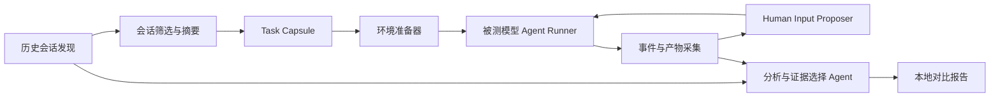

# Reprise 设计说明

状态：讨论稿 v0.2

## 1. 产品定义

Reprise 用于回答一个个人化问题：

> 在我真实使用过的任务上，把 Claude Code 或 Codex 的底层模型换成另一个模型，最终体验和结果会不会变好，代价是什么？

它不是公共榜单、基础模型 benchmark，也不是要求任务可以完全确定性复现的测试集。它是一个本地优先的、少量真实任务上的对照实验工具。

被测对象是一个组合：

```text
固定版本的 agent 产品 + 选定模型 + agent 配置 + 当前任务环境
```

因此结果的含义是“模型在这个实际 agent 产品中的个人效用”，而不是模型脱离产品后的纯能力。

## 2. 目标与非目标

### 目标

- 自动发现或辅助选择本机上已经发生过的高价值会话。
- 使用原始会话作为任务背景，而不是重新编写经典 benchmark 题目。
- 将原始会话作为实际基线，并在相同起始条件下运行新的被测模型。
- 被测模型根据自己的当前轨迹获得动态的人类输入。
- 记录可靠的过程遥测：时间、token、成本、工具调用和运行事件。
- 让分析 agent 自动判断某个任务需要展示哪些结果证据。
- 生成并排、可追溯的本地报告，让用户自己判断结果。

### 非目标

- 不声称测量基础模型的纯能力。
- 不建立适用于所有人的公共排行榜。
- 不要求所有任务都有统一的客观分数。
- 不把一次运行结果概括成模型的普遍结论。
- 不预先为所有领域设计一套固定的人工评分标准。
- 不把历史用户消息无条件地逐字重放。

## 3. “任何任务”的边界

任务域不限制为 Git 或编码。可包含：

- 编程、调试、代码审查
- 浏览器操作和网页研究
- 文档、表格、幻灯片处理
- 数据分析、脚本执行和自动化
- 本地文件整理、配置和迁移
- 需要多轮澄清的研究或创作任务

开放任务并不意味着每个任务都能完全复现。Harness 应根据任务环境选择可用的隔离方式：

| 环境类型 | 可能的隔离方式 | 主要限制 |
| --- | --- | --- |
| 本地文件或代码 | 临时副本、工作树、容器 | 未提交状态可能无法恢复 |
| 浏览器和网页 | 测试账号、浏览器 profile 副本、录制环境 | 外部网站状态会变化 |
| 文档和媒体 | 输入文件快照、输出目录快照 | 外部字体、插件和应用版本会影响结果 |
| 数据库或 API | 测试实例、mock、事务回滚 | 真实外部副作用通常不能安全重放 |
| 私有业务系统 | 用户明确授权的隔离账号 | 权限和网络策略可能无法复制 |

如果环境无法重建，报告必须标记为 `observational`，而不是假装成严格对照实验。

## 4. 核心原则：动态人类输入

### 4.1 为什么不能直接 replay

被测模型的输出、工具调用和中间状态会不同。原始会话中的下一条用户消息可能只适用于原模型已经走到的状态，因此逐字重放会产生两种问题：

- 被测模型没有获得完成任务所需的正常澄清或反馈。
- 被测模型获得了原模型轨迹中特有的、对它并不自然的提示。

### 4.2 Human Input Proposer

Harness 使用一个独立的 agent 作为 `Human Input Proposer`。它不执行被测任务，而是在每次被测模型需要下一轮输入时回答：

> 基于原始会话、任务目标、当前被测模型的输出和当前环境状态，接下来这个用户最合理会输入什么？

Proposer 的输入包括：

- 原始历史会话及其上下文
- 从历史会话提取的任务目标和已知事实
- 当前被测模型的消息、工具调用和工具结果
- 当前环境状态与产物摘要
- 之前已经生成的用户输入

Proposer 的输出是一条普通用户消息，或者一个终止信号。它会根据被测模型当前的表现生成不同内容；这正是该设计的目标。

### 4.3 “同等人类能力”的可操作定义

这里的等价不是“两个候选收到相同文字”，而是让同一个 Proposer 直接根据原始会话和当前被测模型轨迹判断下一步。Proposer 可以自然地询问、澄清、指出问题、确认结果或推动任务继续，不需要额外设计人工规则。

## 5. Task Capsule

原始历史会话直接作为基线和上下文输入。`Task Capsule` 只负责包裹运行所需的环境、版本和约束元数据，不要求把原始会话重写成另一套任务格式。

```text
Task Capsule
├── source_session
├── task_intent
├── original_transcript
├── available_context
├── environment_snapshot
├── agent_product_version
├── agent_configuration
├── target_model
├── execution_constraints
└── provenance_and_privacy
```

其中：

- `source_session`：Claude Code、Codex 或其他来源，以及原始会话位置。
- `task_intent`：从历史会话中提取的任务目的、约束和完成迹象。
- `available_context`：当时用户和 agent 实际可见的文件、URL、账号、配置和资源。
- `environment_snapshot`：可以复制的环境状态；无法复制的部分要显式记录。
- `execution_constraints`：超时、预算、权限、网络和是否允许外部副作用。
- `provenance_and_privacy`：数据来源、脱敏状态和允许发送给哪些模型。

Task Capsule 的环境元数据可以由 agent 初步生成，但必须允许用户在运行前查看和修改；原始会话内容保持可追溯。

## 6. 系统架构



### 6.1 Pi 的位置

Pi 是控制平面基础设施，不是被测任务的执行器：

- 用 `@earendil-works/pi-agent-core` 或 Pi SDK 运行 Proposer 和分析 agent。
- 用 Pi 的事件、session 和模型接口管理控制层状态。
- 通过子进程、RPC 或官方非交互模式启动 Claude Code/Codex。
- 为不同 agent 产品实现独立 runner adapter；一次实验只启动一个被测 runner。

Pi 已有 RPC、SDK、流式事件、steer/follow-up、session 状态和模型切换能力，适合承载控制逻辑，同时不需要 fork Pi 内部实现。

### 6.2 Runner Adapter

每个 runner 负责：

- 固定 agent 产品版本和启动参数。
- 注入初始任务和后续 Proposer 消息。
- 读取流式输出、工具调用、错误和终止状态。
- 捕获 agent 产生的文件、网页状态、文档、截图或其他产物。
- 将不同产品的事件转换为统一的 `Normalized Trace`。

被测 agent 的 system prompt、工具定义、权限和压缩行为应尽量保持不变。若为了接入另一个模型必须使用 API proxy、替换 provider 或改变上下文限制，报告必须标记为兼容性实验。

## 7. 指标与展示

### 7.1 始终记录的客观遥测

这些指标与任务领域无关：

- 墙钟时间和 agent 活跃时间
- 输入、输出、缓存 token
- API 成本或订阅消耗估计
- 模型调用次数
- 工具调用次数和工具类型
- 错误、重试、超时和中止
- 上下文压缩与上下文长度变化
- 每轮用户输入和 agent 输出的时间线

这些数据直接来自 runner 和 provider 事件，不交给分析 agent 猜测。

### 7.2 任务结果不设统一指标

不同任务的“做得好”证据不同，因此由独立的 `Evidence Selection Agent` 决定展示内容。它可以根据任务和产物选择：

- 测试或验证结果
- 文件差异和关键片段
- 最终文档或表格预览
- 网页截图和交互路径
- 数据分析结果和图表
- 任务要求覆盖情况
- 失败点、未完成事项和风险
- 两个候选的关键差异

它的职责是选择、组织和解释证据，不是把所有任务压成一个分数。报告应让用户看到原始证据、生成理由和必要的限制，而不是只显示一个“模型 A 8.4 分”。

### 7.3 报告结构

建议报告至少包含：

1. 实验条件：agent 版本、模型、配置和环境。
2. 过程时间线：原始会话与被测模型每轮输入、输出、工具和耗时。
3. 客观遥测对比：时间、token、成本和调用量。
4. 任务相关证据：由分析 agent 选择的结果视图。
5. 差异摘要：哪些地方明显不同，证据是什么。
6. 不确定性：环境不可复现、外部状态变化、输入生成器风险等。
7. 原始产物入口：日志、文件、截图和结构化事件。

最终决定由用户完成，Harness 不需要替用户输出普适的胜负分数。

## 8. 公平性与实验解释

本项目应该使用“受控个人对照”而不是“公平 benchmark”作为术语。

固定 agent 产品的优点是可以测量真实使用效用；代价是结果同时包含：

- agent 的系统提示和工具策略
- 模型的推理和生成行为
- 上下文压缩、重试和路由逻辑
- Proposer 的动态输入
- 当前环境和外部服务状态

最合理的结论形式是：

> 在 agent X 的版本 Y、配置 Z 和这个任务胶囊下，被测模型相较于原始会话表现出更快/更省/更有用的结果；这个结论不外推到所有任务或基础模型能力。

## 9. 理论依据

- **Potential outcomes / 因果推断**：同一个任务下，不同模型对应不同的反事实结果。
- **Paired / crossover experiment**：同一用户和同一任务的成对比较比跨任务平均更适合个人决策。
- **POMDP / Dec-POMDP**：用户和 agent 根据部分可见状态交替行动并共同改变环境。
- **Offline policy evaluation**：历史输入不能在状态分叉后无条件重放，因此需要动态输入生成。
- **Differential testing / metamorphic testing**：没有统一标准答案时，比较轨迹、状态变化和产物证据。
- **Goal-Question-Metric**：指标由个人决策问题驱动，而不是先收集一组与任务无关的分数。
- **LLM-as-a-judge 研究**：分析 agent 可以扩展证据整理，但必须暴露证据和偏差风险。

相关参考：

- [τ-bench](https://arxiv.org/abs/2406.12045)
- [τ²-bench](https://arxiv.org/abs/2506.07982)
- [SWE-bench](https://arxiv.org/abs/2310.06770)
- [Judging LLM-as-a-Judge](https://arxiv.org/abs/2306.05685)
- [Pi Agent Harness](https://github.com/earendil-works/pi)
- [Inspect AI](https://github.com/UKGovernmentBEIS/inspect_ai)
- [Promptfoo](https://github.com/promptfoo/promptfoo)

## 10. 实施顺序

### 阶段一：单会话对照

- 用户手动选择一个历史会话。
- 手动确认原始会话、运行环境和实验参数。
- 支持一个被测 agent runner 和一个目标模型；原始会话直接作为基线。
- 使用独立 Proposer 生成每轮下一条用户消息。
- 采集统一事件和客观遥测。
- 生成静态本地报告。

### 阶段二：自动会话发现

- 读取本机 Claude Code/Codex 会话目录。
- 提取任务摘要、工具活动、产物和完成迹象。
- 按“可能是一个完整真实任务”的信号排序。
- 由用户确认候选，而不是自动执行所有会话。

### 阶段三：结果证据自动化

- 为常见环境增加产物采集器。
- 让 Evidence Selection Agent 根据任务选择截图、日志、差异或其他证据。
- 支持报告中直接打开原始产物。
- 增加不可复现原因和结论置信提示。

### 阶段四：更多任务环境

- 浏览器、文档、表格、数据分析和外部 API 的环境适配器。
- 只在有明确隔离和回退机制时支持具有副作用的任务。

## 11. 必须保留的安全边界

- 默认在隔离目录、临时工作树或容器中运行。
- 历史会话导入前检测密钥、token、私有 URL 和敏感文档。
- 分析 agent 默认使用脱敏数据或本地模型。
- 不自动向未知 provider 上传完整历史会话。
- 外部副作用必须使用测试账号、mock 或显式用户确认。
- agent 二进制和版本应固定，下载来源和 checksum 可追溯。
- 报告中区分 `controlled`、`partially-controlled` 和 `observational` 实验。

## 12. 当前设计结论

该产品的关键不是设计一套复杂的人类策略，而是构建一个可靠的动态实验循环：

```text
历史会话 + 当前候选轨迹
    -> Proposer 推断下一条人类输入
    -> 被测 agent 继续执行
    -> 采集过程和产物
    -> Evidence Agent 选择需要展示的证据
```

它的核心价值是把“我感觉这个新模型更好”变成一份针对真实任务、可追溯、带过程成本和结果证据的个人对照报告。
