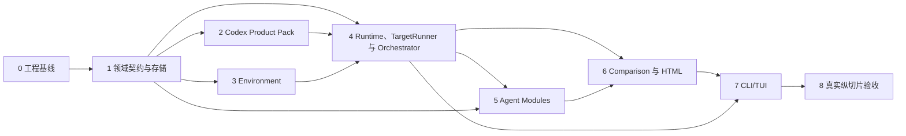

# Reprise 分模块开发实现计划

状态：模块 0–8 已完成；首个冻结历史 Codex C 纵切片已通过，并完成 JSONL 可重放性修复
更新时间：2026-08-10（真实 C 运行、trace 重放验证完成）
依据：[产品定义](./product/overview.md)、[架构总览](./architecture/overview.md)及其专题规范。

## 1. 目标、非目标与完成定义

### 目标

以模块化单体实现一个可在 Windows 11 上运行的本地优先 Harness。开发先交付一条**无外部副作用的可运行纵切片**：使用脱敏 Codex fixture 冻结 `TaskCase`，用 `ScriptedRuntime` 驱动单候选，持久化 `RunRecord`，生成确定性本地报告；该切片通过后再接入当前机器上的 Codex Runtime。

### 非目标

- 不重放历史 Runtime 或逐轮重放原用户消息。
- 不构建新的通用 Agent、Workflow DSL、通用 PTY、插件市场、动态插件加载或远程执行。
- 不自动宣布模型胜者、不强制统一质量分、不承诺回滚外部世界副作用。
- 不在首个纵切片中实现 Claude Code、复杂非空项目恢复、浏览器/容器/远程环境或 macOS/Linux 正式支持。

### 受影响模块

`src/core`、`src/application`、`src/products`、`src/environment`、`src/agents`、`src/infrastructure`、`src/report`、`src/cli` 与对应的测试支持代码。目录是实现导航，不要求每个目录成为独立包；唯一目录基线见模块 0，不再与架构总览维护第二套命名。

### 验收标准（Done-means）

**第一条可运行纵切片：**

1. 脱敏 Codex fixture 能冻结为不可变 `TaskCase`；不读取用户真实会话，不调用外部模型。
2. `ScriptedRuntime` 能驱动单候选从准备到结束，产生独立 run 目录、`RunAttempt`、必要时的 `RunManifest`、append-only trace、artifact 与 `RunRecord`。
3. 状态机、事件重放、引用 ownership 和清理结果都有最小确定性测试；报告由持久化事实重新生成。

**第一版产品闸门：**

4. 在 Windows 11、Node.js `>=22.19.0` 上，fixture CLI 能完成本地实验；受显式环境变量保护的 Codex protocol smoke 能创建单候选真实运行并写出本地报告。
5. 真实 Codex 纵切片通过前，不实现第二 Product Pack、复杂非空项目恢复、浏览器/容器/远程环境或正式跨平台支持。
6. 真实纵切片保留完整运行事实、报告和人工验收记录；不以模型胜负或统一质量分作为通过条件。
### 验证

- 每个模块只运行直接受影响的检查；纯文档改动不构建、不跑测试，未变代码不重复跑已通过测试。
- 第一条可运行纵切片先用 `ScriptedRuntime` 覆盖 accepted、rejected、delivery unknown、settlement、timeout、cancel、crash 与 cleanup failure。
- 只有确定性纵切片和适配器契约测试通过后，才在有本机账号、网络和预算时执行 Codex Runtime smoke：启动 → 接受输入 → settlement → 多轮提交 → stop。
- 真实纵切片后人工核对报告、artifact 链接、Runtime/模型事实、fidelity、限制项与 trace 重放结果。
### 风险边界

- Runtime 私有协议、账号状态、模型可用性、网络与费用属于真实环境风险；适配器必须以可观察事实记录，不能猜测或伪造匹配。
- Recovery 只能在 Harness 持有的 staging/隔离副本中写入；不可安全恢复时标记 `unsupported`，绝不在原位置运行。
- Agent 输出不可信：所有 schema、引用、路径、ownership、隐私和大小限制在确定性工具边界校验；真实发布、付款、删除和权限扩大必须由真实用户授权。
- 先验证 Codex 的单一纵切片，避免以“通用性”为名同时实现第二产品或复杂环境。

## 2. 实施原则与依赖顺序

- **先事实，后智能，再界面。** 领域契约、存储和状态机必须先于 Pi Agent、TUI 或报告完成；Agent 不拥有生命周期或事实。
- **先一条纵切片，后横向扩展。** 首发只实现 Codex + `LocalWorkspaceProvider` + 一个候选；Claude Code 与非空项目恢复是验证边界后的增量。
- **端口先于产品细节。** Core 定义 `RuntimePort`、`EnvironmentPort`、Agent ports；Codex Product Pack 仅实现适配，不让私有格式渗入 Core。
- **默认静态注册、普通函数优先。** 不引入 DI 容器、事件总线、通用 fake 框架或未被第二实现验证的抽象。
- **每个模块的退出条件是可验证产物。** 不以“目录已创建”或“接口已定义”作为完成；必须留下一个能阻止关键不变量回归的最小检查。

## 3. 模块 0：工程基线与开发约束

**目的**：建立与技术选型一致、可快速验证的 TypeScript/ESM 单体骨架，而不预建业务抽象。

**实现范围**：

- 初始化 npm 包、`type: module`、Node `>=22.19.0`、严格 TypeScript 配置和最少测试/检查命令。
- 建立唯一目录基线：`src/core`、`src/application`、`src/products`、`src/environment`、`src/agents`、`src/infrastructure`、`src/report`、`src/cli` 与 `test/`；只创建模块 0 立即需要的目录，后续按模块增加。入口只负责 composition root，不把业务逻辑塞进 CLI。
- 只声明当前模块的直接依赖；TypeBox 在 schema 首次落地时加入，Pi packages 在首个 Agent Host 调用时加入。版本统一由 `package-lock.json` 锁定，不为未实现能力提前接入依赖。
- 写明 Windows 11 是唯一正式支持平台；将进程、路径和文件系统差异限制在基础设施/适配器层。

**依赖**：无。
**退出条件**：空项目可以类型检查与运行一个无副作用的 CLI help；版本与目录约定可被新模块复用。
**最小检查**：类型检查、CLI help、Node 版本断言。

## 4. 模块 1：领域契约、Schema 与事实存储

**目的**：先固定系统的语言和事实边界，使后续 Product Pack、Agent 和 UI 都只能通过同一套可验证对象协作。

**实现范围**：

- 在 `src/core` 定义第一条纵切片实际需要的 `TaskCase`、`ExperimentSpec`、`CandidateSpec`、`RunAttempt`、`RunManifest`、`RunRecord`、`ArtifactRef`、`EvidenceRef`、`RunOutcome` 与状态迁移；只有被实际调用的字段进入 TypeBox schema，其余公共类型随对应模块加入。
- 在 `src/infrastructure/store` 实现 experiment 目录内唯一 append-only `events.jsonl`、单 writer lock、不可变 artifact 提交和事件重放；只有纵切片需要的 hash、ownership 与引用校验先落地，不提前实现完整存储平台。
- 实现七状态转换守卫和稳定 operation ID；先持久化状态/决策，再执行发送、停止、release 等副作用。
- 对尾部半行恢复、重复提交和终态后的迟到事件做明确处理；其他损坏场景在出现对应持久化格式后再补测试。

**依赖**：模块 0。
**退出条件**：准备失败和启动后结束都可从事件重建合法 `RunRecord`；越权或不存在的 artifact/evidence 引用被拒绝；终态 outcome 不会被迟到事件改写。
**最小检查**：schema 解析、状态迁移表、事件重放、单 writer 拒绝、artifact 原子提交和非法引用测试。

## 5. 模块 2：Codex Product Pack 与历史会话导入

**目的**：把 Codex 的私有会话和当前 Runtime 事实隔离在首个静态注册的 Product Pack 内，形成可冻结的历史基线。

**实现范围**：

- 定义 Product Pack manifest、Session Source、Runtime adapter、Recovery playbook 与脱敏 fixtures 的内部边界；composition root 静态注册 Codex Pack。
- 发现/选择本机 Codex 历史会话，导入完整 raw 会话和可执行首条输入；保存来源、turn 范围、隐私标记、原始结果证据和内容 hash。
- 首个 Codex Product Pack 支持完整会话导入、初始输入提取、基线证据和必要 artifact 冻结；不把测试样本绑定进公共适配器。
- 解析当前已安装 Codex Runtime、版本、配置和实际解析后的候选模型事实；无法确认时记录 unknown/drift，而非从 Pi 模型列表推断。

**依赖**：模块 1。
**退出条件**：可生成不可变 `TaskCase`，并能以 fixture 稳定解析来源与基线；产品私有 raw 数据不泄漏进公共领域对象。
**最小检查**：fixture 导入、片段边界、初始输入提取、截图/artifact hash 与 Runtime 事件规范化测试。

## 6. 模块 3：Environment、Recovery 与隔离工作区

**目的**：把“是否能安全运行”从候选执行中分离出来；首发只实现空目录任务所需的本地隔离环境。

**实现范围**：

- 定义 `EnvironmentPort`、`EnvironmentBaseline`、`PreparedEnvironmentRef`、fingerprint、change set、资源 ownership 与 release 协议。
- 实现 `LocalWorkspaceProvider`：创建 Harness 持有的隔离目录，记录输入/输出资源、前后 fingerprint，并实现幂等 release。
- 接入 Recovery Agent Port，但首个纵切片采用最小 Product Recovery Playbook：验证空工作目录资格、冻结输入截图/文档并输出明确恢复事实；不为尚未出现的复杂恢复预留 Provider。
- 无法证明隔离与恢复安全时返回 `unsupported`；禁止候选在原工作目录执行。

**依赖**：模块 1；Recovery 的 Pi Host 实现在模块 5 接入，端口先行。
**退出条件**：确定性 fixture 取得可释放的隔离目录；准备、fingerprint、release 与失败均被记录且不触及源目录。真实任务准入留给模块 8。
**最小检查**：路径/ownership 拒绝、隔离副本、前后 fingerprint、重复 release 与 unsupported 分支。

## 7. 模块 4：RuntimePort、TargetRunner 与 CandidateRun 状态机

**目的**：以确定性编排启动并控制候选 Runtime，严格区分交付回执、活动事件、turn settlement 和进程退出。

**实现范围**：

- 在 Core 定义 `RuntimePort`/`TargetRunner`：resolve、start(initialInput)、submit、事件流、settlement、stop 与进程清理；Codex Pack 同时说明 start/send/stop 在响应丢失时可查询的原生证据及无法确认时的 `uncertain.*` 降级。
- Codex adapter 已实现 executable discovery、候选模型请求校验、app-server JSONL 的启动、native admission/settlement、一次后续提交、stop 与事件规范化；服务端发起的工具/权限请求一律拒绝，不实现通用 PTY。真实 app-server 返回的模型事实仍按证据记录，未解析时保留 `unknown`。
- 在 `src/application` 实现 CandidateRun 七状态模型、预算、heartbeat、timeout、cancel、crash 与 `finalizing` 清理路径；将结果、停止、失败、清理和 delivery certainty 分开固化。
- 提供仅用于测试的极小 `ScriptedRuntime`，不把它升级为通用场景 DSL 或生产组件。

**依赖**：模块 1、模块 2、模块 3。
**退出条件**：在无 Agent 的情况下，ScriptedRuntime 可驱动所有合法/异常状态路径，且输入不因重试重复提交。
**最小检查**：accepted/rejected/delivery-unknown、settlement gate、预算、timeout、cancel、crash、cleanup failure 与状态机重放测试。

## 8. 模块 5：受限 Agent Module 与 Pi Agent Host

**目的**：只在确定性边界已稳固后加入首个真实闭环所需的智能决策；Recovery、Controller、Comparison 共享 Host 基础能力，但只实现当前纵切片需要的接口。

**实现范围**：

- 实现复用 Pi 基础能力的 Host：结构化输出 schema 校验、有限修复、单次调用超时、无效输出后的确定性 fallback 与不含敏感信息的诊断；调用、token 和成本字段只在 Runtime 或 provider 实际提供时记录，不为尚未存在的预算策略预建配置。
- Controller：由完整历史会话、`TaskCase.initialInput`、规范化当前观察和 CandidateRun 限制快照构造 `SteeringContext`，仅返回合法 `send` 或 `done`；system prompt 明确禁止把未来发现伪装成用户先验。
- Recovery：只操作 Harness staging，由 Provider 验证恢复结果；其推断不得自动升格为 verified。
- Comparison：仅可读 artifact/telemetry，写入自由 `comparison.md`，返回薄 `ComparisonEnvelope` 与 evidence refs；不能接触 Runtime 或改变 run state。

**依赖**：模块 1、模块 3、模块 4。
**退出条件**：Agent 非法、单次调用超时或失败时，Harness 能修复有限次数后安全降级；没有 Agent 可以写越权路径、提升事实或破坏 CandidateRun。
**最小检查**：合法/非法 schema、修复上限、工具能力拒绝、Controller 调用时机、fallback 和 evidence ownership 测试。

## 9. 模块 6：比较投影、Artifact 浏览与静态 HTML 报告

**目的**：在不重解释 Agent 结论的前提下，交付用户可离线判断的证据视图。

**实现范围**：

- 将 baseline、RunRecord、telemetry、fidelity 和 artifact catalog 组装为只读 `ComparisonContext`，调用 Comparison Agent 后验证其引用。
- 实现无前端框架的 TypeScript 静态 renderer：内联 CSS/必要脚本、统一转义、内容大小控制、媒体类型处理和安全相对链接。
- 输出 baseline 与候选摘要、观测、限制、任务判断、停止原因、fidelity、遥测与 artifact 入口；Comparison 不可用时输出客观降级报告。
- 报告只链接 experiment-owned 安全副本，绝不泄漏任意本机绝对路径。

**依赖**：模块 1、模块 4、模块 5。
**退出条件**：相同 projection 反复生成同一语义报告；恶意模型文本不能注入 HTML；无 Comparison 结果时仍可诊断。
**最小检查**：HTML 转义、非法/越权引用、降级报告、无绝对路径输出和 fixture 快照检查。

## 10. 模块 7：CLI/TUI 与最短用户路径

**目的**：以一个 npm CLI 提供控制面；TUI 仅投影领域事件，不复制业务状态机。

**实现范围**：

- 提供最少命令：`setup`、`cases`、`compare`、`report`；首次 setup 配置 Harness 内部 Agent provider/model、数据目录与隐私策略。
- 实现会话/候选选择、运行前条件确认、运行时间线、取消、诊断、报告生成/打开等 TUI 投影；将复杂交互留在真实需求出现后。
- composition root 在此统一注册 Codex Pack、Provider、Store、Pi Host 与 services；关闭详情页只切换投影，不取消运行。第一版不做后台 daemon 或 detach/reattach：运行中退出 TUI 转为紧凑日志，第一次 Ctrl+C 请求取消并进入 finalizing，第二次强制退出并留下 interrupted 事实。

**依赖**：模块 2 至模块 6；但只有模块 4 的确定性纵切片和 Codex smoke 闸门通过后才实现。
**退出条件**：新用户无需直接编辑内部文件，即可使用 fixture 与 `ScriptedRuntime` 走通 setup → cases → compare → report；真实 Codex 网络运行只有模块 8 的 smoke 闸门通过后才开放。
**最小检查**：命令参数验证、不可用 Runtime/模型提示、只读事件投影、TUI 关闭/取消语义和非交互 CLI smoke。

## 11. 模块 8：真实纵切片验收与边界扩展

**目的**：用真实任务验证产品假设和现有端口，而不是在抽象层面宣称通用。

**首次真实纵切片准入条件**：

- 历史会话来自 Codex，第一条可执行输入明确；
- 会话开始时工作目录为空，或只依赖已经冻结到 TaskCase 的输入文件；
- 不依赖浏览器登录态、数据库写入、远程服务写操作或用户全局配置修改；
- 输出可通过文件、文本或命令结果检查，允许放入 Harness 持有的隔离目录；
- 不包含真实发布、删除、付款、权限扩大或其他不可逆步骤；
- 操作者在执行前确认实际 Runtime 账号、网络、成本和最大墙钟。

**实施顺序**：

1. **已完成：Codex protocol smoke**：以 Reprise 生成、无工具的非历史文本任务验证当前 app-server 启动、两次 candidate admission/settlement、一次 Controller 决策、stop、隔离 cleanup、RunRecord、Comparison 与报告。候选固定为 Luna/high，Experiment Application 固定为 Terra/medium。
2. **已完成：首个历史 Codex 纵切片（DaoFocus C）**：从 `9752d2b` 冻结 source archive，在独立临时 workspace 中运行 Luna/high；候选仅修改四个允许的服务/测试文件，聚焦测试 12/12、全量测试 52/52。生成 scope JSON、review patch、报告和 acceptance record；10,307 条 trace event 已独立解析、校验连续 sequence 并成功 replay。
3. **保留验收记录**：至少记录 TaskCase/Experiment/Run ID、Codex executable/version、requested/resolved model、fidelity、termination、cleanup、report 路径、人工判断和已知限制；`smoke-record` 只校验并以不可变文件保存记录，不启动 Runtime。
4. **已完成：边界复盘**：真实运行暴露进程内并发 append 会破坏 JSONL，因此仅在 `ExperimentStore` 中串行化 append 并添加并发回归检查；不把一次纵切片扩展成通用 benchmark。
5. **第二产品 Pack**：首个历史 Codex 纵切片通过后，再以 Claude Code 的一条纵切片检验 Product Pack 边界，并把第二适配器作为独立模块计划。

**依赖**：模块 0 至模块 7；其中模块 5–7 已先用 fixture/ScriptedRuntime 完成，真实 Codex 网络运行仍受模块 8 smoke 闸门约束。
**退出条件**：已满足。首个真实纵切片产生可判断的证据；无论结果优劣，都不以候选模型胜负作为验收条件。
**最小检查**：已执行。保留人工验收记录、完整可重放 trace、scope/patch artifacts 与 report；真实 Runtime 使用用户已授权的当前 Codex API。

## 12. 阶段闸门与实施节奏

| 阶段闸门 | 包含模块 | 可演示结果 | 继续条件 |
| --- | --- | --- | --- |
| 阶段 A：可运行地基 | 0–1 | 可校验的领域对象、事件与状态机 | schema/重放/引用边界测试通过 |
| 阶段 B：可控候选运行 | 2–4 | Codex fixture 导入、隔离环境、ScriptedRuntime 运行 | 七状态模型和 cleanup 路径通过 |
| 阶段 C：受限智能与证据 | 5–6 | Controller/Comparison 受限调用与静态报告 | 非法 Agent 输出安全降级 |
| 阶段 D：用户路径 | 7 | fixture + ScriptedRuntime 的 setup → compare → report | 非交互和 TUI 投影检查通过 |
| 阶段 E：产品假设 | 8 | 真实纵切片与边界复盘 | 形成可判断证据 |
| 阶段 F：边界验证 | 后续 | Claude Code 首条纵切片 | 仅在阶段 E 后启动 |

在阶段 B 通过后增加一次人工 Codex smoke 闸门：只验证当前 Runtime 的启动、首条输入 admission、settlement、一次后续提交和 stop；失败时先修复端口或缩小范围，不继续实现模块 5–7。

每个阶段只在其退出条件满足后再启动下一个。发现安全边界、外部副作用、协议不可观测或真实样本不具备前提时，暂停并更新当前规范/实验口径，而不是静默扩大实现范围。

## 13. 文档同步规则

- 本计划是实现顺序与模块验收的唯一来源；产品目标仍以 `product/` 为准，跨模块语义仍以 `architecture/overview.md` 为准。
- 任何改变公共协议、生命周期或产品范围的实现发现，先更新对应的权威文档，再调整本计划；不要让代码或本计划暗中覆盖架构。
- 本 Markdown 是模块顺序与阶段闸门的唯一来源。曾经并行维护一份架构全景 HTML，它需要在每次计划变更时手工同步，因此已移出版本控制。
