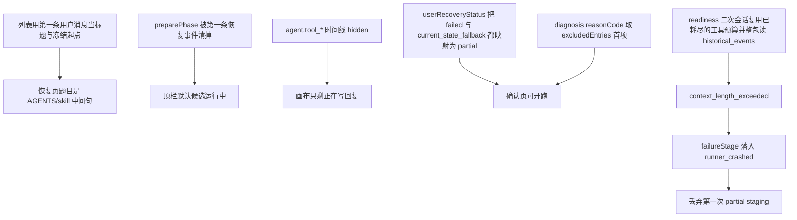

# Codex 真实会话恢复失败修正规划

状态：A–F 已按本清单落地；`npm run check` 为闭合门禁。  
范围：TUI 恢复/确认投影、用户终态与 `reasonCode`、Recovery 重试与工具预算、会话展示标题。不扩大为候选 Runtime、Comparison 或第二套恢复架构。  
依据：[TUI](../product/tui.md)、[会话恢复用户终态](../decisions/accepted/2026-08-28-session-recovery-user-first.md)、[无 accept 不得开跑](../decisions/accepted/2026-08-30-recovery-failed-blocks-candidate.md)、[候选失败分类](../decisions/accepted/2026-08-28-recovery-candidate-runtime-failure.md)、[列表与 Recovery 分界](../decisions/accepted/2026-08-27-session-intake-vs-recovery-agent.md)。走查证据在不受控的 `docs/.local/`（本机 Codex 项目会话，冻结后 Recovery Agent 约 13 分钟到达确认页）。

## 1. 要变成真的事

一次真实历史会话走完恢复后，操作者必须能同时成立下面四条：

1. **阶段诚实**：恢复进行中的顶栏、图例和快捷键是「正在恢复会话」，不是「候选运行中 · Codex」。
2. **终态诚实**：Agent/Host 崩溃、上下文溢出、工具预算耗尽导致没有可接受 staging 时，用户看到「无法恢复」，而不是和「跳过一条出根 symlink」相同的「部分恢复」。
3. **成果不丢**：第一次已经通过协议校验的 `partial` envelope 与 staging，不得被后续 readiness 重试的模型失败整单作废成 `current_state_fallback`。
4. **题目可读**：列表、恢复页、确认页的任务标题是用户任务摘要，不是 skill / `AGENTS.md` 注入正文的中间句。

Done means（整份计划闭合时）：

- `npm run check` 通过；触及 TUI 渲染时更新并提交 `docs/tui-audit/frames/`。
- 新增或更新的门禁附带能让该门禁失败的反向用例。
- 用同一类 fixture（instruction 开头的双用户消息、出根 symlink、第一次 `partial` 后第二次 `context_length_exceeded`）走通恢复，确认页与 `recovery-diagnosis.json` 与上列四条一致。
- 不在本计划内启动真实候选 Runtime。

## 2. 非目标

- 跟随出根 `node_modules` 或放宽快照预算。
- 对上游 HTTP 503 自动重试（见[候选失败分类](../decisions/accepted/2026-08-28-recovery-candidate-runtime-failure.md)）。
- 改冻结契约「起点永远是第一条用户消息」——那是独立 ADR；本计划只改**展示标题**，除非另立决策。
- 重写 Recovery Host、开放 shell、提高无界工具预算来「多删一会儿」。
- 把走查里的真实绝对路径、完整 transcript 或凭据写入受控文档或测试夹具正文。

## 3. 根因（按层，不是按界面症状）

| 层 | 当前缺口 | 目标不变量 |
|---|---|---|
| TUI 顶栏 | `workbench.ts` 只在 `preparePhase==='check'` 时用「正在恢复会话」 | `runPhase==='recovery'` 期间一律恢复标题与恢复快捷键 |
| TUI 时间线 | `timeline.ts` 把 Recovery 工具调用标 `hidden` | 恢复阶段默认可见：工具名、失败、预算耗尽、报告写入；不伪造 Codex 生成 |
| 用户终态 | `userRecoveryStatus()`：`recovery==='failed'` 或 `match==='current_state_fallback'` → `partial` | 无接受点的失败 → `failed`；仅环境跳过且有可运行 staging → `partial` |
| 诊断码 | `reasonCode` 被 symlink 抢先 | 与 `failureStage` / 模型错误类别一致，symlink 只留在 `excludedEntries` |
| 编排 | 二次模型失败走 `failRecoveryRunSession` 的 current-state fallback | 保留上次已校验 envelope；二次失败记 `agent_model_failed`，不覆盖已发布 preview |
| 工具 | `maxToolCalls=64` 含 `write_recovery_report`；`read_observation` 可返回 MB 级 JSON | 完成工具预留名额；observation 有界分页；超限失败不得再塞进下一轮 prompt |
| Git 假设 | 子目录存在 `.git` 时 Host 仍把 `git-history` 放在最高证据 | 只认 **source root** 的 Git；根上无仓库则不把 git-history 当作第一执行候选 |
| 标题 | `sessionTitle()` 去掉 Windows 路径前缀后仍可能落在英文条款句 | 展示用「任务摘要」启发式；冻结 `initialInput` 暂不改 |

## 4. 实施顺序

后一项依赖前一项的契约。不要并行改终态映射和「保留 partial」却共用未更新的测试期望。

| 批次 | 主题 | 风险 | 建议提交粒度 |
|---|---|---|---|
| A | 恢复阶段 TUI 诚实 | 低，只投影 | 单独 PR；必跑 `audit:tui` |
| B | 用户终态与确认页门禁 | 中，改公开语义 | 单独 PR + ADR 补记 |
| C | 失败分类、保留上次 partial、observation 上限 | 高，改编排 | 单独 PR；先红后绿 |
| D | 工具预算与删除策略（playbook + 预留完成工具） | 中 | 可与 C 同 PR，若 diff 过大则拆 |
| E | 展示标题与列表诊断 | 低–中 | 单独 PR；冻结起点不变 |
| F | Git 根探测 | 中 | 单独 PR；forensics fixture |

---

### 批次 A — 恢复页不得冒充候选

**改什么**

- [`src/tui/workbench.ts`](../../src/tui/workbench.ts)：顶栏在 `running.preparePhase==='check'` **或** `running.runPhase==='recovery'` 时使用 `recoveringTitle`。
- [`src/tui/controller-run.ts`](../../src/tui/controller-run.ts)：`appendTimeline` 不得在 `runPhase==='recovery'` 时清掉恢复准备态，或改为只清 `copy`/`compare`；恢复事件必须把 `runPhase` 钉在 `recovery`（`phaseForEvent` 对 `agent.tool_*` 且 `payload.role==='recovery'` 返回 `recovery`）。
- [`src/tui/pages/run.ts`](../../src/tui/pages/run.ts)：`runPhase==='recovery'` 时图例/空态/快捷键走恢复文案，禁止「发给 Codex」「正在写回复」空画布。
- [`src/tui/timeline.ts`](../../src/tui/timeline.ts)：恢复工具失败、预算耗尽、`write_recovery_report` / `write_recovery_manifest`、成批 `delete_file` 汇总行默认可见。其余高频成功 `list_dir` 可继续 hidden 或折叠为计数。

**验收**

- `test/tui-workflow.test.ts` / `test/widgets.test.ts`：恢复事件进入后顶栏仍含「正在恢复会话」或英文 `Recovering session`。
- 反向：构造 `preparePhase=undefined` + `runPhase=recovery` 的投影，断言不得出现 `candidateRunningTitle`。
- `npm run audit:tui` 更新恢复相关帧。

**回滚**：还原上述文件与 frames。

---

### 批次 B — 三种用户终态与确认页

**问题**：[用户终态决策](../decisions/accepted/2026-08-28-session-recovery-user-first.md) 只允许「已恢复 / 部分恢复 / 无法恢复」。实现把崩溃 fallback 显示成部分恢复，确认页仍 `[Enter] 启动隔离候选`，且 `hasAccept===false`。

**目标语义**

| 条件 | 用户终态 | 确认页 Enter |
|---|---|---|
| `match=recovered` 且有 accept | 已恢复 | 允许 |
| 有可运行 staging/accept，仅 `excludedEntries` 或 envelope `partial` | 部分恢复 | 允许，限制必须可见（跳过了哪类路径） |
| `recovery.status=failed` 且无 accept/staging，或 `match=current_state_fallback` 且来源是 runner/model 失败 | 无法恢复 | **禁止**启动候选；可回封面或重试恢复（不静默拷当前树当「已准备」） |
| transcript 无效 | 无法恢复 | 禁止 |

**改什么**

- [`src/application/recovery-user-status.ts`](../../src/application/recovery-user-status.ts)：删除「failed/fallback → partial」这条。`reasonCode` 优先 `failureStage` / 模型错误类，其次才是 `workspace.symlink_skipped`。
- [`src/tui/pages/run.ts`](../../src/tui/pages/run.ts) 确认框：展开脱敏失败摘要（禁止 API key、完整 prompt、完整 URL）。
- [`src/tui/controller-run.ts`](../../src/tui/controller-run.ts) `candidateStartBlocked`：无 accept 且用户终态 `failed` 时拦截。
- i18n：区分「跳过出根链接」与「恢复运行失败」。

**必须新增决策记录**（同一次变更）：修正 `userRecoveryStatus` 与「无 staging 不得开跑」，写明放弃「fallback 也叫部分恢复以便用户继续对照」的方案——那会在错误任务标题上对当前脏工作区计费。

**验收**

- `test/recovery-user-status.test.ts`：反向用例——`current_state_fallback` + `recovery.failed` + 无 accept → `failed`；仅 excluded symlink + 有 staging → `partial`。
- `test/tui-workflow.test.ts`：failed 确认页 Enter 被拦。
- 更新 `test/widgets.test.ts` 确认文案。

**回滚**：还原映射会再次把崩溃显示为部分恢复；ADR 标 superseded。

---

### 批次 C — 二次失败不得吃掉第一次 partial

走查中第一次会话已写出 `partial` manifest；readiness 二次调用 `read_observation(historical_events)` 返回约 1.5 MiB，上游 `context_length_exceeded`；`agent.session_failed` 的 `kind` 为 `unknown`，评估码落到 `runner_crashed`，staging 被丢弃。

**目标**

1. 模型 HTTP 400 `context_length_exceeded` 分类为 `agent_model_failed`（或显式 `model_request_failed`），**不是** `runner_crashed`。
2. `failRecoveryRunSession`：若已有通过 TypeBox 的 envelope + 仍完整的 execution candidate 树，则 **finalize 该次结果**，二次失败只追加 warning / `recovery.model_retry` 失败事件。
3. `read_observation`：单次与累计字节上限；超限返回截断游标，禁止把整包 history 再拼进下一轮。
4. Readiness 反馈轮不得重置「完成工具是否已写过」；预算耗尽时禁止再开需要工具的二次会话，改为接受当前 envelope 或标 `unrecoverable`。

**改什么**

- [`src/application/experiment-recovery-fail.ts`](../../src/application/experiment-recovery-fail.ts)、[`experiment-recovery-run-finalize.ts`](../../src/application/experiment-recovery-run-finalize.ts)、[`experiment-recovery-run-model.ts`](../../src/application/experiment-recovery-run-model.ts)
- [`src/application/recovery-failure-classification.ts`](../../src/application/recovery-failure-classification.ts)、Pi 错误映射
- [`src/infrastructure/recovery-tools.ts`](../../src/infrastructure/recovery-tools.ts) observation 分页

**验收**

- `test/codex-experiment-recovery.test.ts` / `test/codex-experiment-recovery-effort.test.ts`：第一次 TypeBox 通过的 `partial` 后第二次抛出 `context_length_exceeded` → 尝试结果仍为 `partial` 且 `accept` 存在。
- 反向：无第一次 envelope 时二次 400 仍失败，且 `failureStage` 不是 `runner_crashed`。
- 覆盖率只升不降。

**回滚**：编排回退到「任何未捕获错误都 current-state fallback」。

---

### 批次 D — 工具预算与删除

**目标**

- `write_recovery_report` / `write_recovery_manifest` 不计入「调查预算」，或预留固定名额（例如最后 4 次只允许完成工具）。
- Playbook（[`src/products/codex/recovery/SKILL.md`](../../src/products/codex/recovery/SKILL.md)）：无路径级强证据时禁止把「删光事后产物」当主策略；删除必须能填 `beforeHash` 或降级 `partial` 并停止空转 `delete_file`。
- Host：连续无进展的相同 `delete_file` 计入 no-progress，提前结束调查。

**验收**

- 工具层测试：64 次 `list_dir` 之后 `write_recovery_report` 仍成功。
- 反向：调查工具在预留耗尽后失败。
- snapshot：playbook SHA 变化走现有 pack 校验。

**回滚**：恢复单一计数器。

---

### 批次 E — 展示标题与列表诊断

**目标（不改冻结起点）**

- 新增纯函数 `taskDisplaySummary(text, laterUserTexts)`：若首条像 instruction 块（例如以 `# AGENTS.md` / `<INSTRUCTIONS>` / 超长英文条款开头），改用下一条足够短的用户消息做**展示**；列表、恢复页 `taskTitle`、确认页「当前任务」共用它。
- `sessionTitle()` 不再把「去掉路径后的第一句英文条款」当成题目。
- 列表 `pending`：与「可冻结的完整 transcript」拆开文案（摘要窗口截断 ≠ 不可回放），对齐[列表与 Recovery 分界](../decisions/accepted/2026-08-27-session-intake-vs-recovery-agent.md)。
- 页脚 `invalid-jsonl`：标明是 catalog 全局计数，不是当前行损坏。
- 封面「未选 Agent」：进入 intake 前可用「已注册产品」避免空心灯被理解成未配置（可选，P2）。

**若要改冻结 `initialInput`**：另开 ADR。候选始终从 `initialInput` 开跑；把 skill 注入当作用户任务会污染 Controller。未立项前禁止在 Pack `inspect` 里静默丢掉第一条消息。

**验收**

- 单元测试：夹具字符串（无真实会话正文）覆盖「首条 instruction、次条短任务」。
- TUI 帧：会话预览题目不再是 `don't re-write it` 这类条款句。

---

### 批次 F — source root Git

**目标**：`resolvedRecoveryFacts.git.isRepo` 仅当 **source root** 自身是仓库。子目录 `.git` 记为嵌套仓库事实，不得把 `git-history` 选成最高 `executionCandidate`。

**验收**：environment / recovery-tools 测试：根无 `.git`、子目录有仓库 → `isRepo=false` 或 `nestedOnly=true`，第一候选为 `historical-observations` 或 `current-workspace`。

---

## 5. 文档与门禁

同一次跨协议变更必须更新：

- 批次 B：`docs/decisions/accepted/` 新记录（用户终态 vs fallback）。
- 若改 observation 字节上限或完成工具预算：`docs/architecture/` 中恢复/工具相关节，只改规范句，不复制本计划。
- [TUI](../product/tui.md)：恢复页标题绑定 `runPhase`；确认页失败不可开跑。
- 覆盖率阈值只升不降；新门禁带反向用例。

## 6. 建议的第一刀

先做 **A + B**（无真实模型费用，用户立刻能分清「还在恢复」和「没恢复成」）。再做 **C**（保住已写出的 partial）。D/E/F 按回归成本插入，不要在 C 未完成时只加 playbook 句子。
