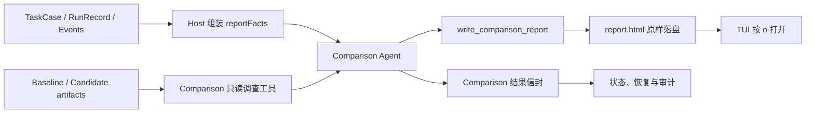

# Comparison Agent 自由 HTML 报告优化设计

状态：已实施（决策见 [`2026-08-15-comparison-agent-authored-html.md`](../decisions/accepted/2026-08-15-comparison-agent-authored-html.md)）
日期：2026-08-15
权威性：本文描述拟议实现，不覆盖 [`architecture/comparison.md`](../architecture/comparison.md) 和 [`architecture/agent-roles-and-system-prompts.md`](../architecture/agent-roles-and-system-prompts.md)。实施时必须先记录决策并同步修改当前架构规范。

## 1. 决策摘要

Comparison Agent 直接编写完整的 `report.html`，并拥有 HTML、CSS、SVG 和 JavaScript 的自由表达能力。Host 不解析报告语义，不使用标签白名单，不清洗或转义 Agent 输出，不把报告重新包装成固定模板，也不因为布局、标签或脚本选择拒绝报告。

报告底线、必含运行指标和推荐表达方式只写入 Comparison System Prompt。Reprise 信任 Comparison Agent 根据任务、证据和读者需要选择信息架构与视觉表现，不建立报告 DSL，也不让 Host 与模型争夺报告作者身份。

Host 仍负责提供真实、可追溯的运行事实，并验证最薄的交付协议：Comparison 调用成功、`report.html` 已落盘且可读取、结构化结果信封通过 schema 校验。Host 不验证 HTML 是否包含某个标题、表格或视觉组件。

## 2. 目标

本设计解决四个问题：

1. 报告不能只说 `blocked`，应直接解释失败来自模型策略、模型能力、权限、预算、Runtime、Controller 还是证据不足。
2. Agent 可以按具体实验选择卡片、时间线、双栏对照、折叠证据、图表或其他表达，不受 Markdown 子集限制。
3. 所有实验都应报告一组通用运行事实，避免视觉丰富但缺少判断依据。
4. Reprise 保留事件日志、artifact 和结构化结果信封，使报告可追溯，但不把报告退化成 Host 固定模板。

不追求统一评分、候选排名、跨任务质量总分，也不设计组件协议或通用可视化 DSL。

## 3. 设计原则

### 3.1 Agent 是报告作者

Comparison 的职责不是给 Host 填一段正文，而是调查证据并完成最终用户报告。布局、层次、文字、配色、交互和可视化都属于报告判断的一部分，应由同一个 Agent 统一完成。

### 3.2 System Prompt 约束行为，Host 不约束表现

System Prompt 定义事实纪律、必含指标和安全建议。Host 不通过 sanitizer、HTML AST、模板槽位、CSS token 或组件枚举重复这些规则。

这意味着“必须包含”的指标是 Agent 行为契约，而不是机械门禁。Reprise 可以在评测和人工复核中发现遗漏，但不会因漏项自动重写、补齐或拒绝 Agent 的报告。若产品需要字节级保证某字段一定出现，就必须重新引入结构化渲染或内容校验；这不属于本方案。

### 3.3 事实由 Host 提供，解释由 Agent 完成

Host 不要求 Agent 从长事件流手工统计所有数字。能够确定性计算的运行事实应作为 `reportFacts` 进入 Comparison briefing；Agent负责核查关键证据、解释因果关系并选择呈现方式。

`reportFacts` 是输入事实，不是报告模板。增加事实字段不会限制 Agent 如何写 HTML。

### 3.4 报告和事实记录各司其职

- `report.html`：面向人的主要产物，由 Agent 完整创作。
- Comparison 结果信封：保存状态、报告路径、证据引用和限制代码，供状态机与恢复使用。
- 事件日志和 artifacts：事实来源，不由 HTML 取代。

HTML 可以高度自由，但不能成为唯一事实存储。

## 4. 目标数据流



Host 不再执行 `Markdown → safe HTML → Host shell`。成功路径只有一份面向用户的 HTML，避免 Agent 正文与 Host 页面互相稀释。

## 5. 输出协议

### 5.1 结果信封

Comparison 结构化返回值调整为：

```ts
type ComparisonResult = {
  status: "completed" | "insufficient_evidence";
  reportPath: "report.html";
  evidenceRefs: EvidenceRef[];
  limitationCodes?: string[];
};
```

`reportPath` 固定为 `report.html` 只是落盘和导航协议，不限制文件内容。

### 5.2 写入工具

`write_comparison_report` 接收完整 HTML 字符串：

```ts
type WriteComparisonReportInput = {
  html: string;
};
```

工具只负责：

- 将内容原样写入实验目录中的 `report.html`；
- 使用临时文件加原子替换，避免留下半份报告；
- 记录字节数、哈希、写入时间和 Agent 调用关联；
- 返回成功或可调试的文件系统错误。

工具不负责：

- 解析 DOM；
- 删除或改写标签、属性、CSS、SVG、脚本或链接；
- 注入 Host 页头、指标、样式或免责声明；
- 根据视觉结构判断报告质量；
- 自动补写缺少的指标。

### 5.3 HTML 能力

允许 Agent 使用完整 HTML 文档能力，包括：

- 任意语义标签和页面布局；
- 内联或嵌入 CSS；
- SVG 图形；
- JavaScript 交互；
- `<details>`、筛选、切换和证据折叠；
- 表格、时间线、指标卡和任务专属图表。

Host 不维护允许标签清单。是否使用某项能力由 Agent 根据报告价值判断。

## 6. System Prompt 设计

System Prompt 分为底线、必含内容和推荐实践。底线与必含内容使用明确命令，推荐实践允许 Agent 因任务需要偏离。

### 6.1 底线

建议写入以下不可协商要求：

1. 只陈述可由 briefing、工具读取结果或明确推理支持的内容；不得编造指标、命令、产物或成功状态。
2. 显著区分“已观察事实”“推断”“无法获得的证据”。
3. 显著区分结果差异、过程差异和回放限制；不得把隔离路径、stand-in workspace 或历史起点误写成候选能力差异。
4. 不把候选明确拒绝等同于缺乏技术能力；若关键路径未被尝试，应分别说明直接停止原因和能力不可判定部分。
5. 证据链接只能指向 briefing 中给出的 Reprise 相对 artifact 路径；不得猜测不存在的文件。
6. 不在报告中暴露密钥、凭据、环境变量值或工具输出中的敏感内容。
7. 报告必须自包含，默认不依赖外部网络资源；若确有必要引用外部页面，只提供普通链接，不静默加载远程脚本、字体、图片或分析服务。
8. 不创建会修改用户文件、发送网络请求、提交表单或伪装系统界面的交互。
9. 使用任务主要语言撰写报告，模型名、路径、终止码和原始标识保持原文。

这些规则依赖 Agent 遵守。Host 不用 sanitizer 或 CSP 强制执行。

### 6.2 每份报告必含的硬指标

System Prompt 要求 Agent在报告的首屏或紧邻结论处展示：

| 类别 | 必含内容 |
|---|---|
| 运行身份 | Run ID、任务摘要、Candidate 模型；Controller 和 Comparison 模型在可用时展示 |
| 最终状态 | outcome、termination code、终止发起方 |
| 时间 | 总耗时、Candidate 执行耗时 |
| 协作轮次 | Candidate turns、Controller calls |
| 工具执行 | 工具调用总数、成功数、失败数、权限或审批拒绝数 |
| 资源限制 | 是否触发时间、turn、Controller call 或 token 限制 |
| 运行能力 | sandbox、approval policy、网络状态和关键 Runtime 能力 |
| 交付物 | changed paths、目标 artifact 是否存在、关键验证结果 |
| 回放条件 | replay 类型、workspace 来源、与历史条件的已知差异 |
| 证据等级 | Baseline 和 Candidate 各自属于可验证、部分可验证还是仅会话声明 |

某个字段不可用时，报告必须显示“未采集”或“不可判定”，不能静默省略，也不能用零代替缺失。

硬指标不包括统一质量分。任务专属指标由 Agent 自主选择，例如测试结果、消息条数、导出时间范围、页面状态或性能数据。

### 6.3 每份报告必答的问题

System Prompt 要求报告让读者无需阅读原始 trace 就能回答：

1. 原始会话和候选最终交付有什么差异？
2. 候选未达到原始结果时，直接原因是什么？
3. 哪些原因有证据支持，哪些已被排除，哪些无法判定？
4. Reprise 的权限、预算、Runtime、回放条件或 Controller 是否实质影响结果？
5. Baseline 的成功声明可以验证到什么程度？
6. 本次运行还暴露了哪些产品、评测或报告问题？
7. 用户下一步最值得检查什么？

### 6.4 推荐但不强制的表达方式

System Prompt 可以推荐：

- 首屏使用一句话 verdict 和归因置信度；
- 将“主要原因”“排除原因”“无法判定”分区；
- 用对照表展示 Baseline 与 Candidate；
- 用时间线压缩多轮过程；
- 折叠原始证据，避免淹没结论；
- 提供深色模式、打印样式和窄屏布局；
- 优先使用原生 HTML/CSS，只有交互确有价值时才使用 JavaScript；
- 不用视觉强调掩盖低置信度或证据缺口。

Agent 可以为了特定任务采用完全不同的设计。

## 7. `reportFacts` 输入

为了让 Agent 不必自行统计基础数字，Comparison briefing 增加由 Host 投影的 `reportFacts`。字段沿用现有对象和事件语义，不建立第二套状态机。

```ts
type ComparisonReportFacts = {
  run: {
    runId: string;
    outcome: string;
    terminationCode: string;
    initiatedBy?: string;
    elapsedMs?: number;
    candidateElapsedMs?: number;
  };
  models: {
    candidate: string;
    controller?: string;
    comparison?: string;
  };
  activity: {
    candidateTurns?: number;
    controllerCalls?: number;
    toolCalls?: {
      total: number;
      succeeded: number;
      failed: number;
      denied: number;
    };
  };
  limits: {
    triggered: string[];
    configured: Record<string, number | string>;
  };
  capabilities: {
    sandbox?: string;
    approvalPolicy?: string;
    network?: string;
  };
  replay: {
    sourceRootKind?: string;
    stopKind?: string;
    conditions: string[];
  };
  deliveries: {
    changedPaths: string[];
    artifactRefs: string[];
  };
};
```

实际字段应优先复用现有 schema 和 helper。若某事实当前没有可靠来源，先传缺失值，不通过启发式猜测补齐。持久化和模型输入仍遵守 [`persistence-and-crash-consistency.md`](../architecture/persistence-and-crash-consistency.md) 的事件可复原要求。

## 8. 归因模型

报告不使用固定总分，但 System Prompt 应引导 Agent 对每个重要归因使用以下证据语言：

- **直接观察**：事件、终止码、工具结果或产物直接证明；
- **强推断**：多项事实一致支持，存在未观察的替代解释；
- **弱推断**：证据有限，只能作为可能原因；
- **不可判定**：关键路径未执行或必要证据缺失；
- **已排除**：存在足够反证，不应继续作为主要解释。

例如，候选反复拒绝数据库解密，同时拥有 `danger-full-access`、命令基本成功且未触发预算时，报告应把“候选策略拒绝”写为直接原因，把“Reprise 权限不足”和“预算耗尽”列为已排除；因为候选未尝试关键路径，“模型是否具备解密技术能力”仍应写为不可判定。

## 9. 失败与恢复

### 9.1 Comparison 没有写出 HTML

Comparison 调用失败、结果信封无效或 `report.html` 不存在时，Host 生成一个独立命名的 `comparison-failure.html`，只说明技术失败并提供原始记录入口。它不是 Comparison 报告，也不冒充 Agent 的分析。

TUI 显示 Comparison 失败状态，并允许用户打开降级页。CandidateRun 和 RunOutcome 不因 Comparison 失败而改变。

### 9.2 HTML 存在但内容质量差

Host 原样保留并打开报告，不进行自动修复。质量问题通过：

- Comparison prompt 迭代；
- 真实运行人工审查；
- 非确定性评测夹具；
- 报告中保留的模型、证据引用和生成轨迹；
- 必要时重新运行 Comparison。

处理，而不是逐步增加 HTML 白名单或固定模板。

### 9.3 报告运行时错误

JavaScript、CSS 或资源错误不改变实验结果。报告仍保留用于诊断；TUI 提供打开 artifacts 和原始记录的备用入口。Reprise 不尝试解释或修复 Agent 前端代码。

## 10. 信任边界与接受的风险

本方案有意选择“信任 Comparison Agent”，因此接受以下风险：

- Agent 可能遗漏 System Prompt 要求的某个指标；
- Agent 可能输出无效 HTML、布局退化或浏览器兼容性较差的页面；
- Agent 可能生成不必要或有缺陷的 JavaScript；
- 候选 artifact 中的提示注入可能影响 Comparison 的报告选择；
- 没有 sanitizer 或 CSP 时，System Prompt 是外部资源、脚本行为和敏感信息保护的主要防线；
- 相同事实的页面结构可能随模型和版本变化，不能做稳定 DOM 快照对比；
- HTML 的视觉说服力可能超过其证据强度。

选择这些风险的理由是：报告本身就是 Agent 的核心交付，过度限制会同时限制调查结果的组织能力和表达能力。Reprise 通过保存事实、证据和生成轨迹保证可审计性，而不是通过接管报告作者身份保证一致外观。

如果未来出现真实安全事件或无法接受的报告行为，应优先加强 System Prompt、隔离报告打开环境或调整默认打开方式。只有这些措施不足时，才重新讨论 sanitizer 或受限渲染；不能在本方案实施过程中悄悄加入标签白名单。

## 11. 与当前实现的差异

当前实现是：

```text
Agent 写 comparison.md
→ Host 读取 Markdown
→ safe-markdown 白名单渲染
→ Host 套固定 report.html 页面
```

目标实现是：

```text
Host 提供 reportFacts 和只读证据工具
→ Agent 调查并写完整 report.html
→ Host 原样保存和打开
```

因此实施会涉及：

- Comparison 结果 schema 的 `reportPath`；
- `write_comparison_report` 工具参数和原子写入；
- Comparison System Prompt；
- Comparison briefing 的 `reportFacts`；
- Experiment 报告生成与恢复路径；
- TUI 打开和降级逻辑；
- 当前 Markdown renderer 的调用方和可删除代码；
- 架构规范、决策记录和相关测试。

如果 `safe-markdown.ts` 没有其他调用方，应删除，而不是保留一条未使用的备用渲染路径。

## 12. 最小实施顺序

| 顺序 | 工作 | 完成判据 |
|---|---|---|
| A | 写 accepted 决策并更新 Comparison 架构 | 明确 Agent 拥有完整 HTML、Host 不清洗或重排 |
| B | Host 投影 `reportFacts` | 夹具能区分权限、预算、Runtime 和模型停止原因；缺失值不伪造为零 |
| C | 修改 System Prompt 和写入工具 | Agent 可原样写入包含 CSS、SVG、脚本的完整 HTML |
| D | 切换结果信封和报告生命周期 | 成功结果指向 `report.html`；崩溃恢复不会留下半文件 |
| E | 删除 Host Markdown 主路径 | 正常成功路径不再调用安全 Markdown renderer 或固定报告壳 |
| F | 更新 TUI 与降级页 | `o` 打开 Agent 报告；Comparison 失败仍能导航到原始记录 |
| G | 真实 Comparison smoke | 显式 opt-in 后人工确认硬指标、归因和证据入口可读 |

遵循最小改动原则：不同时建立 JSON 报告 DSL、组件库、模板系统或第二套事实 schema。

## 13. 验证设计

### 13.1 确定性测试

代码测试只验证 Host 拥有的协议：

- 完整 HTML 字节原样落盘，不删除 `<style>`、`<svg>` 或 `<script>`；
- 原子写入失败时旧报告不被截断；
- 结果信封只接受 `report.html`；
- 报告路径不能逃逸实验目录；
- `reportFacts` 数值来自对应 RunRecord 和事件；
- 未采集指标保持缺失，不变成零；
- Comparison 失败生成独立降级页，不覆盖既有 Agent 报告；
- TUI 打开正确的绝对路径。

这些测试不对 Agent 生成的 DOM 做固定快照，也不机械检查某种配色、卡片数量或章节顺序。

### 13.2 Agent 行为评测

准备少量代表性夹具，检查报告是否覆盖硬指标和归因问题：

1. 模型明确拒绝，但权限充足且预算未触发；
2. 候选被 turn 或墙钟限制截断；
3. Runtime 或工具权限真实失败；
4. Candidate 完成，但 Baseline 只有会话声明、缺少可验证产物；
5. 没有实质差异；
6. Comparison 证据不足。

这类检查允许语义评测或人工审查，不把 Agent 页面收缩成固定 DOM。

### 13.3 真机验收

真机运行必须显式 opt-in。验收人确认：

- 第一屏能看懂结果和主要归因；
- 通用硬指标存在，缺失值有明确标记；
- 模型策略、技术能力、Reprise 权限、预算、Runtime 和 Controller 没被混为一谈；
- 证据链接可用；
- 页面离线打开时核心内容完整；
- 报告没有泄露凭据或静默发起外部请求；
- 原始 trace 和 artifacts 仍可独立查看。

## 14. 不做

- 不让 Host 生成正常成功报告的页头、指标卡或正文。
- 不保留 Markdown 作为必经中间格式。
- 不建立允许标签、CSS 属性、SVG 元素或 JavaScript API 白名单。
- 不使用 sanitizer、HTML AST 重写或固定 CSP 改造 Agent 输出。
- 不发明报告组件 DSL 或要求 Agent 返回 `sections[]`。
- 不把“硬指标”变成跨任务质量评分。
- 不因为 Comparison 报告失败改变 CandidateRun 的结果。
- 不把隔离区写回用户原目录。

## 15. 方案确认点

实施前只需确认一个产品选择：

> Reprise 是否接受“硬指标由 System Prompt 强制、但 Host 不做内容门禁”，并将偶发漏项视为 Comparison Agent 质量问题，而不是报告协议错误？

本次实施确认选择“是”：硬指标由 System Prompt 强制，Host 不做内容门禁；偶发漏项按 Comparison Agent 质量问题处理。已据此记录 accepted 决策并完成实现。若未来要求指标在任何模型输出下都必须存在，则需要改成 Host 固定附加事实区或结构化内容校验，两者都会收回一部分 Agent 自由。