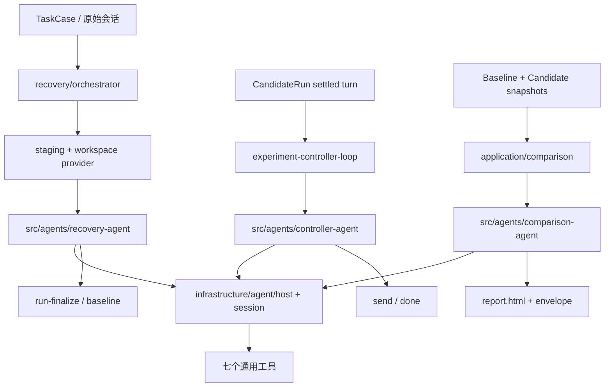

# 三 Agent 统一设计与重构规划（代码对照版）

## 1. 当前代码结构

```text
src/agents/
  recovery-agent.ts       # Recovery prompt 与三轮调用
  recovery-working-set.ts # Recovery 工作区/记录
  controller-agent.ts     # Controller prompt 与 decision
  comparison-agent.ts     # Comparison prompt 与报告信封
src/infrastructure/agent/
  host.ts session.ts tools.ts compaction.ts structured.ts model-input.ts
  audit.ts artifacts.ts failure.ts providers/{pi,fake}/
src/application/recovery/
  orchestrator.ts session.ts staging.ts readiness.ts recover.ts run-finalize.ts
  investigation*.ts writes.ts verifier.ts types.ts
src/application/
  experiment-controller-loop.ts controller-request.ts controller-tools.ts
  comparison.ts comparison-briefing.ts comparison-report-shell.ts
  experiment-compare-persisted.ts experiment-report.ts
src/environment/
  local-workspace-provider.ts local-workspace-fs.ts
```



## 2. 现有调用链与保留边界

### Recovery

入口是 `application/recovery/orchestrator.ts`，先经 `staging.ts` 创建 source/workspace，再由 `session.ts` 调用 `agents/recovery-agent.ts`。工具注册位于 `infrastructure/recovery-workspace-tools.ts` 与 `infrastructure/agent/tools.ts`。完成后 `run-finalize.ts` 写结果并生成可复用 baseline。`readiness.ts`、`verifier.ts`、`admission.ts` 只能做机械检查；业务上的“是否足够恢复”必须由 Agent 输出决定。

重构重点：取消以整体复制预算拒绝大仓库；source 允许只读挂载和按需读取；workspace 可写。保留三轮 Session、`ready|blocked`、240 字符 summary、reportPath 和 unresolved。旧的 `partial`、`insufficient_evidence` 等状态需在 schema、迁移和调用方统一清理。

### Controller

入口是 `experiment-controller-loop.ts`，请求装配在 `controller-request.ts`，briefing 在 `controller-briefing.ts`，工作区工具在 `controller-tools.ts`，Agent 实现为 `agents/controller-agent.ts`。保持每个 CandidateRun 独立连续 Session；首轮理解，后续在 settled turn 后按需读取 `current-user-view.md` 与 candidate workspace，再返回 `send` 或 `done`。

重构重点：检查 prompt 和 `controller-queries.ts` 是否仍按历史消息下标 replay；删除固定消息数量和固定阅读顺序暗示。Controller 可读取完整候选内容但不修改候选、不调用 Target 工具。Host 只校验 decision schema、记录和投递。

### Comparison

入口是 `application/comparison.ts` 或 `experiment-compare-persisted.ts`，材料由 `comparison-briefing.ts` 装配，指标壳由 `comparison-report-shell.ts` 生成，Agent 为 `agents/comparison-agent.ts`，发布由 `experiment-report.ts` 完成。保留一个 Session、四个工作委托和最后薄信封；候选快照只读，Agent 写 `report.html`。

重构重点：允许 Agent 按需读取 `candidate/`、history、turns、artifacts 全部内容；不预生成差异结论、不评分、不要求固定章节。Host 仅验证 envelope、指标壳和文件可读性。

## 3. 共享 AgentHost 设计

`infrastructure/agent/host.ts` 是唯一模型调用承载层；`session.ts` 管理连续上下文，`tools.ts` 注册工具，`model-input.ts` 与 `structured.ts` 负责输入/输出边界，`compaction.ts` 负责压缩，`audit.ts`/`artifacts.ts` 负责事件和文件证据。三个 Agent 通过配置注入不同 system prompt、turn prompt、workspace 权限和输出 schema；不得在 Host 中加入 Recovery/Controller/Comparison 分支。

模型输入必须能由事件日志复原。压缩只保留角色定义所需的最小事实，不把临时推断升级为事实。取消、传输错误和 schema 修复沿现有 Session 处理；工作区损坏才重启。

## 4. Prompt 改造要求

- System prompt 只说明角色目标、事实纪律、工具可用性和连续 Session；不写固定输出格式或不可完成的证明要求。
- 每轮 prompt 提供当前任务和必要路径，允许 Agent 自己决定调查、修改、验证或结束。
- Recovery 三轮：侦察、恢复、自检；最后一轮同时写报告和 summary。
- Controller 首轮理解用户，后续面向当前候选状态决策；消息风格由历史会话引导。
- Comparison 四轮：理解、调查、创作、审阅；报告结构由 Agent 自定。

## 5. 分阶段实施

1. **契约清理**：搜索 `partial`、旧 readiness reason、固定候选选择和旧 prompt 文案，统一 schema 与类型。
2. **Recovery**：修改 `staging.ts`/provider 为 source mount + sparse workspace；移除 source budget 作为业务阻断；补 G1 大目录 fixture。
3. **共享 Host**：确认三角色均使用同一 `AgentSession`、compaction、audit 和 structured path；消除重复 loop。
4. **Controller**：核对 briefing、workspace tools 和 decision 投递；删除 replay 业务逻辑，保留稳定 settlement 机械条件。
5. **Comparison**：核对 sealed snapshot、metrics shell、报告发布；删除差异预筛与评分逻辑。
6. **验证**：改源码先 `npm run build`，再运行针对性 `node --test`，最后 `npm run check`；只改文档运行 `npm run verify:docs`。

## 6. 验收矩阵

| 场景 | 预期 |
|---|---|
| G1 大仓库 | Agent 可启动并按需读取，不因总文件数阻断 |
| 无 Git | 与有 Git 使用同一 Recovery 路径 |
| 关键环境缺失 | Recovery 输出 blocked，候选不启动 |
| 非关键未知 | ready + unresolved，允许继续 |
| 候选偏离目标 | Controller 发送纠正/验证消息 |
| 候选已满足 | Controller done=satisfied |
| 双方结果相近或材料缺失 | Comparison 如实说明，允许无法判断 |
| 报告失败 | 不改变 CandidateRun，不覆盖旧报告 |

## 7. 完成标准

三个 Agent 均能在真实代码路径中使用连续 Session 和现有工具自主完成职责；Host 不替代业务判断；大仓库和多任务类型不需要专用分支；所有结果、输入、报告和 blocked 原因可从事件与 artifact 复原。