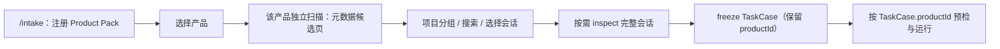
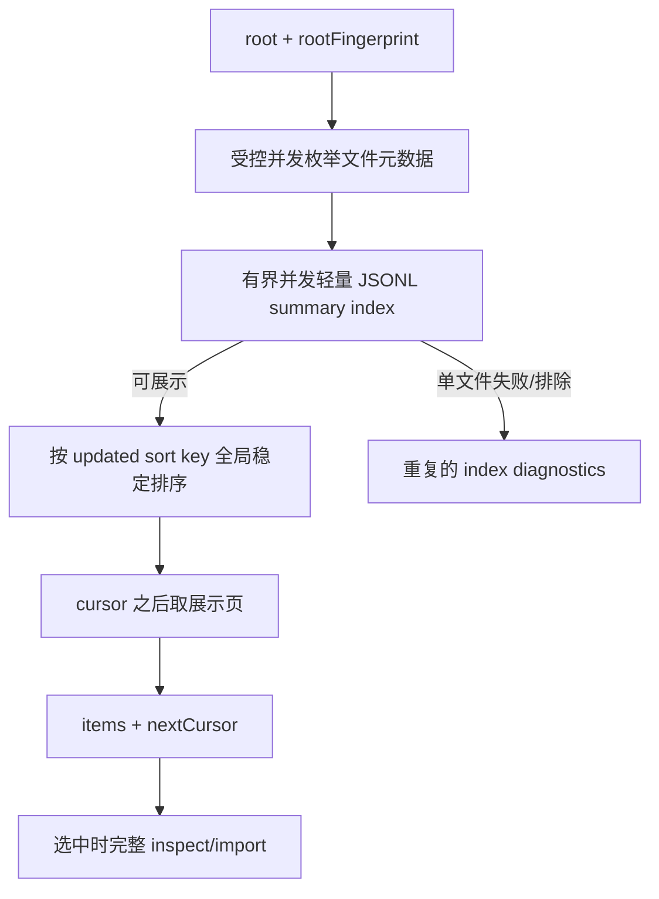

# 会话发现与产品中立 TUI 优化计划

状态：已实施（2026-08-15）
范围：会话发现正确性、可观测性、性能和 TUI 产品中立化；不重复正在实施的 [Comparison Agent 自由 HTML 报告优化设计](./comparison-report-optimization.md)。

## 1. 结论与目标

实现以“先选产品”的纵切片为入口：`src/tui/controller.ts` 持有 `intakeLevel = "products"`、`activeProductId`、按产品隔离的 cache 与 `loadProductSessions(productId)`，`src/tui/pages/intake.ts` 渲染产品页。本计划定义并记录该入口随后需要满足的发现正确性、可解释性、分页与产品中立 TUI 契约。

本计划的目标流程：



已实施的验收契约：

1. 选择 Claude Code 时绝不扫描、解析或显示 Codex 会话；反之亦然；每个产品的 root、分页、错误和 cache 相互隔离。
2. 缺失或非法时间不再被伪装成 `1970-01-01`；未知时间明确显示为未知，排序稳定地落在已知时间之后。
3. 列表扫描不再为取得一条摘要而完整 import、保存整份 transcript；大目录扫描可取消，完整轻量摘要 index 完成后结果按页渐进显示，并给出可操作的部分失败诊断。为保证跨页全局事件时间排序，不承诺在 index 未完成前展示“最新”首屏。
4. 产品的显示名来自注册 Pack，TUI 顶栏、intake、预检、运行和失败说明不再把“当前产品”默认写成 Codex。
5. 不改变 TaskCase on-disk 格式、CandidateRun 状态机、真实 Runtime 的显式 opt-in、凭据策略或 Comparison 报告行为。

本计划先记录问题、边界和验收标准；实施记录见第 7.1 节。实现不修改 Comparison 报告专属范围。

## 2. 已验证证据

### 2.1 截图症状

用户提供的 TUI 截图中同时存在以下异常：

- 顶部状态 pill 固定显示 `Codex`；
- 项目表显示“11 projects / 32 sessions”，但多个项目最新时间是 `1970-01-01`；
- `Path` 只展示 `Documents/session-distill`；这是 `shortPath()` 保留末两段的显示策略，未必是 session 的原始 cwd 损坏，但会使同名目录和历史位置难以辨认；
- 某条 Latest 文本提到 “Codex 会话”。这只是历史任务正文，不能据此把 Claude 会话识别成 Codex；产品归属必须只信任 `SessionSummary.productId`。

本机只读统计（不读取或记录会话正文）说明截图的 `32 sessions` 与 Claude 默认目录数量一致：

| 数据源 | 文件数 | 首行缺 timestamp | 任意行存在有效 ISO timestamp | 时间范围 |
| --- | ---: | ---: | ---: | --- |
| `~/.claude/projects` | 32 | 15 | 32 | 2026-07-14 至 2026-08-14 |
| `~/.codex/sessions` 抽样 100 条 | 100 | 0 | 100 | 2026-03-25 至 2026-05-09 |

Claude 缺时间的首行类型为 `mode` 或 `custom-title`；其后仍有合法的会话事件时间。因此“1970”不是历史数据真的发生在 epoch，而是当前 parser 的 fallback 造成的确定性缺陷。

### 2.2 1970 的改前直接根因

改前，`src/products/claude-code/sessions.ts` 的 `startedAtFrom(imported)` 读取 `imported.historicalEvents[0].timestamp`，缺失时返回 `new Date(0).toISOString()`。Claude 的首行可以是无时间的元事件，因而 15/32 个本机会话被标为 1970。`relativeTime()` 随后正常把这个伪造值渲染为日期，项目分组又把它当成 `latestAt` 排序。

不能用“如果是 1970 就改成文件 mtime”的 UI 特判修复：它会丢失事实来源、继续污染 API 语义，并且无法处理其他非法时间。

### 2.3 改前扫描器的其它根因

| 层 | 改前行为 | 后果 | 已实施方向 |
| --- | --- | --- | --- |
| 文件枚举 | `listJsonlFiles()` 递归 `readdir` 全树、每个文件 `stat`，无限制并发递归 | “不解析全树”仍会遍历全树；大目录/权限错误难诊断 | 限制并发、保留目录/文件失败诊断、按稳定键分页 |
| Claude discover | 为展示摘要调用 `inspectClaudeSession()`，而后者调用完整 `importClaudeSession()` | 每次列表扫描读取、JSON 解析并在内存构造整份 transcript/raw | 单独的轻量 summary reader；inspect/import 只在用户选中后执行 |
| Codex discover | 读取完整文件并 `split` 全部 JSONL 行后才找摘要 | 大 rollout 产生不必要内存与延迟 | 流式/有上限的元数据和首个可展示任务扫描 |
| 候选收集 | `collectNewest()` 八 worker 并发，`summaries.length < limit` 是竞态式停止条件 | 可能多解析若干文件，且没有 `hasMore`、cursor 或扫描统计 | 返回 page/cursor；并发只负责 I/O，不决定分页语义 |
| 错误处理 | `inspectForDiscovery()` 对单文件错误静默跳过 | 用户看不到损坏、超限、权限或格式问题；排查像“没有会话” | 累计分类 diagnostics，正文/密钥不得进入日志或 UI |
| 时间校验 | 仅检查 ISO 前缀，未检查 `Date.parse()` 是否有限 | `2026-99-99T...` 也可能进入排序/显示 | 统一 `parseKnownInstant()`，保留原始来源和 unknown |
| 项目身份 | `cwd` 小写化、斜杠化后作 key；basename 作 label | junction/UNC/盘符/同名项目可能重复或误导；缺 cwd 都混进 Other | `productId + canonicalPath` 作身份；label 仅展示；unknown 单独计数 |
| 配置 root | `sessionsRoots[productId] ?? sessionsRoot ?? pack.defaultRoot` | 旧的全局 `sessionsRoot` 可能错误施加给非默认产品 | 显式 `sessionsRoots[productId]`；仅默认产品允许 legacy 迁移，迁移要有告警 |
| 限制提示 | `sessions.length === SESSION_LIMIT` 判定可能“还有更多” | 刚好等于限制时也会被误报，无法加载下一页 | adapter 返回 `hasMore` 或 `nextCursor` |
| cache | 只按 `productId` 缓存，无 root/freshness/generation | root 改变后读旧结果；异步切换可覆盖当前产品 | cache key 包含 root/version；请求 generation/AbortSignal；显式刷新 |

### 2.4 产品中立化的断点

`src/tui/workbench.ts` 目前把登录状态直接投影成固定 `Codex` pill；`src/tui/view-projection.ts` 也给 running model 固定 `productLabel: 'Codex'`。`pages/run.ts`、`pages/result.ts` 与 `i18n.ts` 仍含“start Codex process”“global Codex config”“not a Codex crash”等用户可见固定文案。

这不是仅替换字符串的问题。以下事实必须分离：

1. **注册产品**：编译时可用的 Product Pack；
2. **当前 intake 产品**：用户正在浏览其会话的 Pack；
3. **任务来源产品**：冻结后的 `TaskCase.source.productId`；
4. **本次运行产品**：经 preflight 解析的 candidate Runtime；
5. **Harness 认证/健康状态**：Reprise 自身功能；它不能被偷换为某个产品已登录。

渲染优先级应为“运行产品 > 已冻结任务来源产品 > 当前 intake 产品 > 未选择产品”，并通过 Pack manifest 的 `displayName` 取文案。Runtime 是否安装/认证独立显示为 availability，未知状态不应阻塞会话浏览。

## 3. 成熟实现可借鉴的边界

本项目是本地兼容层，不应依赖第三方私有存储格式或把外部产品的内部数据库复制进 Reprise；借鉴的是交互和协议边界。

- OpenAI 的 [Codex app-server 协议](https://github.com/openai/codex/blob/main/codex-rs/app-server/README.md) 将 `thread/list` 定义为带 `cursor` 的分页接口，支持 `cwd`、归档和搜索等过滤条件；列表与继续会话是不同动作。这支持 Reprise 把 discovery page 与 inspect/import 分开，而不是把全量 parse 隐藏在列表渲染中。
- 同一协议明确归档会话默认不出现在 `thread/list`，除非显式请求 archived。Reprise 仅在具体 Pack 的来源格式存在可靠归档事实时，才把包含范围加入 query；当前 Claude/Codex JSONL Pack 不猜测目录或字段，因此不预置 `includeArchived`。
- Anthropic 的 [Claude Code 恢复会话文档](https://code.claude.com/docs/en/common-workflows) 将“继续最近会话”“选择/恢复历史会话”“按项目恢复”区分为显式用户动作。这支持先选择产品、再选择项目和会话的层级；但 Reprise 不应猜测 Claude 目录 slug 就等于真实 cwd。
- Node 的 [`fs.opendir()` 文档](https://nodejs.org/api/fs.html#fspromisesopendirpath-options) 提供异步目录迭代能力，可用于受控并发的遍历。第一版无需引入数据库、watcher 或新依赖；先保证 bounded traversal、稳定排序和 diagnostics。

## 4. 目标契约与不变量

### 4.1 Discovery 不等于 inspect/import

当前 `SessionSourceAdapter.discover()` 返回裸数组，不能表达下一页、扫描范围或部分失败。实施时先在 `src/products/contract.ts` 演进端口，再同步改 Codex 与 Claude Pack；禁止在 TUI 按 productId 判断文件格式。

建议的最小目标契约：

```ts
export type KnownInstant = {
  readonly value: string;       // 严格校验后的 ISO UTC
  readonly source: 'event' | 'file-mtime' | 'filename';
};

export type SessionTime = KnownInstant | { readonly source: 'unknown' };

export type DiscoveryDiagnostic = {
  readonly code: 'unreadable-directory' | 'unreadable-file' | 'too-large'
    | 'invalid-jsonl' | 'invalid-metadata' | 'unsupported-entry';
  readonly count: number;
  readonly samplePath?: string; // 仅相对 root 的受限路径，不包含正文
};

export type SessionDiscoveryPage = {
  readonly items: readonly SessionSummary[];
  readonly nextCursor?: string;
  readonly scanned: number;
  readonly skipped: number;
  readonly diagnostics: readonly DiscoveryDiagnostic[];
};

export type SessionDiscoveryQuery = {
  readonly root?: string;
  readonly limit?: number;
  readonly cursor?: string;
  readonly excludeRoots?: readonly string[];
  readonly signal?: AbortSignal;
};
```

`SessionSummary` 应把 `startedAt` 从“必然存在的字符串”迁移为 `startedAt?: string`，增加必然存在、可用来排序的 `updatedAt?: string`（只在合法时提供）以及必要的时间来源。不要写 epoch fallback。为了避免一次大爆炸，可在 Pack 内部先生成 `SessionTime`，随后只向旧调用点投影合法 `startedAt`；第二个提交再收紧类型并更新所有 renderer。

### 4.2 时间规则

1. `startedAt` 是最早的**合法且属于会话事件**的产品时间；不能只取 JSONL 首行。
2. `updatedAt` 优先取最晚合法事件时间；没有时取文件 mtime，并标记来源。它用于“最近活动”排序，不冒充会话开始时间。
3. `unknown` 不是 epoch：展示 `Unknown time`，项目 latest 按已知时间优先、未知稳定排尾。
4. 所有比较使用 epoch number；输出前 canonicalize ISO。相同时间以 `sourcePath` 作 tie-break，确保分页、截图和测试稳定。
5. `Date.parse` 非有限、非 ISO、异常时均是 invalid diagnostic；不崩掉整个产品扫描。

### 4.3 项目规则

```text
projectKey = productId + '\0' + canonicalHistoricalCwd
```

- canonicalHistoricalCwd 仅对绝对路径做 Windows 规范化（分隔符、盘符大小写、尾部 separator）；不为不存在的历史路径盲目 `realpath`。
- 若路径存在，可在一个受控 helper 中尝试 `realpath` 合并 junction/symlink；失败保持 lexical canonical path 并累计非致命 diagnostic。
- basename 只用于 display label；重名时展示足以区分的父级片段，并允许 preview 显示完整/可复制路径，不以两段截断作为唯一信息。
- cwd 缺失的会话不得用共同的 `Other` 假装同一项目；显示“未关联项目（N 个会话）”，项目 key 至少包含产品及 session 归属，或进入独立的 ungrouped 列表。
- `excludeRoots` 由路径 helper 处理，不能用简单字符串包含关系误伤 `C:\work\app2` 与 `C:\work\app`。

### 4.4 扫描算法



`updatedAt` 来自 JSONL 事件而不是文件 mtime；因此只在每页内排序会让 mtime 与事件时间逆序的会话跨页错位。每次 metadata fingerprint 新建时，轻量 reader 必须先建立完整的摘要 index，再按全局 `updatedAt + sourcePath` 分页。reader 逐行读取且限制 4 MiB / 50,000 行，不构造 `raw.text`、完整 `historicalEvents` 或 transcript；完整 inspect/import 仍只在选中时执行。首个页面会等待这个有界 index；加载态和 AbortSignal 必须可取消，不能用“先返回 mtime 顺序、随后在 UI 重排”伪造正确分页。

index 仅在进程内保存，按 `productId + normalized root + path/mtime/size fingerprint` 隔离，最多保留 4 个完成的 index。连续页复用同一 index；`r` 强制重建。每次 continuation 仍重新枚举 metadata 并比对 fingerprint，所以 root 内容变化会使旧 cursor 失败而不是读取旧缓存。目录层面明确不跟随 symlink/junction；递归、目录枚举与摘要读取都采用固定小并发（8），处理 `ENOENT`、`EACCES`、循环/不支持项并汇总。cursor 编码 root、fingerprint 和上一条全局排序结果的 `sourcePath`；root 改变、候选集合变化或该 path 消失时返回可恢复的 stale-cursor 错误。

## 5. TUI 设计

### 5.1 产品页与状态

产品页从 Pack 注册表立即投影，不能等待 discovery：

```text
Select agent product
> Claude Code    Sessions: not scanned   Runtime: unchecked
  Codex          Sessions: 50+            Runtime: available

Enter select · r refresh · Esc back
```

“已安装的插件”在产品语义上应是“当前注册且可加载的 Product Pack”，不要以“有 sessions”或“已认证”过滤。若插件加载失败，显示其 manifest 可安全取得的名称与失败摘要，其他 Pack 仍可使用。

选择某个产品后，页面只显示该产品的项目/会话和该页 diagnostics；加载中支持取消/返回，完成后显示 `N shown · M skipped · more available`。`r` 刷新当前产品，明确丢弃同一 rootFingerprint 的 cache 并重新扫描。首次版本不做 watcher 或持久化索引。

### 5.2 统一产品标签

新增一个纯函数（例如 `productDisplayContext(view)`）集中决定：

| 页面状态 | 主标签 | 次标签 |
| --- | --- | --- |
| 无任务、未选产品 | `No agent selected` | `Choose an agent in /intake` |
| 浏览 Claude 会话 | `Claude Code` | `Session source` |
| Codex TaskCase 已冻结 | `Codex` | `Task source` |
| Claude candidate 正在运行 | `Claude Code` | `Candidate runtime` |
| Runtime 未知/未安装 | Pack 名称 | `Runtime not checked/not installed` |

`hasCodexLogin` 必须改名并拆解为产品无关的 Harness auth 与按 Pack 的 runtime availability；不要让某个历史布尔值继续控制顶栏品牌。`running.productLabel ?? 'Codex'` 等 fallback 改为 manifest 查找或 `Unknown agent`。

### 5.3 文案迁移顺序

| 优先级 | 位置 | 改法 |
| --- | --- | --- |
| P0 | `workbench.ts`、`view-projection.ts` 顶栏和 running label | 接收统一 ProductDisplayContext，移除固定 `Codex` |
| P0 | `pages/run.ts`、`i18n.ts` 的成本/隔离/配置提示 | 用 `{ product }` 参数；配置归属明确为 Harness 或该 Runtime |
| P1 | `pages/result.ts` runtime failure origin | Runtime 产品名来自结果/TaskCase；与 Comparison 结果页 diff 协调，不改变其报告打开与恢复逻辑 |
| P2 | `CodexIntakeTui`、`CodexExperimentResult` 等内部类型名 | 可保留兼容 alias；只在同一文件有实际产品歧义时最小重命名 |

不要全仓库机械替换 `Codex`：Codex Pack、协议、fixture 和真实 Codex 专属错误当然仍应保留其名字。目标是“用户当前上下文”的中立化，不是否认某个产品的专有能力。

## 6. 分阶段实施

### Phase 0：回归用例和事实夹具

- 使用匿名化最小 JSONL fixture 覆盖：无 timestamp 的首行但后续合法、全无时间、非法时间、相同时间、损坏行、超限文件、同名项目、相同 cwd 跨产品，以及不跟随的 symlink/junction 循环。`ENOENT` race fixture 在目录枚举后同步删除临时文件，验证其收敛为 `unreadable-file`；Windows 专属 ACL fixture 使用临时目录与 `icacls.exe` 拒绝当前用户的读取权限，并在 `t.after` 先移除 deny ACE 再删除临时根；不触碰真实历史目录。
- 补充 controller 测试：进入 intake 不 discover；选择 A 只调 A；切换时晚到的 A 结果不覆盖 B；每产品独立 page/cache/root。
- 新增的门禁或流程按项目规则附反向失败用例。

Done-means：旧实现下“无 timestamp 首行”的用例稳定失败为 epoch，目标实现下 `startedAt` 为后续有效时间或 unknown，绝不为 epoch。

### Phase 1：先修时间与轻量摘要

- 在 Pack 内实现严格时间 helper，并修 Claude 选取最早/最晚有效事件；Codex 也迁移到相同 helper。
- 引入轻量 summary reader，不调用 `import*Session()`；重用各 Pack 的行解释逻辑，避免复制协议 parser。
- 替换静默 catch 为受限 diagnostics；所有 UI/log 输出只含计数、产品名与相对路径。

Done-means：本机 32 个 Claude 会话不再出现 `1970-01-01`；无效文件不使其他可用项目消失。

### Phase 2：端口分页、排序、项目身份

- 先改 `src/products/contract.ts` 的 discovery port，再改两个 Pack 和 adapter 测试；不在 TUI 判断 product 类型。
- 实现稳定 page/cursor、`nextCursor`、root fingerprint、受控并发枚举与 cancellation；全局 event-time 排序优先于未完成 index 时的首屏渐进展示。
- 将 SessionSummary 时间、project identity 和 renderer 迁移到 unknown-aware 模型；完整路径在 preview 中可区分。

Done-means：相同输入重复扫描结果和 cursor 边界一致；`limit` 正好等于 N 时不假报更多；目录中一个损坏文件可以被诊断且其余页面仍可翻页。

### Phase 3：收紧产品选择与 cache

- 修正 legacy `sessionsRoot` 迁移，避免覆盖非默认 Product Pack；CLI/config 改成 product-keyed root。
- 内存 cache 以 `productId` 与 resolved root 隔离；cursor 额外绑定该次枚举的候选集合 fingerprint。首版没有 watcher，只有 `r` 才承诺丢弃缓存并重新扫描；刷新、root 变更与取消具有明确状态转移。
- 产品、项目、搜索和 eligibility filter 仅在 activeProductId 作用域内工作。

Done-means：不同 root 或产品不能复用旧项；连续快速切换产品后 TUI 只显示最后一次选择的数据。

### Phase 4：产品中立 TUI

- 建立并使用 ProductDisplayContext；迁移顶栏、home、run、i18n 和可安全改动的 result 文案。
- 将 availability/auth 与“当前产品”分开投影；无产品时不显示 Codex 品牌为默认选择。
- 更新宽屏/compact TUI frame；保留各 Pack 专有名称与错误。TUI 帧审计的相对时间必须由注入的固定渲染时钟计算，生产 TUI 仍使用系统时钟；不能靠每日重写基线掩盖漂移。

Done-means：Claude intake、Claude run 和无选择状态的快照均不含错误的 Codex fallback；Codex 专属操作仍准确写 Codex。

### Phase 5：架构记录、验证与人工验收

跨模块端口、分页格式和 TUI 产品上下文是协议变化；同一次实现必须新增/更新 `docs/decisions/`，说明 cursor 格式、unknown 时间、root 迁移和兼容策略。更新 `docs/product/tui.md` 的 intake 流程，但不要改 Comparison 专属章节。

- 代码变动：先 `npm run build`，再只运行受影响测试，最后一次 `npm run check`。
- 仅本计划文档改动：`npm run verify:docs`。
- Windows 11 操作验收：在有 Claude 与 Codex 本地历史的环境分别选择两产品、刷新、翻页、返回和快速切换；ACL 拒绝与 junction 循环已由临时自动化 fixture 验证。人工操作不修改真实历史根的 ACL 或链接。

## 7. 测试与性能矩阵

| 领域 | 最小自动化断言 |
| --- | --- |
| 时间 | 首行无 timestamp、后续有效 timestamp 不产生 epoch；invalid/unknown 排在有效时间后 |
| 排序/分页 | 文件 mtime 与事件时间混合时稳定；连续页无重叠/遗漏；sourcePath tie-break 固定 |
| 解析成本 | `discover` 不调用 `import`；超过 summary byte/line 上限不建立 raw transcript |
| 诊断 | `ENOENT`、`EACCES`、损坏 JSONL、超限分别汇总，不暴露正文；自动化验证 junction/symlink 不被跟随及 Windows 临时 ACL 拒绝 |
| 项目 | 跨产品不混组；同名目录可区分；unknown cwd 不假合并 |
| Controller | 惰性加载、取消、防晚到写入、root-aware cache、独立 refresh |
| TUI | 产品标签来源正确；未选择产品不展示 Codex fallback；宽屏/compact 无溢出；审计帧的相对时间使用固定注入时钟，不随执行日期漂移 |
| Freeze/Runtime | 选中 Claude 的 ref、TaskCase 和 runtime 皆为 `claude-code` |

性能验收以可测预算而非主观“快”为准：在 1,500 个元数据文件、50 MiB 以内的本地树上，首个 50 条展示页会建立完整轻量摘要 index，但不读取完整 raw transcript；因此首屏要等待 index 完成，用户可取消但不会看见可能被后续事件时间推翻的暂定排序。目录和摘要峰值并发均不超过 8，诊断准确报告跳过数；同一 fingerprint 的连续页不重复解析 JSONL，`r` 才重建。实际墙钟/内存阈值在 Windows 11 基准完成后写入 ADR；不先引入 SQLite 索引、watcher 或新依赖。

## 7.1 实施记录（2026-08-15）

本计划的范围已落地，且未修改 Comparison 报告专属实现：

- `discover()` 现在返回 root 绑定、全局事件时间排序的 cursor、摘要 index 候选计数与分类 diagnostics；产品选择后才调用对应 Pack。
- Claude Code 与 Codex 的列表摘要使用 `fs.opendir()` 和逐行 JSONL reader；每份摘要限制为 4 MiB / 50,000 行，完整 inspect/import 仍维持 64 MiB 上限。目录扫描按稳定的广度优先批次调度，每批至多 8 个目录任务；不会用无界 `Promise.all()` 创建整棵目录树的 I/O，批次完成后再按确定顺序合并条目、诊断和下层目录。
- 摘要不构造 transcript、raw JSONL 或 `historicalEvents`；超限、坏 JSONL、无效元数据、不可读目录/文件和不支持条目以聚合 code 上报。目录 symlink/junction 在读取前作为 `unsupported-entry` 跳过，绝不跟随到 root 外或循环目录。
- 事件时间缺失时仅将 `updatedAt` 回退到 file mtime，并以 `updatedAtSource: 'file-mtime'` 表示；未知开始时间保持缺失，排序稳定落后于已知时间。Codex 与 Claude 都从全部合法事件取最早开始时间。
- cursor 还绑定已枚举文件的 `path + mtime + size` fingerprint；候选集合变化时拒绝继续页。diagnostic sample path 在可安全相对化时才以 root-relative 路径返回。
- `SessionDiscoveryPage` 将一次 metadata 枚举和不可变摘要 index 产生的 diagnostics 放在每页重复的 `rootDiagnostics` 中；全局 index 不能可靠地把坏文件归属到某个展示页，因此不把同一失败在翻页时伪装成新的 `pageDiagnostics`。Controller 只计入一次这些 diagnostics，兼容旧 adapter 时才累计其 page diagnostics，并由最终聚合结果计算 `skipped`。选择产品后的项目/会话页固定显示 `N shown · M skipped`，仅在存在 `nextCursor` 时追加「more available」及 `m` 加载提示；产品页保留累计 skipped 和按 code 聚合的安全诊断摘要。状态、提示和产品页文案都有中英文投影，因此用户不会在进入下一层后失去扫描部分失败的解释，同时不暴露路径或会话正文。
- 旧单值 `sessionsRoot` 的迁移有确定归属：显式 `pack` 优先；多 Pack 时仅归属历史 Codex Pack，与数组顺序无关；仅有一个 Pack 时归属该 Pack。产品 keyed 的 `sessionsRoots` 可显式覆盖它，因而不会把旧 root 泄漏到 Claude Code 或任意其他 Pack。
- 项目 identity 只规范化绝对 historical cwd，并使用 `productId + '\0' + canonicalCwd`；相对或缺失 cwd 逐会话落入未关联项目，不假合并。
- 当前本地 JSONL Pack 没有可靠的归档事实，因此发现契约不预置 `includeArchived`；避免将外部产品的私有目录或字段猜测成跨产品能力。
- 已删除将“任一 Pack 已配置”误命名为 Codex 登录状态的 `hasCodexLogin` / `refreshCodexLogin` 遗留投影；Home 与运行刷新统一使用产品中立的 `refreshProductAuth()`。
- 新增 1,500 文件树、超限/格式错误、file-mtime fallback、Codex 最早时间、候选集合变更、相对诊断路径、未知时间排序、相对 cwd 隔离、相邻 `excludeRoots` 路径边界，以及快速产品切换后晚到 discovery 结果不会覆盖当前产品的自动化覆盖；其中 1,500 文件树额外断言目录批次扫描返回全部且无重复的条目。分页、root 隔离、刷新/取消与产品中立 TUI 的既有测试继续保留。

### 7.2 Windows 11 本机只读验收（2026-08-16）

在本机已有的真实历史根目录上，直接调用两个 Pack 的 `discover()`，不启动 Runtime、不读取/输出会话正文，也不输出绝对路径或 session id。此验收只记录面向操作者的聚合事实：

| 产品 | 首次页 | 连续页/刷新 | 诊断 |
| --- | --- | --- | --- |
| Codex | 50 shown、1,306 index candidates、158 skipped，有下一页 | 第二页与第一页无重叠，仍有下一页；同 fingerprint 复用摘要 index；`refresh` 后首页稳定 | `too-large: 150`、`invalid-metadata: 7`、`invalid-jsonl: 1` |
| Claude Code | 32 shown、32 index candidates、0 skipped，无下一页 | 刷新结果稳定；没有 continuation，因而不请求第二页 | 无 |

这证明两个已安装 Pack 的默认根可分别发现；Codex 全局 summary index 下的分页 cursor 不重叠、同 fingerprint 的连续页不重复解析 JSONL、显式刷新可稳定重建且不会混入另一产品的数据。自动化 TUI frame 和 controller 测试覆盖产品选择、返回、取消、快速切换及中英文投影；帧审计将会话/项目相对时间连接到固定的注入渲染时钟，避免真实日期导致基线漂移；另以临时根自动验证 directory junction/symlink 循环不被跟随、枚举后文件消失的 `unreadable-file` 聚合，以及 Windows ACL 拒绝的 `unreadable-directory` 聚合。fixture 的 cleanup 会先移除 deny ACE，再删除临时根；真实历史根从未改变 ACL。遇到该类环境差异时，应保留安全 diagnostic code 并按 root 单独隔离，而不是降低扫描限制或回退到跨产品扫描。
## 8. 与 Comparison 报告计划的边界

[Comparison Agent 自由 HTML 报告优化设计](./comparison-report-optimization.md) 正在实施，以下内容归它独占：

- comparison schema、`reportFacts`、System Prompt、`write_comparison_report` 与 `report.html`；
- 报告恢复、降级、打开行为以及 `src/tui/open-report.ts`；
- `src/tui/pages/result.ts` 中报告页/降级页结构、result frame 与 Comparison 架构文档。

本计划可以在 Phase 4 参数化 result 页的**产品显示名**，但必须在 Comparison 改动稳定后以最新结构做最小合并；不得借机修改报告逻辑、结果恢复或 result frame。下列文件在本计划中默认不改，除非仅为产品 label 参数化且已与该计划协调：

```text
src/agents/comparison-agent.ts
src/application/comparison.ts
src/application/experiment-report.ts
src/core/schema.ts
src/infrastructure/agent-tools.ts
src/report/*
src/tui/open-report.ts
src/tui/pages/result.ts
docs/architecture/comparison.md
```

## 9. 非目标与风险控制

非目标：插件市场/热加载、自动安装 Runtime、读取或保存 Codex/Claude 凭据、跨产品聚合搜索、全文索引、持久化 cache、filesystem watcher、重写 Runtime 协议、默认真实模型调用。

风险控制：

- 工作区已有大量未提交变更；实施前只用 scoped `git diff` 确认边界，绝不 reset/stash/覆盖他人工作。
- 不把会话正文、绝对敏感路径或密钥写进 diagnostics、fixture、日志或文档；fixture 必须人工构造。
- 所有新增 runtime 能力遵守项目约束：先更新 `src/core/runtime.ts` 端口，再同步两个 Pack，应用层不靠产品类型分支。
- 所有持久化、模型输出和外部 JSON 边界继续使用 `Value.Check`；本计划的 discovery cursor 如落盘，必须先定义 schema 和 crash consistency。
- 真实 Runtime 继续显式 opt-in；扫描和 TUI 验收不得产生模型费用。

## 10. 推荐交付顺序


先交付 P1 是最短且高价值的根因修复：它直接消除截图中的 epoch 伪数据，并减少 Claude 列表扫描的错误成本。P2 之后才引入 cursor；不要先在 TUI 用 `sessions.length === limit` 伪造分页。P4 最后统一产品文案，避免 UI 在底层仍混合扫描时制造“看起来支持多产品”的假象。
