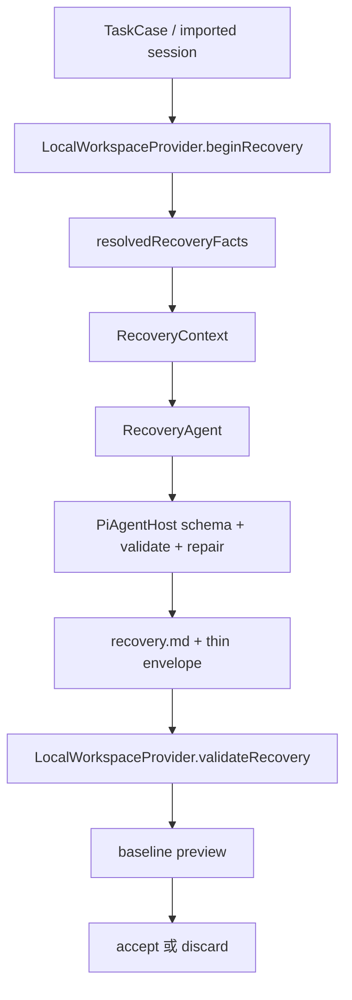

# Recovery Agent 模块修改与优化实施规划

> 状态：待实施规划
>
> 依据：Recovery Agent 当前实现、Recovery Host/Provider 链路、Codex 与 Claude Code 两个 Pack，以及 2026-08-17 本地真实样本实验。
>
> 本文只定义修改方案，不在本轮直接修改源码、不重新调用模型。

## 1. 目标与非目标

### 1.1 目标

把 Recovery Agent 从“能够在隔离副本中调查、写报告并返回一个通过语法校验的 envelope”，提升为：

1. 在存在可用历史证据时，模型能够引用**真实、可定位、由 Host 拥有**的证据，而不是自行猜测 `event:*` 引用。
2. 在证据不足、历史起点不可确定或恢复无法验证时，能低成本、明确且可复核地返回 `insufficient_evidence` 或 `partial`，而不是消耗完整预算后以 `invalid_output` 失败。
3. 在 Git 仓库、无提交的 Git 仓库、非 Git 工作区、Claude history-only 和 Codex transcript 等输入上，失败原因属于正确的阶段和类别。
4. Provider 不只验证“隔离安全、报告存在、引用格式正确”，还能够验证恢复动作与证据覆盖范围；`recovered` 不再仅表示模型声称恢复。
5. 重新抽样时，每条样本都有独立 baseline dossier，可以判断“实际回到了任务起点”而不是只判断 staging 是否被修改。
6. 不泄露任务正文、完整 transcript、凭据、真实 session ID 或敏感绝对路径；不向源目录写入任何内容。

### 1.2 非目标

- 不把模型输出改成 Host 自动猜测或自动伪造的恢复结果。
- 不把 `sourceUnchanged`、`changedPathCount=0`、tripwire 完整或 Git exact match 单独当作恢复成功。
- 不为了通过样本而放宽 evidence ownership 校验，不删除隔离、路径、凭据和源目录保护。
- 不把本轮 10 条结果当作总体准确率，也不重复使用本轮失败样本充当修复后的成功证据。
- 不读取或保存 Codex 凭据，不改变 `.reprise/harness-model.json` 的凭据边界。

## 2. 当前链路与观察到的行为

当前主链路如下：



关键实现位置：

- Agent 合同、系统提示词和 envelope：[`src/agents/recovery-agent.ts`](../../src/agents/recovery-agent.ts)。
- 证据解析、Git 探测、观察工具和 evidence ownership：[`src/infrastructure/recovery-tools.ts`](../../src/infrastructure/recovery-tools.ts)。
- 通用 Host 的 JSON 解码、结构校验、修复重试和工具审计：[`src/infrastructure/pi-agent-host.ts`](../../src/infrastructure/pi-agent-host.ts)。
- 调用编排、失败 fallback 和 Provider 验证入口：[`src/application/experiment.ts`](../../src/application/experiment.ts)。
- 隔离副本、报告、源目录 tripwire、证据复核和 accept：[`src/environment/local-workspace-provider.ts`](../../src/environment/local-workspace-provider.ts)。
- 产品历史语义：[`src/products/codex/recovery/SKILL.md`](../../src/products/codex/recovery/SKILL.md) 和 [`src/products/claude-code/recovery/SKILL.md`](../../src/products/claude-code/recovery/SKILL.md)。

当前 `RecoveryResult` 只有：

```text
status: recovered | partial | insufficient_evidence
reportPath: recovery.md
unresolved: string[]
evidenceRefs: string[]
```

Host/Provider 对它做的是三类检查：

1. TypeBox 能否解析 JSON；
2. `recovered` 不能带 `unresolved`，`recovered/partial` 必须至少有一个 evidence ref；
3. 每个 ref 是否存在于 `resolved.evidenceRefs`，以及 Provider 能否重新检查 Git object 或 preimage。

这套设计能保护边界，但当前不能证明“任务相关文件已回到起点”。

## 3. 实验结果与根因判断

实验目录：

```text
.reprise/recovery-sample-2026-08-17T07-16-11-598Z-eb52c7ca/
```

结果概览：

| 产品 | 实际尝试 | 有效恢复 | 基本可用 | 表面恢复 | 错误恢复 | 证据不足 |
|---|---:|---:|---:|---:|---:|---:|
| Codex | 5 | 0 | 0 | 0 | 5 | 0 |
| Claude Code | 5 | 0 | 0 | 0 | 4 | 1 |

10 条样本均满足源目录未变、隔离 tripwire 完整、`changedPathCount=0`。这些只证明安全边界工作，不能证明恢复语义正确。

### 3.1 根因一：evidence catalog 在真实样本中为空，成功合同因此不可满足

证据链：

1. [`resolvedRecoveryFacts`](../../src/infrastructure/recovery-tools.ts) 只从以下位置产生 ref：
   - `baseline.evidenceRefs`；
   - baseline/source runtime 的 artifact refs；
   - `historicalEvents` 顶层的 `eventId` 或 `id`；
   - 校验成功的 preimage；
   - 存在于 staging Git object database 的 historical commit。
2. Codex 导入把原始 rows 放入 `historicalEvents`，但本轮样本的 rows 没有符合当前 extractor 的顶层 `eventId/id`；Claude Code 同样没有可用顶层 ID。
3. `TaskCase.transcript` 虽然有稳定的 `message-*` 或导入消息 ID，但 `taskCaseEvidence` 完全没有把 transcript message 纳入 catalog。
4. 两个 Pack 的 baseline/source artifact refs 在这轮样本中为空，历史 preimage 也为空；无提交样本还没有可验证的 historical commit。
5. 因而这 10 条样本的 `resolved.evidenceRefs` 实际均为 0 个。独立审计也记录了 `evidenceRefs=0`；六条模型输出因引用未知 ref 被 Host 拒绝。

这不是“模型随机发挥不好”，而是协议层的可满足性错误：

```text
recovered/partial -> evidenceRefs.length >= 1
model can only choose refs in resolved.evidenceRefs
resolved.evidenceRefs = []
=> recovered/partial 永远无法通过
```

模型只能在两条路中选择：

- 诚实返回 `insufficient_evidence`；
- 猜一个看似合理的 `event:*`，最终收到 `unknown recovery evidence reference`。

优化重点不是删掉 ownership 校验，而是建立 Host 生成、模型可读、Provider 可复核的 evidence catalog。

### 3.2 根因二：观察工具没有把“页面内容”与“可引用 ref”绑定

`read_observation` 只返回 `{content, details: {source,start,returned,nextCursor}}`。模型看到了 transcript 或 historical events，但页面中的每条记录没有 Host 生成的 evidence ref、内容摘要或定位信息。

同时，系统提示要求模型在最终 envelope 中引用 evidence ref，却没有提供一个可靠的“从观察项到 ref”的闭环。模型容易把 transcript 的 `id`、session 的原始字段或自己命名的 ID 转成 `event:*`，但这些并不一定属于 Host 的 ownership catalog。

这解释了为什么错误集中为统一的 `unknown recovery evidence reference`，而不是不同的文件恢复错误。

### 3.3 根因三：输出 schema 允许不一致状态，语义检查太晚

`RecoveryResultSchema` 是一个普通 Object + status Union；它并没有在 schema 层表达：

- `recovered` 必须 `unresolved=[]`；
- `recovered/partial` 必须有 ref；
- `insufficient_evidence` 不应修改 staging；
- `partial` 应明确存在未解决事项。

这些条件在 `validateRecoveryResult` 和 Provider 中才检查。Claude Code 的一条 history-only 样本返回了 `recovered` 加 `unresolved`，Host 正确拒绝并要求 `partial`，但模型在一次修复机会中仍未改正，最终浪费一次模型调用并失败。

这属于“防线正确、交互设计不够可修复”：结构化 schema 没有尽早约束，repair 提示也只追加一段通用错误文本，没有告诉模型应如何只修正 envelope。

### 3.4 根因四：无 HEAD 的 Git 工作区被当成了异常，而不是一种正常状态

`resolvedRecoveryFacts` 先执行 `git rev-parse HEAD`，整个函数用一次 try/catch 包裹 Git 探测，仅把错误文本包含 `not a git repository` 的情况当作非仓库。

实验中 2 条 Codex 样本处于“有 `.git`、但没有有效提交”的工作区，`git rev-parse HEAD` 返回 unborn/empty repository 错误。错误没有被识别为“仓库存在但 HEAD 不可用”，因此在模型调用前就进入 `agent_failure` fallback。

需要把以下状态分开：

```text
not a repository
repository with valid HEAD
repository with unborn/empty HEAD
repository probe unavailable (permission/tool failure)
```

不能依赖英文错误消息匹配来区分它们。

### 3.5 根因五：失败后只保留 current-state fallback，诊断信息不足且状态容易被误读

`recoverCodexExperiment` 的 catch 会 discard staging，再通过 `resolveBaseline` 复制当前源目录作为 fallback，并把 `baseline.match` 可能显示为 `matched`。同时，`recovery.status` 是 `failed`，warning 才说明“replay uses the current source state”。

这在安全上是保守的，但在产品语义上容易让调用方把 `match=matched` 与“恢复匹配”混淆。真实样本的独立审计必须额外结合 `recoveryStatus=failed` 才能正确判断。

应明确区分：

- `baseline.match`：baseline 解析/现有环境状态；
- `recovery.status`：恢复尝试结果；
- `recoveryFallback`：恢复失败后是否使用 current state；
- `accepted`：是否真的发布为可重放 baseline。

失败阶段、失败码、是否调用过模型、是否写过报告也应以脱敏结构化字段保存。

### 3.6 根因六：当前 Provider 验证的是“可交付性”，不是“恢复有效性”

`LocalWorkspaceProvider.validateRecovery` 会验证：

- envelope 形状；
- evidence refs ownership 和 Git/preimage 可复核性；
- 源目录未改变；
- 非 `insufficient_evidence` 时 `recovery.md` 存在；
- staging 自身仍满足预算和边界。

但它没有验证：

- 哪些文件是任务输出，是否已移除；
- 哪些任务前文件是用户已有内容，是否保留；
- 修改路径是否由证据覆盖；
- 当前状态是否真的等于历史任务开始点；
- 恢复后候选是否能从原任务起点继续工作。

因此“模型写了报告 + 引用了一个弱历史事件”理论上可能通过 Provider。当前实验没有产生这种假阳性，但模块设计存在该风险；不能把本轮 `changedPathCount=0` 当作已覆盖。

### 3.7 实验与测试本身的限制

本轮临时运行器没有为每条样本单独生成计划要求的 baseline dossier。因此对失败样本只能确认 Recovery 未完成，不能正向证明任务相关文件起点、任务前用户改动或可重新开始性。

此外，现有单元测试主要覆盖：

- 有有效 Git commit 的理想 fixture；
- 手工构造的合法/非法 evidence ref；
- `recovered + unresolved` 的拒绝。

尚缺：

- imported Codex/Claude TaskCase 的空 evidence catalog；
- 每种 Git HEAD 状态；
- observation page 与 ref 的对应关系；
- 动态可引用 refs 和 repair 行为；
- Provider 对 mutation manifest / path coverage 的验证；
- history-only 的“受控停止且 staging 不变”；
- 失败阶段的结构化产物。

## 4. 目标设计

### 4.1 两层证据模型

将证据分成“可定位引用”和“可证明强度”两层，不混为一个字符串数组。

建议新增内部的 `RecoveryEvidenceCatalog`（具体是否持久化到 TaskCase，实施时按现有 schema 兼容策略决定）：

```text
catalogVersion
caseContentHash
entries[] {
  ref: event:recovery-transcript-000001 | event:recovery-history-000001 | artifact:...
  source: transcript | historical_events | baseline | runtime | preimage | git_commit
  locator: { index, path?, commit? }
  contentHash
  strength: observed | verifiable | reconstructable
  modelReadableSummary: 仅结构性摘要，不含任务正文和密钥
}
```

规则：

- `ref` 由 Host 根据 frozen TaskCase 稳定生成，模型不能自定义；
- `contentHash` 用于证明引用指向冻结内容，不把完整内容写进 envelope；
- `verifiable` 仅用于 Git object、digest 校验通过的 preimage 等强证据；
- transcript/history 的 entry 可以支持“观察到某条记录”，但默认不足以单独证明文件内容已恢复；
- `recovered` 的最低证据门槛高于 `partial`，不能只因为存在一个弱 event ref 就通过；
- catalog 中不能出现原始 API key、完整任务正文或敏感绝对路径。

不建议让模型直接填写完整 evidence 对象；保留薄 envelope，但把可复核的细节放在 Host 生成的 catalog / action manifest 中。

### 4.2 观察工具建立 ref 闭环

改造 `read_observation`：

- 每一页返回条目级安全引用，例如 `event:recovery-transcript-000007`；
- `details` 返回 `nextCursor`、页范围、catalog 版本和条目 hash；
- 模型最终引用的 ref 必须来自该页或 `resolved` catalog；
- 对没有历史内容的 history-only case，工具明确返回“没有 transcript/event evidence”，并推荐只返回 `insufficient_evidence`；
- 不把完整原始事件再次写入 audit event；审计只记录 source、cursor、count、hash 和 byteLength。

### 4.3 输出契约分层

将 `RecoveryResultSchema` 改为按 status 的判别联合（仍保持向后兼容的 on-disk 版本迁移）：

- `recovered`：`unresolved` 只能为空；至少一个 owned ref；必须包含恢复验证摘要或由 Host 生成的 action manifest 引用；
- `partial`：至少一个 unresolved；至少一个 owned ref；必须明确哪些内容已恢复、哪些仍不确定；
- `insufficient_evidence`：至少一个 unresolved；不得修改 staging；evidence refs 可为空；
- 所有 status 都固定 `reportPath: recovery.md`。

动态 ref 集合不宜无限塞进 schema。可行方案是：

1. 用判别联合约束状态内部一致性；
2. 在 Host validator 做 ownership 和 strength 校验；
3. repair 提示只列出安全的 ref 标识/数量，不回显任务正文；
4. 若 catalog 为空，在进入模型前生成 capability gate：只允许 `insufficient_evidence` 路径，避免不可能的 API 调用。

### 4.4 增加恢复动作/验证 manifest

由 `write_recovery_report` 同步或新增一个受控工具写入 `recovery-manifest.json`，内容只包含结构性字段：

```text
chosenPoint: { kind, evidenceRefs, confidence }
actions[]: {
  operation: create | modify | delete | restore
  path
  beforeHash?
  afterHash?
  evidenceRefs
}
verifications[]: {
  kind: hash | git_commit | patch_base | file_exists | command
  target
  result
  evidenceRefs
}
unresolved[]
riskLevel
```

约束：

- 路径必须是 staging 相对路径；
- `beforeHash/afterHash` 只存 digest，不存敏感文件正文；
- action 的 ref 必须属于 catalog；
- 不允许 manifest 声明 Host 未观察到的命令结果；
- `recovery.md` 继续承载人类可读解释，但不能是唯一机器验证材料。

如果实施评估认为新增文件过重，第一阶段可把 manifest 作为 `recovery.md` 的受控结构块；但最终应有独立 JSON，以便 Provider 和独立评估器不解析自然语言。

### 4.5 Provider 验证分级

Provider 验证按恢复状态执行：

1. `insufficient_evidence`
   - 强制 staging fingerprint 与输入完全相同；
   - 不接受任何 mutation；
   - 允许没有 report，但如果有 report 则保存脱敏 artifact；
   - 结果明确标记为“current-state fallback”，不能叫 matched recovery。
2. `partial`
   - report 和 manifest 必须存在；
   - 每个 mutation path 必须在 staging 内、在 manifest 中、且有至少一个 owned ref；
   - 强 evidence 可重新 hash/Git 校验；弱 evidence 必须进入 unresolved；
   - 恢复后的 changed paths 与 manifest 做双向比对，漏报或多报均拒绝。
3. `recovered`
   - report 和 manifest 必须存在；
   - unresolved 必须为空；
   - 所有 changed paths 必须有强证据覆盖；
   - 若有 historical commit，优先做整个 tree 或任务相关路径 exact match；
   - 若无 commit，必须有可验证 preimage/patch 或独立 baseline dossier 提供足够的路径级 golden evidence；否则降级为 `partial`/`insufficient_evidence`，不得仅凭模型表述接受。

`acceptRecovery` 只接收已通过上述验证的 preview。Provider 不应自动把“模型声称 recovered”升级为可发布 baseline。

### 4.6 Git 探测状态机

重写 `resolvedRecoveryFacts` 的 Git 探测，不再用一个 try/catch 和英文错误消息判断仓库类型：

```text
probe is-inside-work-tree
  ├─ false -> isRepo=false
  ├─ true -> probe HEAD separately
  │          ├─ valid commit -> head=...
  │          ├─ unborn/empty -> isRepo=true, head absent, headState=unborn
  │          └─ permission/tool error -> facts unavailable + explicit diagnostic
```

`git status --porcelain` 单独执行；无 HEAD 仍可得到 dirty/untracked 状态。historicalCommit 的 `cat-file` 校验仍保持独立且失败可解释。

建议把 `headState` 加入内部 facts 和 recovery report 摘要；如果影响持久化 schema，新增版本字段并写 decision record。

### 4.7 失败阶段和 current-state fallback 语义

将编排失败分为：

```text
preflight_failed
agent_timeout
agent_tool_failed
agent_invalid_output
provider_validation_failed
source_tripwire_failed
accepted
```

保留现有 `AgentFailure.code`，但在 Recovery 结果外再保存结构化 `failureStage`，避免把“Git facts 预检失败”伪装成模型 `agent_failure`。

fallback baseline 必须：

- `recovery.status=failed`；
- `match` 使用独立的 `current_state_fallback` 或等价枚举，不再复用 `matched`；
- 明确 `accepted=false`；
- warning 只放不含任务正文、密钥和敏感绝对路径的诊断；
- 保存错误类型、命令类别和安全摘要，而不是原始 shell stderr 全文。

## 5. 分阶段实施步骤

### 阶段 0：先建立失败回归和证据快照

**修改范围**：测试与开发 fixture，不改生产行为。

1. 从本轮样本提炼脱敏 fixture：
   - transcript 有稳定消息但 historical events 无顶层 ID；
   - history-only 只有一条初始线索；
   - 有 `.git` 但无 HEAD；
   - 有 valid HEAD；
   - 非 Git 目录。
2. 添加测试断言：当前实现中 catalog 为 0、六条未知 ref 被拒绝、无 HEAD 不应抛出未分类错误；先把缺口固定下来。
3. 为每条 fixture 生成独立 baseline dossier，至少含 file tree digest、任务相关路径候选、任务前 user-modification 摘要和 source tripwire。

**完成判据**：测试能稳定复现本轮三类失败，并且 fixture 不含真实 session 内容、密钥和敏感绝对路径。

### 阶段 1：修复 evidence catalog 和观察引用闭环

**主要文件**：

- `src/infrastructure/recovery-tools.ts`
- `src/agents/recovery-agent.ts`
- `src/core/schema.ts`（若 catalog 需要持久化）
- `src/products/shared/freeze.ts` 或统一 freeze helper
- `src/products/codex/sessions.ts`
- `src/products/claude-code/sessions.ts`
- `test/recovery-tools.test.ts`
- 新增或扩展 recovery integration test

**步骤**：

1. 实现 deterministic catalog builder，覆盖 transcript、historical events、baseline/runtime artifacts、preimages、Git commit。
2. 对没有原始 ID 的 historical row 使用 frozen index + content hash 生成 ref，不使用模型可控文本作为 ID。
3. 将 catalog 作为 recovery context 的已验证事实，并在 `read_observation` 页上返回对应 ref。
4. 保持旧 TaskCase 可读：旧 case 没有 catalog 时运行一次派生构建；新 case 可在 freeze 时保存 catalog 摘要/版本。
5. 添加 capability gate：catalog 为空且没有可验证 commit/preimage 时，先告知模型只可走 `insufficient_evidence`，不允许消耗完整调查预算。
6. 统一 sample runner 与生产 helper，不在临时脚本中另写一份 evidenceReferences 逻辑。

**完成判据**：真实导入形状的 fixture 至少能产生 transcript/history 的稳定 refs；模型引用 observation 返回的 ref 能通过 Host ownership 校验；空证据 case 仍可诚实、零修改地停止。

### 阶段 2：修复状态合同、repair 和成本控制

**主要文件**：

- `src/agents/recovery-agent.ts`
- `src/infrastructure/pi-agent-host.ts`
- `src/environment/local-workspace-provider.ts`
- `test/agent-host.test.ts`
- `test/harness-agents.test.ts`
- snapshots（如契约文本变化）

**步骤**：

1. 用判别联合表达 status/unresolved/evidenceRefs 的关系；保留 validator 作为第二道防线。
2. repair 提示包含稳定错误码和最小修复动作，例如“把 status 改为 partial 或清空 unresolved；只能选择 catalog 中的 ref；不要再次调用工具”。
3. repair 期间不重复打开新一轮调查；如果第一轮已经写出报告，第二轮只修 envelope，避免 48 tool calls 类似的预算浪费。
4. 在 Host 记录 `invalid_output` 的安全摘要：错误类别、attempt、ref 数量和 ref hash，不记录完整任务/模型正文。
5. 设置不可满足合同的预检，避免空 catalog 仍发起会注定失败的 recovered/partial 尝试。

**完成判据**：`recovered + unresolved` 能在 schema 或一次 repair 内稳定转为合法 `partial`；未知 ref 的 repair 不再重复同一错误；空 catalog history-only 最多一次受控模型调用或直接返回受控 insufficient result。

### 阶段 3：修复 Git 状态处理和失败语义

**主要文件**：

- `src/infrastructure/recovery-tools.ts`
- `src/application/experiment.ts`
- `src/environment/local-workspace-provider.ts`
- `test/recovery-tools.test.ts`
- `test/contamination.test.ts` 或相应 experiment integration test

**步骤**：

1. 引入无 HEAD 的 Git fixture，验证 status/untracked 仍能返回。
2. 把 Git probe、HEAD probe、status probe、historical commit probe 分开，各自记录有限诊断。
3. 新增 failure stage 和 current-state fallback 语义；更新 UI/report 投影只显示真实状态。
4. 验证所有异常路径 discard staging，不写 source，不保留可被候选看到的 recovery.md。

**完成判据**：无 HEAD 样本进入 Agent 调查或按证据能力受控停止，不再在 facts preflight 阶段被误报为 `agent_failure`；失败结果不会出现 `match=matched` 与 `recovery.status=failed` 的冲突语义。

### 阶段 4：引入动作 manifest 和语义验证

**主要文件**：

- `src/agents/recovery-agent.ts`
- `src/infrastructure/recovery-tools.ts`
- `src/environment/local-workspace-provider.ts`
- `src/core/schema.ts`
- `src/application/experiment.ts`
- 两个 product recovery playbook
- recovery agent、provider 和 contamination 测试
- 新增 decision record（协议/on-disk 格式变更）

**步骤**：

1. 增加受控 `write_recovery_manifest`（或等价的结构化扩展）。
2. 将 changed path、before/after hash、action evidence refs、verification 记录纳入 Provider 校验。
3. 为 Git exact、preimage、patch base、weak observation 分别定义证据强度和允许的最终 status。
4. 对 `recovered` 实施强证据覆盖；对无法覆盖的场景要求 `partial` 或 `insufficient_evidence`。
5. 将 recovery.md 作为人类解释层，manifest 作为机器验证层；两者不允许互相矛盾。

**完成判据**：一个伪造“报告正确但文件未恢复”的 fixture 被 Provider 拒绝；一个有正确 before/after hash 的 fixture 能通过；manifest 漏报或多报 changed path 都能失败。

### 阶段 5：产品证据适配与重新实验

**主要文件**：

- `src/products/codex/sessions.ts`、`src/products/claude-code/sessions.ts`
- 两个 recovery playbook
- 共享 evidence/case fixture
- `.reprise` 下临时运行器仅在本地使用，不提交
- `docs/plan/recovery-module-real-sample-evaluation.md`（补充 baseline dossier 产物要求时再修改）

**步骤**：

1. Codex：验证 rollout rows、turn context、patch/preimage、历史 commit 的索引和 hash；不要把 rollout 中的 cwd/commit 直接当作已验证事实。
2. Claude Code：区分 transcript、history-only、compact gap、API error；根据 `sessionId`/`cwd` 证据生成可定位 catalog，不逆向猜目录 slug。
3. 每产品先跑 fixture/integration，再做真实模型预检；真实实验固定 seed，逐条恢复，保持源目录只读。
4. 每条样本先保存 baseline dossier，再开始 Recovery；恢复后按 dossier、manifest、机械审计和独立人工判断四层评估。
5. 重新实验必须报告：有效恢复、基本可用、表面恢复、错误恢复、证据不足，以及失败阶段和模型调用成本；不得将“受控 insufficient”计入成功率。

**完成判据**：Codex/Claude Code 各至少 5 条实际尝试；每条有 baseline dossier、机械审计、独立评估和脱敏产物；源目录 100% 未变；结果中不含 key、完整正文、完整 transcript、真实 session ID 或敏感绝对路径。

## 6. 测试设计矩阵

| 维度 | 必测场景 | 预期 |
|---|---|---|
| Git | valid HEAD + historical commit | 可验证 commit；路径/树匹配按证据强度判定 |
| Git | `.git` 无 HEAD | `isRepo=true`、head absent；不抛 facts preflight 异常 |
| Git | 非 Git 目录 | `isRepo=false`；继续使用文件/历史证据 |
| Git | Git 工具不可用/权限错误 | 明确 probe failure，不伪装成非仓库 |
| 证据 | transcript 有消息、rows 无 ID | 生成稳定 Host-owned observation refs |
| 证据 | history-only 无执行记录 | zero mutation + `insufficient_evidence` |
| 证据 | preimage hash 正确 | 可验证 path restore；manifest 与 changed paths 一致 |
| 证据 | preimage hash 错误 | 拒绝该 ref，不得声称 recovered |
| 输出 | recovered + unresolved | schema/repair 拒绝或转为合法 partial |
| 输出 | partial + owned refs | 通过结构检查，必须披露 unresolved |
| 输出 | recovered + unknown ref | 失败且给出可修复错误，不重复无限调查 |
| Provider | report 正确但 workspace 未恢复 | 拒绝 recovered |
| Provider | `insufficient_evidence` 修改 staging | 拒绝并 discard |
| 安全 | staging 外路径、symlink、源目录写入 | tripwire/路径边界失败，源目录保持不变 |
| 成本 | 空 catalog | 不发起必败的多轮工具调查 |
| 兼容 | 旧 TaskCase 无 catalog | 派生 catalog 或受控降级，不破坏读取 |

测试实现遵循项目门禁：改源码先 `npm run build`，测试读取 `dist/`；新增协议或 on-disk 格式时同一次变更新增 decision record；纯文档变更只跑 `npm run verify:docs`。

## 7. 观测、报告与验收指标

### 7.1 运行指标

记录但不把它们单独当成功标准：

- `factsPreflightMs`、`agentDurationMs`、`providerValidationMs`；
- tool call 数、repair 次数、是否提前 capability gate；
- evidence catalog entry 数、强/弱证据数量；
- manifest changed path 数与 Provider 实际 changed path 数的差异；
- failure stage 分布；
- source tripwire、staging tripwire、credential scan 结果。

### 7.2 实际效果指标

每条样本独立回答：

1. 任务完成产物是否被移除？
2. 任务开始前已有的用户修改是否保留？
3. 无关文件是否保持不变？
4. 当前工作区能否让候选从原始任务重新开始？
5. Recovery Agent 的报告是否诚实区分 observed/inferred/assumed/unresolved？
6. manifest、报告、实际文件和 evidence catalog 是否相互一致？

最终分类仍由独立评估者结合硬失败、证据强度和实际工作区判断，不按分数机械映射。

### 7.3 本计划 Done-means

本规划文档完成的判据：

- 已把本轮 10 条结果映射到实际代码路径和明确根因；
- 已区分安全指标、交付校验和恢复语义验证；
- 已给出分阶段文件范围、测试矩阵、协议迁移和真实复验步骤；
- 没有把本轮失败结果夸大为总体准确率；
- 文档不含 API key、完整任务正文、完整 transcript、真实 session ID 或敏感绝对路径。

模块修改完成的判据见第 5 节各阶段，不以“`npm run check` 通过”替代实际恢复验收。

## 8. 风险与决策点

1. **是否把 catalog 持久化到 TaskCase**：持久化可复现性最好，但会变更 on-disk schema；若选择，必须增加 schemaVersion 迁移和 decision record。仅运行时派生可降低迁移成本，但必须以 `contentHash + deterministic index` 保证同一 case 得到同一 refs。
2. **历史事件摘要的隐私**：catalog 默认只放 hash、类型、索引和脱敏结构摘要；任何需要模型读正文的内容仍通过 bounded observation 工具按页提供，不进入长期报告。
3. **没有强证据时的可用性**：不能为了提高 recovered 数量放宽标准。宁可 honest `partial/insufficient_evidence`，再通过产品导入和 baseline dossier 提高真实可恢复范围。
4. **真实历史样本可重复性**：源目录可能继续变化，baseline marker 必须绑定 source fingerprint；发现源变化就新建 case，禁止复用旧 baseline。
5. **模型差异**：Codex 与 Claude Code 的错误分布可能不同，但 evidence contract、Host ownership、Provider verification 必须产品中立；差异只进入 playbook 和 importer 的事实层。

## 9. 推荐实施顺序

优先级为：

```text
P0 证据 catalog + observation ref 闭环 + 无 HEAD 探测
P0 判别输出合同 + capability gate + repair 成本控制
P1 failure stage/current-state fallback 语义
P1 manifest + Provider 路径级/强证据验证
P2 Codex/Claude 产品证据适配与真实样本复验
```

在 P0 未完成前，不建议再次消耗真实 API 预算做 5+5 样本：本轮已经证明，当前空 catalog 会让大多数成功输出在 Host 边界必然失败。P0 完成后先跑 fixture 和 targeted integration，再进行新的真实实验。
