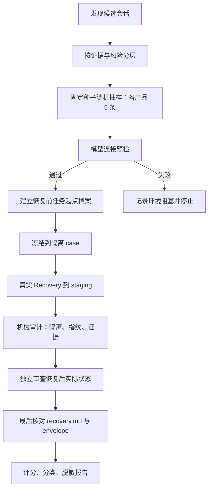

# 恢复模块真实样本效果评估实施计划

状态：待执行（2026-08-17）  
范围：在不改写原始 Codex / Claude Code 会话目录的前提下，各随机抽取 5 条本机历史会话，执行真实恢复并用独立人工语义判断评估恢复质量；本计划不扩大为产品功能改造或模型基准比较。

## 1. 目的

恢复模块的目标不是让 `recovery.md` 看起来合理，也不只是让文件指纹或 Git 提交匹配。它必须把隔离工作区恢复到**足以从原任务开始前继续工作的合理状态**，并在证据不足时诚实说明限制。

本次实验用真实的历史会话检验这一能力。每个产品各选 5 条样本，既保留可机械验证的安全底线，也将“恢复后实际工作区是否可用”作为最终结论的核心依据。

## 2. 背景与当前前置条件

已完成本机候选勘察：Codex 有足够数量的可恢复候选，Claude Code 也有足够数量的完整 transcript 或 history-only 候选。候选的具体任务正文、路径和会话标识不写入受控报告。

真实模型调用需要显式 opt-in，凭据只从本机 Git 忽略文件 `.reprise/harness-model.json` 的 `apiKey` 字段或允许的 `env:NAME` 引用读取。不得读取 Codex 凭据，也不得在日志、事件、产物或报告中输出密钥。

当前已知执行阻塞是模型连接预检收到 HTTP 401。它表示本机 harness 凭据、端点或授权配置尚不能完成请求；在预检通过前，**不得**开始 freeze、导入或真实恢复。该阻塞不等同于恢复模块失败，应单独记录为环境前置条件未满足。

## 3. 目标与非目标

### 目标

- 对 Codex 与 Claude Code 各完成 5 条分层随机样本的恢复；若某一层候选不足，记录不足原因并重抽其他可用层。
- 对每条样本建立恢复前的“任务起点档案”，再独立审查恢复后的实际工作区。
- 将每条结果归为有效恢复、基本可用但不完整、表面恢复、错误恢复或证据不足，且附带置信度和理由。
- 验证源会话目录不变、恢复仅发生在隔离 staging 中，并生成可在本机复核的审计产物。
- 报告 Recovery Agent 实际判断与独立审计是否一致，并识别其过度推断、遗漏或不诚实表述。

### 非目标

- 不根据这 10 条样本推导通用准确率或进行统计显著性声明。
- 不改动用户原始工作区、原始会话、Git 历史或模型服务账户设置。
- 不把恢复后的 staging 当作候选 Agent 真实执行任务的场所；“可重新开始”评估仅检查准备状态，不触发新的付费任务运行。
- 不在受控文档、Git diff 或最终摘要中保存完整任务正文、完整 transcript、密钥、用户数据原文或敏感绝对路径。

## 4. 核心原则

1. **硬门先行，语义结论为主。** 源目录变更、隔离失效、数据不可解释丢失和伪造 evidence 属于直接失败；通过这些门槛不自动代表恢复成功。
2. **先独立判断，再读恢复报告。** 评估者先看任务起点档案、恢复后的文件系统、Git 状态、diff 与历史证据，形成结论后才查看 `recovery.md` 和 envelope，避免被 Agent 叙述锚定。
3. **Git 精确匹配是强证据而非唯一真相。** 真实任务可能始于 dirty workspace、未提交用户修改或不完整历史；不能因 commit 不同就草率判失败，也不能因没有 Git 证据就判成功。
4. **区分事实、推断和未知。** 恢复报告及独立评估都必须标记 observed（观察）、inferred（推断）、assumed（假设）与 unresolved（未解决）。
5. **抽样可复现但不挑样本。** 使用记录的固定随机种子；先按证据形态与风险分层，再在层内随机选择，禁止按任务难易或预期结果人为替换。
6. **保护隐私和凭据。** 仅保存复核所需的最小摘要、哈希、相对路径或脱敏标识；不复制原始会话正文。

## 5. 总体流程



## 6. 阶段一：候选发现与分层随机抽样

### 6.1 候选纳入条件

候选必须能够被对应 Product Pack 发现、inspect 和 import，且其关联工作目录在只读检查时可访问。发现阶段只读取最小必要元数据；遇到权限错误、损坏记录或无法定位工作目录的候选，记录排除代码而不尝试修复原目录。

### 6.2 分层规则

每个产品优先覆盖下列维度；维度交叉不足时以可用候选为准，并在样本清单中说明未覆盖项：

- 证据形态：完整 transcript；Claude Code 另尽量包含 history-only；
- Git 证据：可取得历史基线或 patch/preimage；无足够 Git 基线；
- 会话长度：相对较短与较长；
- 工作目录：不同项目或目录（以脱敏目录标签区分）；
- 工作区状态：干净基线与可能含任务前用户修改的情况。

### 6.3 抽样与替补

对每个产品使用固定、记录但不含隐私的种子。先产生每层的随机排列，再轮转抽取，直到 5 条；同一会话最多一次。候选在 freeze 前失效时，按同层排列选择下一条并记录替换理由。样本标识采用 `codex-01` 至 `codex-05`、`claude-01` 至 `claude-05`，不在公开报告中写真实 session ID。

输出 `selection.json`，其中只含产品、脱敏样本标识、层标签、种子、选择/排除/替补理由和必要的内容哈希。

## 7. 阶段二：建立恢复前任务起点档案

每一条样本在实际恢复前由独立审计流程创建 baseline dossier。该档案是后续语义评估的参照，而不是对 Recovery Agent 的提示。

档案至少包括：

- 可观察到的任务线索的**脱敏摘要**，以及证据等级；
- 任务开始前最合理状态的候选说明：Git 提交、patch/preimage、事件时间线和工作区线索分别支持什么；
- 与任务相关的文件集合及其预期状态（存在、内容特征、修改/未修改），以哈希或最小必要结构描述；
- 明确应保留的任务前用户修改与不相关文件；
- 已知冲突、无法判断项、替代起点假设及每项置信度；
- 源目录只读指纹和导入前元数据快照。

档案不得把完整任务正文或 transcript 写入报告。若任务起点无法可靠推断，应明确标为“证据不足”，仍可执行恢复，但不得在随后用恢复报告反向补写基线事实。

## 8. 阶段三：真实 Recovery 执行

1. 运行不产生费用的连接预检；只有成功后设置项目规定的真实 Runtime opt-in 环境变量。
2. 对已选会话执行 inspect 与 freeze，创建不可变的 TaskCase；源目录只读，不允许在其上执行恢复命令。
3. 在每条独立 staging 目录中执行 Recovery；记录生命周期事件、输入证据引用、模型调用状态和输出路径，但不记录密钥或敏感正文。
4. 为每条样本设置可机械判定的结束状态：完成、受控失败、超时或环境阻塞。失败或超时仍生成最小诊断，不自动重试到掩盖问题。
5. 执行期间若检测到 staging 外写入、源目录指纹变化或意外网络/费用边界，立即停止该样本并标记硬失败。

## 9. 阶段四：机械审计（安全底线）

对每条已运行样本进行以下检查：

| 检查项 | 通过条件 | 失败处理 |
| --- | --- | --- |
| 源会话与原工作区 | 前后只读指纹一致 | 直接失败，停止该产品后续样本并保全证据 |
| 写入隔离 | 写入仅在该 case 的 staging/artifact 根内 | 直接失败 |
| 冻结一致性 | TaskCase、evidence refs 和事件引用可解析且互相对应 | 失败或证据不足，视影响升级 |
| 数据完整性 | 关键文件不存在不可解释的删除、截断或替换 | 直接失败 |
| 证据真实性 | 不引用不存在内容，不将推断伪称观察 | 直接失败 |
| Git/文件可审计性 | 可取得恢复后 Git 状态、diff、文件清单与哈希 | 不能取得时标“证据不足”，不得伪判通过 |

机械审计输出 `mechanical-audit.json`。这一步只判断安全、隔离和可复核性，不替代恢复效果判断。

## 10. 阶段五：独立实际效果评估

评估者按以下顺序操作：

1. 阅读该样本的 baseline dossier；
2. 在**不读取** `recovery.md`、Agent 自评或 envelope 结论的前提下，检查恢复后的 staging：文件树、Git status、diff、提交/patch 证据、关键文件内容特征与启动/构建前置条件；
3. 写下独立结论、反例和不确定性；
4. 最后阅读 `recovery.md`、envelope 与事件，检查其结论是否与可观察事实相符、是否完整披露限制；
5. 记录独立结论与 Recovery Agent 结论一致、部分一致或冲突的原因。

每条样本以 0–2 分评估以下六个维度，并同时给出简短的定性说明；分数辅助一致性，不取代文字判断。

| 维度 | 0 分 | 1 分 | 2 分 |
| --- | --- | --- | --- |
| 任务起点识别 | 起点明显错误或无依据 | 方向合理但存在关键不确定性 | 与可用证据一致，边界明确 |
| 任务相关文件恢复 | 关键任务结果仍在或基线被破坏 | 大体回退但有残留/遗漏 | 与合理起点一致 |
| 无关内容保留 | 误删/误改无关或任务前内容 | 大部分保留但有可疑变化 | 无关及任务前用户修改得到保留 |
| 工作区可用性 | 无法从起点继续且无说明 | 可继续但有可修复障碍 | 可合理重新开始任务 |
| 证据质量 | 无法支持结论或彼此矛盾 | 有效但不完整 | 可追溯、相互印证且边界清楚 |
| 报告诚实性 | 将猜测说成事实或遗漏关键限制 | 有限制说明但不充分 | 清楚区分观察、推断与未知 |

“工作区可用性”由文件/状态检查和必要的非破坏性前置验证判断；除非实验范围另行批准，不重新调用模型或执行会产生费用的 Candidate Run。

## 11. 阶段六：评分、分类与置信度

先适用硬失败规则，再结合六项评分、反例和证据质量给出最终分类。不得仅按总分机械分类。

- **有效恢复**：恢复后状态与最合理任务起点一致；任务结果已移除，任务前/无关内容被保留，且可继续工作。
- **基本可用但不完整**：核心起点可用，但存在已披露、可界定的残留、遗漏或低风险偏差。
- **表面恢复**：报告、提交或单一指纹看似正确，但实际文件状态、可用性或边界不支持“已恢复”的结论。
- **错误恢复**：恢复到错误时点，保留关键任务结果，破坏基线/无关内容，或触发任一硬失败。
- **证据不足，无法判断**：可观察证据不足以建立或检验起点；此分类不是成功，也不等同模块错误。

每条同时给出高、中、低置信度：高置信度需要多个独立证据相互印证；中置信度存在可解释缺口；低置信度表示结论主要受限于缺失基线或历史。

## 12. 阶段七：报告与复核产物

每次执行写入 Git 忽略的 `.reprise/recovery-sample-<run-id>/`。建议结构：

```text
selection.json
cases/<sample-id>/baseline-dossier.json
cases/<sample-id>/mechanical-audit.json
cases/<sample-id>/independent-evaluation.md
cases/<sample-id>/recovery/          # TaskCase、events、recovery.md、envelope
summary.json
summary.md
```

`summary.md` 按产品汇总样本分层、硬失败、最终分类、置信度、常见模式、Recovery Agent 与独立审计的分歧，以及环境阻塞（如有）。报告只放脱敏摘要、相对 artifact 路径或哈希；完整原始材料仅留在本机受控实验目录，且不纳入 Git。

## 13. 凭据、隐私与安全边界

- `.reprise/harness-model.json`、`.env`、credentials 和任何等价本机凭据必须保持 Git 忽略，且不得被 `git add`。
- 不读取、不复制、不保存 Codex 的 `auth.json` 或其他 Codex 凭据；Claude Code 原始会话和用户工作区只读。
- 日志、事件、artifact、报告和终端输出都不得包含 API key、Authorization 头、完整任务正文、完整 transcript、真实 session ID 或敏感绝对路径。
- 报告展示需使用样本别名、内容哈希、最小结构性描述和脱敏目录标签。
- 发生源目录变更、staging 外写入、疑似密钥泄露或无法解释的数据丢失时，立即停止，并只记录足以复现和处置的最小元数据。

## 14. API 401 的处置

在执行第 8 阶段前，先用不包含会话数据的最小请求验证 harness 配置。若仍返回 HTTP 401：

1. 仅检查 `.reprise/harness-model.json` 的字段存在性、端点和模型配置，不打印 `apiKey` 或 Authorization 信息；
2. 核对服务端期望的鉴权方案、有效的 API key 与账户/模型访问权限；
3. 记录“模型连接预检失败（HTTP 401）”及时间，不生成恢复成功/失败结论；
4. 保持样本清单和源目录不变，待预检通过后从阶段二重新开始。

## 15. 完成判据（Done-means）

本轮实验仅在以下条件全部满足时完成：

- Codex 和 Claude Code 各有 5 条实际恢复结果；若不足 5 条，有逐条、可复核的候选不足或受控阻塞说明；
- 每条均具备 baseline dossier、机械审计和独立实际效果评估；
- 每条都有最终分类、置信度、证据不足说明（如适用）以及对 Recovery Agent 报告诚实性的结论；
- 最终结论不只采信 `recovery.md` 或 Git commit 精确匹配；
- 任何硬失败均被明确列出，且源目录保持不变；
- 已生成本机可复核的 JSON/Markdown 产物，报告未泄露密钥、任务正文或敏感绝对路径；
- `summary.md` 给出按产品的实际效果结论和后续修复优先级，而不将样本结果夸大为总体准确率。

## 16. 执行清单与验收命令

1. 确认 `.reprise/harness-model.json` 已正确配置且保持 Git 忽略；不打印其中的密钥。
2. 执行最小模型连接预检。预期：成功响应；若为 HTTP 401，按第 14 节停止。
3. 运行本地 Git 忽略的批量恢复运行器，生成固定种子样本和隔离产物。预期：每个样本都有明确结束状态。
4. 对完成的样本依次执行机械审计和独立评估，最后核对 Recovery 报告。
5. 生成脱敏汇总并检查源目录指纹、产物路径和敏感信息。
6. 仅修改本计划文档时，运行：

```powershell
npm run verify:docs
```

7. 提交前（如未来有人决定提交）只检查本计划文件的 diff，绝不暂存 `.reprise/` 下的本地凭据或实验产物：

```powershell
git diff -- docs/plan/recovery-module-real-sample-evaluation.md
```

本计划本身不触发真实模型调用；真实执行必须遵守项目的显式 opt-in 约束。
